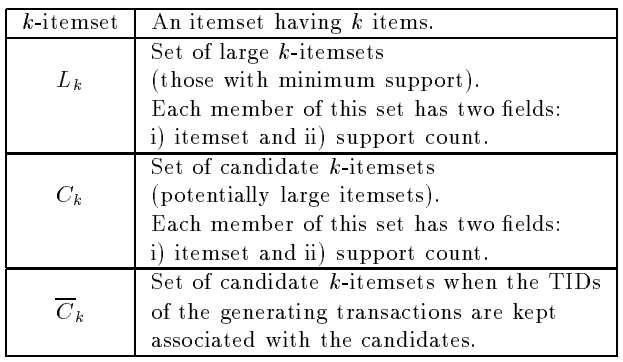
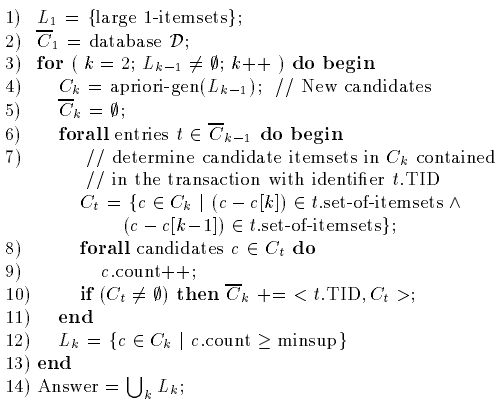
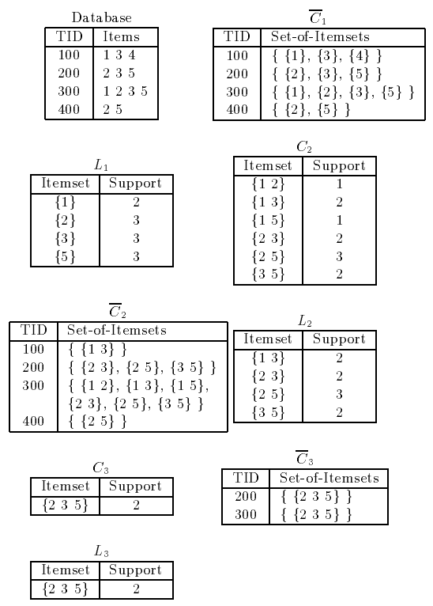

* [Back to Main](../../README.md)
---

# Fast Algorithm for Mining Association Rules
### Rakesh Agrawal and Ramakrishnan Srikant
* [Read Paper](../paper_pdfs/230916%20fast_mining.pdf)

---

## 1. Introduction
#### The Problem of Mining Association Rules over Basket Data
* Setting)
  * $I =\{i_1, i_2, ..., i_m\}$ : a set of literals, or items
  * $T$ : a transaction
  * $D$ : a set of transactions
    * where each transaction $T$ is a set of items s.t. $T \subseteq I$
  * $TID$ : a unique identifier of a transaction
  * $X \subseteq T$ : a transaction $T$ contains $X$, where $X$ is a set of items in $I$    
  
* Association Rule : $X\Rightarrow Y$
  * Condition : $X\subset I$, $Y\subset I$, and $X\cap Y = \emptyset$
  * **Association Rule with Confidence**
    * Notation
      * $X\Rightarrow Y$ with confidence $c$
    * Meaning
      * $c$% of transaction set in $D$ that contain $X$ also contain $Y$
  * **Association Rule with Support**
    * Notation
      * $X\Rightarrow Y$ has support $s$
    * Meaning
      * $s$% of transactions in $D$ contain $X\cup Y$

<br>

#### The Problem of Mining Association Rules
* Goal)
  * Generate all association rules that have support and confidence greater than the user-specified *minimum support (minsup)* and *minimum confidence (minconf)* respectively.
* Prop.)
  * The problem in neutral with respect to the representation of $D$.
    * $D$ can be either a data file, a relational table, or the result of a relational expression.

<br>

### 1.1 Problem Decomposition and Paper Organization
* Subproblems of the problem of discovering all association rules
  1. Find all sets of items that have transaction *support* above minimum support.
     * the *support* for an item set
       * the number of transactions that contain the item set.
     * *large item set*
       * an item set with minimum support
     * *small item set*
       * ~ *large item set*
  2. Use the large item sets to generate the desired rules.
     * Algorithm
       * For every large item set $l$, find all non-empty subsets of $l$.
       * For every such subset $a$, output a rule of the form $a\Rightarrow (l-a)$ if the ratio of support($l$) to support($a$) is at least [minconf](#the-problem-of-mining-association-rules).

<br><br>

## 2. Discovering Large Itemsets
#### Preivious Algorithms for Discovering Large Itemsets
* Algorithms
  * AIS
  * SETM
* Props.)
  * Make multiple passes over the data
    * First Pass
      * Count the support of individual items.
      * Determine which of them are [large (having minium support)](#11-problem-decomposition-and-paper-organization) .
    * Subsequent Passes
      * Start with a seed of itemsets found to be large in the previous pass.
      * Generate candidate itemset, a potentially large itemset, from that seed.
      * Count the actual support for these candidate itemsets during the pass over the data
      * Determine which candidate itemsets are actually large.
        * If a large one exists, it becomes the seed for the next pass
    * Continue until no new large itemset is found.

<br>

#### Preview) [Apriori](#21-algorithm-apriori) and [AprioriTid](#22-algorithm-aprioritid) Algorithm
* Prop.)
  * Candidate itemsets are counted in a pass and in a way that those candidates are generated.
  * **(AprioryTid only)** An encoding of the candidate itemsets used in the previous pass is employed for counting the support of candidate itemsets after the first pass.
* Analysis)
  * Distinctive Feature from from [AIS and SETM](#preivious-algorithms-for-discovering-large-itemsets)
    * Generating and counting the itemsets are operated separately.
    * Thus, unnecessarily generates and counts too many candidate itemsets.
      * Why) 
        * Perform recursive algorithm for every itemset that it generates
        * Most of them turn out to be small, not large.
  * Intuition)
    * Any subset of a large itemset must be large.
  * Implementation)
    * Generate itemsets with $k$ items by joining itemsets with $k-1$ items.
    * Delete those that contain any subset that is not large.
  * Advantage)
    * Much smaller number of candidate itemsets are generated.

<br>

#### Assumptions & Notations
* Items in each transaction are kept sorted in the lexicographic order.
* The database $D$ is kept normalized and each database record is a **<TID, item>** pair.
  * **TID** : The identifier of the corresponding transaction
* size : the number of items in an itemset
* $k$-itemset : an itemset of size $k$
* $c[1] \cdot c[2] \cdot ... \cdot c[k]$ : items sorted lexicographically in a $k$-itemset.
  * $c[1] \lt c[2] \lt ... \lt c[k]$ : Due to the lexicographic sorting
* $m$-extension of $X$:
  * $c=X\cdot Y$ and $Y$ is an $m$-itemset
* A count field to store the support for an itemset   
  * Initialized to zero when the itemset is first created.   


* $\bar{C_k}$ will be used for [AprioriTid](#22-algorithm-aprioritid)

<br><br>

### 2.1 Algorithm Apriori
#### Algorithm
```
L[1] = {large 1-itemsets};       -- first pass

for (k=2; L[k-2]!=∅; k++) do     -- subsequent k-passes
  begin
    Ck = apriori-gen(L[k-1]);    -- New candidates
    for t in D do
      begin
        Ct = subset(Ck, t);      -- Candidates contained in t
        for c in Ct do
          c.count++;
      end
    L[k] = {c in Ck | c.count >= minsupport}
  end

result = union(L[k])
```
* Description
  * The first pass of the algorithm counts item occurrences to determine the large 1-itemsets.
  * Subsequent passes consists of two phases
    * Let the pass be $k$-th pass.
    * Then,
      1. Use [the apriori-gen function](#211-apriori-candidate-generation) to generate candidate itemsets $C_k$ using large itemsets $L_{k-1}$ found in the $(k-1)$-th pass.
         * Use [the subset function](#212-subset-function) to efficiently determine the candidates for $C_k$
      2. Scan the database and count the support of candidates in $C_k$.
    
<br>

#### 2.1.1 Apriori Candidate Generation
* Apriori-gen Function
  * Input
    * $L_{k-1}$ : the set of all large $(k-1)$-itemsets
  * Output
    * A superset of the set of all large $k$-itemsets.
  * Steps
    1. **Join Step** : Join $L_{k-1}$ with $L_{k-1}$.
       ```
       INSERT INTO Ck
       SELECT p.item_1_, p.item_2_, ..., p.item_k-1_, q.item_k-1_
       FROM   L_k-1_  p
             ,L_k-1_  q
       WHERE p.item_1_ = q.item_1_
       AND   ...
       AND   p.item_k-2_ = q.item_k-2_
       AND   p.item_k-1_ < q.item_k-1     -- guarantees that no duplicate is generated!
       ```
    2. **Prune Step** : Delete all itemsets $c \in C_k$ such that some $(k-1)$-subset of $c$ is not in $L_{k-1}$.
       ```
       for c in Ck do   -- c : candidate itemsets
        for s in c do   -- s : (k-1)-subsets of c
          if (s not in L_k-1_) then
            DELETE c from Ck;
       ```
  * Examples
    * Let $L_3$ be {{1 2 3}, {1 2 4}, {1 3 4}, {1 3 5}, {2 3 4}}.
    * Then, $apriori \_ gen(L_3) = \lbrace \lbrace 1 \space 2 \space 3 \space 4 \rbrace \rbrace$
      * why?)
        * After the join step, $C_4$ will be {{1 2 3 4}, {1 3 4 5}}.
        * The prune step will delete {1 3 4 5}.
          * why?) {1 4 5} $\notin L_3$.
        * Thus, {1 2 3 4} will be returned.
  * Proof
    * $C_k \supseteq L_k$
      * Any subset of a large itemset must also have minimum support.
      * Then we did the join and prune step.
        * Join : Extend $L_{k-1}$ with items in $L_{k-1}$
        * Prune : Delete all itemsets which $(k-1)$-subset is not in $L_{k-1}$
      * Thus, $L_k$ is left with the superset of the itemsets in $L_k$
  * Analysis
    * Comparison with AIS and SETM
      * Apriori is way efficient.
      * Example
        * Suppose AIS and SETM are at $L_3$ state and about to extend to $L_4$
        * Then, they will extend {1 2 3} to {1 2 3 4} and {1 2 3 5} first and then calculate the support.
        * They will repeat this for {1 2 4}, {1 3 4}, {1 3 5}, {2 3 4} again.
          * Redundant!

<br>

#### 2.1.2 Subset Function
* Candidate Itemset Hash Tree
  * Why needed?)
    * Candidate Itemsets are stored in a hash-tree.
  * Data Structure
    * A **node** of the hash-tree either contains a list of itemsets(a leaf node) or a hash table(an interior node).
      * Root Node
        * Defined to be at depth 1.
      * Interior Node
        * Each bucket of the hash table points to another node.
        * One at the depth of $d$ points to nodes in the depth of $d+1$.
      * Leaf Node
        * Itemsets are stored in the leaves.
  * Operations
    * Searching an itemset : **The Subset Function**
      * Starting from the root node, find all the candidates contained in a transaction $t$ as follows.
        * At the root node, hash on every item in $t$.
        * At a leaf node, find which of the itemsets in the leaf contained in $t$ and add references to them to the answer set.
        * At an interior node, suppose we have reached the node by hashing an item $i$.
          * Then, we hash on each item after $i$ in $t$ and recursively repeat the procedure to the node in the corresponding bucket.
    * Adding an itemset
      * Start from the root and go down the tree until we reach a leaf.
      * At each branch, use hash function to the $d$-th item of the itemset.
      * Initially, all nodes are created as leaf nodes.
        * When the number of itemsets in a leaf node exceeds a threshold, convert the leaf node into an interior node.


<br><br>

### 2.2 Algorithm AprioriTid
* Props.)
  * Use [the apriori-gen function](#211-apriori-candidate-generation) to generate candidate itemsets $C_k$ using large itemsets $L_{k-1}$ found in the $(k-1)$-th pass.
  * Use the set $\bar{C_k}$ to count the support.
    * cf.) Apriori Agorithm used database $D$.

#### Def.) 
* $\bar{C_k}$
  * A Set of candidate $k$-itemsets when the $TID$s of the generating transactions are kept associated with the candidates.
  * Each member of the set $\bar{C_k}$ is of the form $\lt TID,\{X_k\} \gt$, where $X_k$ is a potentially large $k$-itemset present in the transaction $t$ with the identifier $TID$.
    * $\bar{C_1} \equiv D$ : database
    * $X_k = \lbrace c \space |$ contained in $t \rbrace$
* Prop.)
  * If a transaction does not contain any candidate $k$-itemset, then $\bar{C_k}$ does not have an entry for that transaction.
  * For large values of $k$, the number of entries in $\bar{C_k}$ is always less than or equal to the number of transactions in the database.

<br>

#### Algorithm

* Explanation
  * Step 7)
    * t.set-of-itemsets : All $(k-1)$-candidates contained in $t$
    * t.
* Example   
  
  * Setting
    * $minsupport=2$
  * Progress
    * $k=1$
      * $\bar{C_1}$ generated from $D$
    * $k=2$
      * $C_2$ generated by $apriori \_ gen(L_1)$
      * For itemsets in $C_2$, count support using $\bar{C_1}$
        * Generate $\bar{C_2}$
        * Add to $L_2$ if $c.count \ge minsupport$.
    * $k=3$
      * $C_3$ generated by $apriori \_ gen(L_2)$
      * For itemsets in $C_3$, count support using $\bar{C_2}$
        * Generate $\bar{C_3}$
        * Add to $L_3$ if $c.count \ge minsupport$.

<br>

#### 2.2.1 Data Structures
* Assign each candidate itemset a unique number, $ID$.
* Each set of candidate itemsets $C_k$ is kept in an array indexed by the $ID$s of the itemsets in $C_k$.
* A member of $\bar{C_k}$ has the form of $\lt TID, \lbrace ID \rbrace \gt$.
* Each $\bar{C_k}$ is stored in a sequential structure.
* A candidate itemset $C_k$ maintain two additional fields for each candidate itemset.
  * generators : Store the $ID$s of the two large $(k-1)$-itemsets whose join generated $C_k$ in the apriori-gen function.
  * extensions : Store the $ID$ of $C_k$
* t.set-of-itemsets : All $ID$s of $(k-1)$-candidates contained in $t.TID$
  * For each candidate itemset $C_{k-1}$, its extension field gives $T_k$
    * $T_k$ : the set of $ID$s of all the candidate $k$-itemsets that are extensions of $C_{k-1}$

<br><br>

## 3. Performance
### 3.1 The AIS Algorithm
* Review
  * Candidate itemsets are generated and counted on-the-fly as the database is scanned.
  * Determine whether a candidate is large or not after reading a transaction.
  * New candidate itemsets are generated by extending the previous large itemsets.

<br>

### 3.2 The SETM Algorithm
* Review
  * Utilize SQL to compute large itemsets.
  * Candidate itemsets are generated and counted on-the-fly as the database is scanned.
  * Separate the candidate generation from counting.
    * To use SQL JOIN operation.
    * Save a copy of the candidate itemset together with the TID of the generating transaction in a sequential structure.
    * Determine the support count of candidate itemsets at the end of the pass.
  * $\bar{C_k}$
    * Used to determine the large itemsets
    * Prevents subset operations
    * Disadvantages
      * Memory usage
      * Needs to be sorted on items

<br>

### 3.3 Generation of Synthetic Data
* Why needed?
  * To evaluate the performance of the algorithms over a large range of data characteristics.
* Generation
  * Parameters
    * $|D|$ : Number of transactions
    * $|T|$ : Average size of the transactions
    * $|I|$ : Average size of the maximal potentially large itemsets
    * $|L|$ : Number of items
  * Derivations
    * Size of the next transaction
      * Picked from the Poisson distribution with $\mu = |T|$.
      * cf.) If each item is chosen with the same probability $p$, and there are $N$ items, the expected number of items in a transaction is $Np \approx \mu$. ($\because$ Binomial Distribution.)
    * Assigning items to transactions
      * Each transaction is assigned a series of potentially large itemsets.
      * If the large itemset on hand does not fit in the transaction, the itemset is put in the transaction anyway in half the cases, and the itemset is moved to the next transaction the rest of the cases.
    * Choosing large itemsets
      * Pick the size of the itemset from a Poisson distribution with $\mu = |I|$.
      * Items in the first itemset are chosen randomly.
      * Subsequent itemsets are chosen from the previous itemsets generated.
      * Use an exponentially distributed random variable with $\mu = correlation level$ to decide this fraction for each itemset.
        * $correlation level = 0.5$
      * Remaining items are picked at random.
      * Each itemset has a weight associated with it, which corresponds to the probability that this itemset will be picked.
        * Weight is picked from an exponential distribution with unit mean, and is then normalized so that the sum of weights for all the itemsets is 1.
    * Corruption Level
      * To model the phenomenon that all the items in a large itemset are not always bought together.
      * $c$ : corruption level
        * When adding an itemset to a transaction, drop an item from the itemset as long as a uniformly distributed random number between 0 and 1 is less than $c$.

<br>

### 3.4 Relative Performance
* SETM took too long to execute for most of the dataset.
* Apriori beats SETM by more than an order of magnitude for large datasets.
* Apriori beats AIS for all problem sizes.

<br>

### 3.5 Explanation of the Relative Performance
* Why SETM is slow?
  * Mainly due to the size of $\bar{C_k}$.
    * $\bar{C_k} = \Sigma_{c \in C_k}{support _ count(c)}$ where $C_k$ is the candidate itemset.
    * Putting $S$, the average support count of the $C_k$, $\bar{C_k}$ is roughly $S$ times bigger than $C_k$
    * If the data size is bigger, $\bar{C_k}$ must be saved in the disk, which makes the algorithm perform more poorly.
  * cf.) AprioriTid also generates $\bar{C_k}$
    * But generates fewer candidates
    * Also, AprioriTid uses a single word(ID) to store a candidate rather than requiring where SETM uses words which size depends on the number of items in the candidate.
* Why AIS is slow?
  * It generates too many candidates that later turn out to be small.
    * cf.) Apriori also counts too many small sets in the second pass but dramatically improves after the third pass.

<br>

### 3.6 Algorithm AprioriHybrid
* Observation
  * Same algorithm illustrate different performance in each pass.
    * In earlier passes, Apriori beats AprioriTid.
    * In later passes, AprioriTid beats Apriori.
      * Why?)
        * In later passes, the number of candidate itemsets reduces but Apriori still examines every transactions 
        * AprioriTid scans $\bar{C_k}$, not the database, which becomes smaller.
  * Why don't we mix them?

<br>

#### AprioriHybrid
* How?
  * Start with Apriori.
  * Switch to AprioriTid when $\bar{C_k}$ can fit the memory.
    * why?)
      * The main degradation of AprioriTid's performance was that $\bar{C_k}$ was stored in the disk, due to its size.
      * The point that AprioriTid exceeds Apriori is when $\bar{C_k}$ can fit in the memory.
* When do we switch?
  * Use a heuristic to estimate the size of $\bar{C_k}$.
    * At the end of each pass, we have the counts of the candidates in $C_k$.
    * Estimate the size of $\bar{C_k}$ with $\Sigma_{c \in C_k}{support _ count(c)} +$ (number of transactions).


---
* [Back to Main](../../README.md)