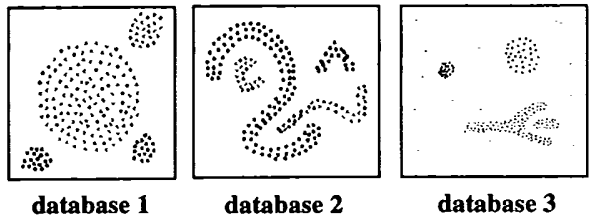

* [Back to Main](../../README.md)
---

# A Density-Based Algorithm for Discovering Clusters in Large Spatial Database with Noise
### Martin Ester, Hans-Peter Kriegel, Jorg Sander, Xiaowei Xu
* [Read Paper](../paper_pdfs/231008%20density_based_algo.pdf)

---

## 1. Introduction
* The task considered in this paper is class identification, i.e. the grouping of the objects of a database into meaningful subclasses.
* Requirements for clustering algorithms when applied to large spatial data.
  * **Minimal requirements of domain knowledge** to determine the input parameters, because appropriate values are often not known in advance when dealing with large databases.
  * **Discovery of clusters with arbitrary shape**, because the shape of clusters in spatial databases may be spherical, drawn-out, linear, elongated etc.
  * **Good efficiency on large databases**, i.e. on databases of significantly more than just a few thousand objects.
* This paper presents the new clustering algorithm DBSCAN.
  * DBSCAN 
    * Requires only one input parameter 
    * Supports the user in determining an appropriate value for it
    * Discovers clusters of arbitrary shape
    * Efficient even for large spatial databases.

  

## 2. Clustering Algorithms (Partitioning vs Hierarchical)
### 2.1 Partitioning Algorithms
* Props.)
  * Construct a partition of a database $D$ of $n$ objects into a set of $k$ clusters.
    * $k$ is an input parameter for these algorithms, i.e some domain knowledge is required which unfortunately is not available for many applications. 
  * Typically starts with an initial partition of $D$ and then uses an iterative control strategy to optimize an objective function. 
  * Each cluster is represented by the gravity center of the cluster ($k$-means algorithms) or by one of the objects of the cluster located near its center ($k$-medoid algorithms). 
  * Use a two-step procedure. 
    1. Determine $k$ representatives minimizing the objective function. 
    2. Assign each object to the cluster with its representative "closest" to the considered object. 
  * Very Restrictive.
    * Why?)
      * Consider the second step.
      * A partition is equivalent to a voronoi diagram 
      * Each cluster is contained in one of the voronoi cells. 
      * Thus, the shape of **all clusters found by a partitioning algorithm is convex** which is very restrictive.

#### Ex.) CLARANS (Clustering Large Applications based on RANdomized Search)
* An improved $k$-medoid method.
* Prop.)
  * Runs efficiently on databases of thousands of objects compared to former $k$-medoid algorithms
* Application)
  * Ng & Han (1994) 
    * Discuss methods to determine the "natural" number $k_{nat}$ of clusters in a database.
    * Run CLARANS **once** for each $k$ from 2 to n.
    * For each of the discovered clusterings the silhouette coefficient (Kaufman & Rousseeuw 1990) is calculated and the clustering with the maximum silhouette coefficient is chosen as the natural clustering
    * The run time of this approach is prohibitive for large n, because it implies $O(n)$ calls of CLARANS.
* Drawback
  * Assumes that all objects to be clustered can reside in main memory at the same time which does not hold for large database.
  * The run time of CLARANS is prohibitive on large databases
* DBSCAN's Improvement
  * Small enough to be memory resident and second
  * The run time of CLARANS on the objects of the focus is significantly less than its run time on the whole database.

 

#### 2.2 Hierarchical Algorithms
* Algorithms that create a hierarchical decomposition of the database $D$.
* Props.)
  * Represented by a *dendrogram*, a tree that iteratively splits $D$ into smaller subsets until each subset consists of only one object.
  * In such a hierarchy, each node of the tree represents a cluster of $D$.
  * Types
    1. Agglomerative Approach
       * From the leaves up to the root     
    2. Divisive Approach
       * From the root down to the leaves by merging or dividing clusters at each step
  * Do not need $k$ as an input.
    * [Partitioning Algorithms](#21-partitioning-algorithms) did.
  * A **termination condition** has to be defined.
    * Indicates when the merge or division process should be terminated. 
    * e.g) agglomerative approach
      * Critical distance $D_{min}$ between all the clusters of $Q$
    * **Requirements**
      * Small enough to separate all "natural" clusters 
      * Large enough such that no cluster is split into two parts
* Drawbacks)
  * The difficulty of deriving appropriate parameters for the termination condition
    * Improvements
      * Ejcluster (Garcfa, Fdez-Valdivia, Cortijo & Molina 1994) 
        * Automatically derives a termination condition in signal processing
        * The key idea is that two points belong to the same cluster if you can walk from the first point to the second one by a "sufficiently small" step. 
        * Follows the divisive approach. 
        * Advantages
          * Does not require any input of domain knowledge. 
          * Experiments show that it is very effective in discovering non-convex clusters.
        * Disadvantages
          * $O(n^2)$ runtime due to the distance calculation for each pair of points.
            * Prohibitive for applications on large databases
      * Jain (1988)
        * A density based approach to identify clusters in $k$-dimensional point sets.
        * The data set is partitioned into a number of non-overlapping cells and histograms are constructed.
        * Cells with relatively high frequency counts of points are the potential cluster centers and the boundaries between clusters fall in the "valleys" of the histogram.
        * Advantage
          * Has the capability of identifying clusters of any shape
        * Disadvantage
          * The space and run-time requirements for storing and searching multidimensional histograms can be enormous. 
          * The performance of such an approach depends on the size of the cells.

  

## 3. A Density Based Notion of Clusters
### Concept) Intuitive Notion about Density
We recognize a cluster when it has a typical density of points which is considerably higher than outside of the cluster.   

 

#### Settings
* Cluster
  * Formalization of "clusters" and "noise" in a database $D$ of points of some $k$-dimensional space $S$.
  * For each point of a cluster, the **neighborhood** of a given radius has to contain at least a minimum number of points.
    * i.e.) The density in the neighborhood has to exceed some threshold. 
* Neighborhood
  * The shape of a neighborhood is determined by the choice of a **distance function** for two points $p$ and $q$, denoted by $dist(p,q)$. 

  

#### Def.1) Eps-Neighborhood of a point $p$
$N_{Eps}(p) = \lbrace q \in D | dist(p,q) \le Eps \rbrace$

 

#### Def.2) Directly Density-Reachable
A point $p$ is directly density reachable from a point $q$ w.r.t. $Eps$ and $MinPts$ if
1. $p \in N_{Eps}(q)$ and
2. $|N_{Eps}(q)| \ge MinPts$ : core points condition
* Why needed?
  * Core Points vs Border Points
    * Core Points : Points inside of a cluster
    * Border Points : Points on the border of a cluster
  * Props.)
    * In general, a core point contains significantly more points in a Eps-Neighborhood compared to a border point.
    * Thus, we should set the minimum number of points to a relatively **low value** in order to include all points belonging to the same cluster. 
      * This value, however, will not be characteristic for the respective cluster - particularly in the presence of noise.
* Props.)
  * Directly density-reachable is symmetric for pairs of core points.
  * In general, however, it is not symmetric if one core point and one border point are involved.
  * 

 

#### Def.3) Density-Reachable
A point $p$ is density-reachable from a point $q$ w.r.t. $Eps$ and $MinPts$ if there is a chain of points $p_1, p_2, \dots, p_n$, $p_1 = q$, $p_n=p$ such that $p_{i+1}$ is [directly density-reachable](#def-2-directly-density-reachable) from $p_{i}$.
* Prop.)
  * Density-reachability is a canonical extension of [directly density-reachability](#def-2-directly-density-reachable).
  * This relation is transitive, but it is not symmetric.
    * ex.) Asymmetric Case
    * 
  * It is obvious that density-reachability is symmetric for core points.

 

#### Def.4) Density-Connected
A point $p$ is density-connected to a point $q$ w.r.t. $Eps$ and $MinPts$ if there is a point $o$ such that both, $p$ and $q$ are density-reachable from $o$ w.r.t. $Eps$ and $MinPts$.
* Why needed?
  * A concept that covers a relation between border points is needed.
  * why?
    * Two border points of the same cluster $C$ are possibly not density reachable from each other.
      * why?) The core point condition might not hold for both of them.
  * Meanwhile, There must be a core point in $C$ from which both border points of $C$ are density-reachable. 
* Prop.)
  * Symmetric
  * Reflexive
* Ex.)   

 

#### Def.5) Cluster
Let $D$ be a database of points. A cluster $C$ w.r.t. $Eps$ and $MinPts$ is a non-empty subset of $D$ satisfying the following conditions:
1. Maximality
   * $\forall p,q$, if $p \in C$ and $q$ is density-reachable from $p$ w.r.t. $Eps$ and $MinPts$, then $q \in C$
2. Connectivity
   * $\forall p,q \in C$, $p$ is density-connected to $q$ w.r.t. $Eps$ and $MinPts$.

 

#### Def.6) Noise
Let $C_1, \dots, C_k$ be the clusters of the database $D$ w.r.t. parameters $Eps_i$ and $MinPts_i$, $i = 1, \dots, k$. The noise is the set of points in the database $D$ not belonging to any cluster $C_i$.
* i.e.) noise = $\lbrace p \in D|p \notin C_i, \forall i \rbrace$

  

### Concept) Lemmata for validating the correctness of the clustering algorithm
Given the parameters $Eps$ and $MinPts$, we can discover a cluster in a two-step approach. 
1. Choose an arbitrary point from the database satisfying the core point condition as a seed. 
2. Retrieve all points that are density-reachable from the seed obtaining the cluster containing the seed.

#### Lemma 1)
Let $p$ be a point in $D$ and $|N_{Eps}(p) > MinPts|$.   
Then the set $O = \lbrace o | o \in D \space and \space o \space is \space density-reachable \space from \space p \space w.r.t. Eps \space and \space MinPts \rbrace$ is a cluster w.r.t. $Eps$ and $MinPts$.
* Meaning
  * A cluster $C$ w.r.t. $Eps$ and $MinPts$ is uniquely determined by any of its core points.
  * A cluster $C$ contains exactly the points which are density-reachable from an arbitrary core point of $C$.

 

#### Lemma 2)
Let $C$ be a cluster w.r.t. $Eps$ and $MinPts$ and let $p$ be any point in $C$ with $|N_{Eps}(p)| > MinPts$.  
Then $C$ equals to the set $O = \lbrace o | o \in D \space and \space o \space is \space density-reachable \space from \space p \space w.r.t. Eps \space and \space MinPts \rbrace$

  

## 4. DBSCAN: Density Based Spatial Clustering of Applications with Noise
* Objective
  * Discover the clusters and the noise in a spatial database according to [Def.5 (Cluster)](#def5-cluster) and [Def.6 (Noise)](#def6-noise).
* Required Inputs
  * $Eps$ and $MinPts$
  * Not easy to get this information in advance for all clusters of the database.
    * Nevertheless, there is a [simple and effective heuristic](#42-determining-the-parameters-eps-and-minpts) to determine the parameters $Eps$ and $MinPts$ of the "thinnest" cluster in the database.
      * Thinnest : least dense

 

### 4.1 The Algorithm
* Pseudo Code by the Authors
  |DBSCAN()|ExpandCluster()|
  |:-------|:--------------|
  |||
* Explanation
  * SetOfPOints.regionQuery(Point, Eps)
    * Returns the Eps-Neighborhood of Point in SetOfPoints
    * Can achieve $O(n \log{n})$ time complexity by using R*-Tree data structure for the database.
      * $O(\log{n})$ for the R*-Tree
      * $O(n)$ iterative calls of R*-Tree by DBSCAN
  * Tricky Case
    * For two clusters $C_1$ and $C_2$, there exists a point $p$ such that $p \in C_1 \wedge p \in C_2$.
      * Then $p$ must be a border point in both $C_1$ and $C_2$
      * In this algorithm, $p$ will be assigned to the cluster discovered first.
* [Python Implementation by hozy](../experiments/004_density_based_algo/Library.py)
  * [One-Dimensional Data Test](../experiments/004_density_based_algo/one_dim_test.py)

  

### 4.2 Determining the Parameters Eps and MinPts
#### Objective
Developing a simple but effective heuristic to determine the parameters $Eps$ and $MinPts$ of the *thinnest* cluster in the database.

 

#### The Heuristic
Let $d$ be the distance of a point $p$ to its $k$-th nearest neighbor.   

* Prop. 1) For **almost all** points $p$, the $d$-neighborhood of $p$ contains exactly $(k+1)$ points.
  * cf.) Rarely, the $d$-neighborhood of $p$ may have has more than $(k+1)$ points when several points have exact $d$ distances from $p$, which is very unlikely. 
* Prop. 2) Changing $k$ does not result in significant change in $d$
  * cf.) Again rarely, if points are located in a straight line, it may happen, which is very unlikely.

* Defs.)
  * $k$-$dist$
    * A function from the database $D$ to the real numbers, mapping each point to the distance from its $k$-th nearest neighbor.
  * sorted $k$-$dist$ graph
    * A graph that the vertical axis is the $k$-$dist$ of each point and the horizontal axis is the points $p$ sorted by their $k$-$dist$ values.
  * Threshold Point
    * The first point in the first valley of the sorted $k$-$dist$ graph.
    * This point indicates a special point that a significant change in the decreasing trend of the $k$-$dist$ value takes place.
    * With the *Threshold Point*...
      * **Noise**
        * Points on the left side of the *Threshold Point*
        * High $k$-$dist$ values
      * **Core Points**
        * Points on the right side of the *Threshold Point*
        * Low $k$-$dist$ values

* Suggested Interactive Approach
  * Suggestions
    1. The system computes and displays the 4-dist graph for the database.
    2. If the **user can estimate the percentage of noise**, this percentage is entered and the system derives a proposal for the threshold point from it.
    3. The user either accepts the proposed threshold or selects another point as the threshold point. The 4-dist value of the threshold point is used as the Eps value for DBSCAN.
  * Why?
    * Difficulty in detecting the threshold point automatically.
    * But easy for users to find it from the graphical representation
    * Increase in $k$ does not significantly differ from $k=4$.

  

## 5. Performance Evaluation : DBSCAN vs CLARANS
#### Why CLARANS?)
[CLARANS](#ex-clarans-clustering-large-applications-based-on-randomized-search) is the first and only clustering algorithm designed for the purpose of KDD.

 

#### DBSCAN settings)
C++ based implementation and R*-tree application

 

#### Evaluation)
Evaluate the accuracy of both algorithms by visual inspection
* why?
  * Clustering algorithms have no common quantitative measure of the classification accuracy.

 

#### Data)
* DB1 : Four ball-shaped clusters with different sizes
* DB2 : Four clusters of non-convex shape
* DB3 : Four clusters with different shape and size with additional noise.   

 

#### Result)
* Accuracy
  |CLARANS|DBSCAN (winner)|
    |:-----|:----|
    |CLARANS splits clusters if they are relatively large or if they are close to some other cluster. CLARANS has no explicit notion of noise. Instead, all points are assigned to their closest medoid.|DBSCAN discovers all clusters (according to [def.5](#def5-cluster)) and detects the noise points (according to [def.6](#def6-noise)) from all sample databases.|
    |||
* Efficiency
  |CLARANS|DBSCAN (winner)|
    |:-----|:----|
    |The run time of CLARANS is close to quadratic in the number of points.|The run time of DBSCAN is slightly higher than linear in the number of points.|

 

---
* [Back to Main](../../README.md)