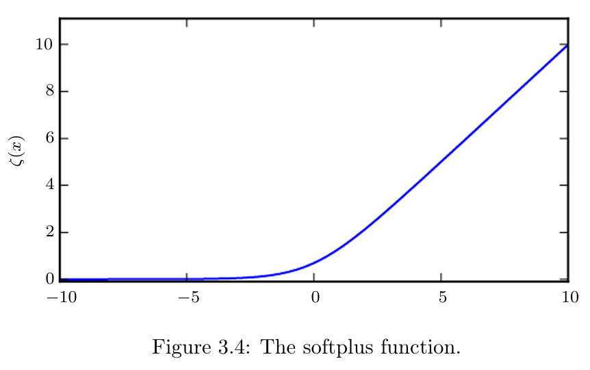

* [Back to Deep Learning MIT](../../main.md)

#  3.10 Useful Properties of Common Functions

### Concept) Logistic Sigmoid
- Def.)
  - $`\displaystyle\sigma(x) = \frac{1}{1+\exp{(-x)}}`$
- Usages)
  - Generating $`\phi`$ of the [Bernoulli distribution](../09/note.md#391-bernoulli-distribution).
- Props.)
  - $`\displaystyle\sigma(x) = \frac{\exp(x)}{\exp(x) + \exp(0)}`$
  - $`\displaystyle\frac{d}{dx}\sigma(x) = \sigma(x)(1-\sigma(x))`$
  - $`\displaystyle 1-\sigma(x) = \sigma(-x)`$
  - $`\displaystyle \sigma^{-1}(x) = \log{\left(\frac{x}{1-x}\right)}, \forall x \in (0,1)`$

 

### Concept) Softplus
- Def.)
  - $`\varsigma(x) = \log{(1+\exp(x))}`$
    - cf.) A smoothed version of the function $`x^{+} = \max(0, x)`$
- Usages)
  - Generating $`\sigma, \beta`$ of the [Gaussian distribution](../09/note.md#393-gaussian-distribution-normal-distribution).
- Props.)
  - $`\displaystyle \log\sigma(x) = -\varsigma(-x)`$
  - $`\displaystyle \frac{d}{dx} \varsigma(x) = \sigma(x)`$
  - $`\displaystyle \varsigma^{-1} = \log(\exp(x)-1), \forall x \gt 0`$ : the logit function
  - $`\displaystyle \varsigma(x) = \int_{-\infty}^x \sigma(y)dy`$
  - $`\displaystyle \varsigma(x) - \varsigma(-x) = x`$

 

* [Back to Deep Learning MIT](../../main.md)