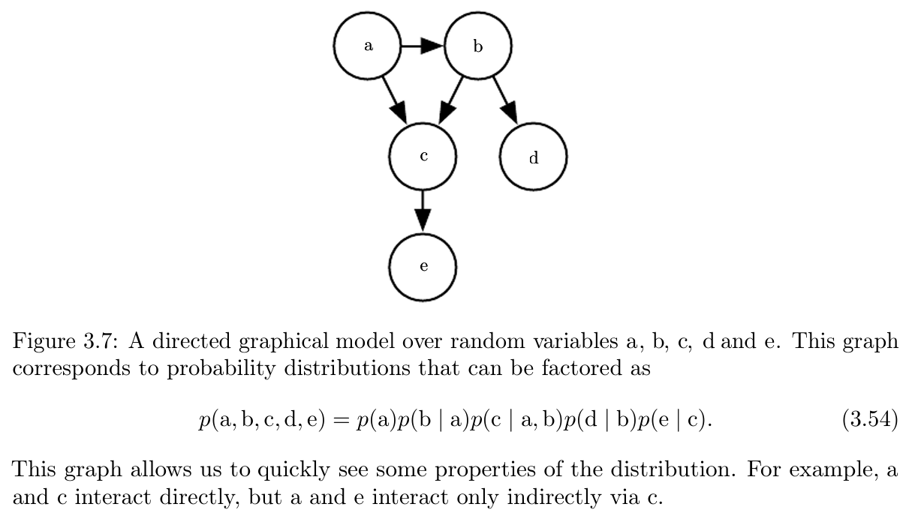
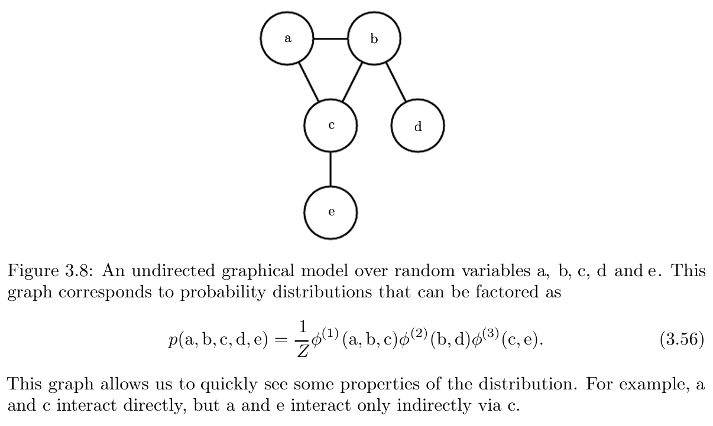

* [Back to Deep Learning MIT](../../main.md)

# 3.14 Structured Probabilistic Models

### Concept) Probability Distribution Factorization
- e.g.)
  - Suppose
    - $a,b,c$ : random variables
      - where
        - $`a`$ influences the value of $`b`$.
        - $`b`$ influences the value of $`c`$. 
        - $`a`$ and $`c`$ are independent given $`b`$.
  - Then, $`p(a,b,c) = p(a) \cdot p(b|a) \cdot p(c|b)`$
    - why?)   
      $`\begin{aligned}
        p(a,b,c) & = p(a \cap c | b) \cdot p(b) \\
        &= (p(a|b) \cdot p(c|b)) \cdot p(b) & \because a,c \textrm{ are indep. given } b \\
        &= p(a) \cdot p(b|a) \cdot p(c|b) & \because p(a) \cdot p(b|a) = p(a\cap b) = p(b)\cdot p(a|b)
      \end{aligned}`$
- Why doing this?)
  - In the probability distribution, the **parameter** denote the **probability** that a random variable takes certain value.
    - e.g.) Tossing a Coin
      - Parameters : $`p(H), p(T)`$
  - In joint probabilities problem, the number of parameters usually grows exponentially.
    - e.g.) Three Dices
      - Parameters : $`p(1,1,1), p(1,1,2), \cdots, p(6,6,5), p(6,6,6)`$
        - i.e.) $`6^3`$ parameters
  - Applying factorization, we can **reduce the number of parameters** in the ML model.
    - Why?)
      - Suppose the random variables $`a,b,c`$ can take $`A,B,C`$ number of values respectively.
      - In case of $`p(a,b,c)`$ we should set $`A\times B\times C`$ number of parameters.
      - However, in case of $`p(a) \cdot p(b|a) \cdot p(c|b)`$, we need $`A + A\times B + C\times B`$ number of parameters.
    - More efficient calculation process!

 

### Concept) Structured Probabilistic Model (Graphical Model)
- Desc.)
  - Graphically represented [factorization of a probability distribution](#concept-probability-distribution-factorization)
- Types)
  - [Directed Model](#concept-directed-model)
  - [Undirected Model](#concept-undirected-model)
- Prop.)
  - Being directed or undirected is not a property of a probability distribution.
  - It is a property of a particular **description** of a probability distribution.

 

#### Concept) Directed Model
- Settings)
  - Edges are directed.
  - These interactions between random variables are denoted by the conditional probabilities.
    - cf.) $`p(\mathbf{x}_i | Pa_\mathcal{G}(\mathbf{x}_i))`$ below.
- Def.)
  - $`\displaystyle p(\mathbf{x}) = \prod_i p(\mathbf{x}_i | Pa_\mathcal{G}(\mathbf{x}_i))`$
    - where
      - $`\mathcal{G}`$ : the graph
      - $`\mathbf{x}_i \in \mathbf{x}`$ : the $`i`$-th random variable
      - $`Pa_\mathcal{G}(\mathbf{x}_i)`$ : the parents of $`\mathbf{x}_i`$

e.g.)   

 

#### Concept) Undirected Model
- Settings)
  - Edges are undirected.
  - These interactions between random variables are denoted by the set of functions.
  - Clique : A set of nodes that are all connected to each other in $`\mathcal{G}`$.
    - Notation) $`\mathcal{C}^{(i)}`$ 
  - Factor : Each clique $`\mathcal{C}^{(i)}\in\mathcal{G}`$ is associated with a function called the factor $`\phi^{(i)}\left(\mathcal{C}^{(i)}\right)`$ 
    - cf.) 
      - Factors are NOT probability distributions.
      - Output of each factor must be non-negative.
      - No constraint that $`\displaystyle\sum_\mathcal{i\in G}\phi^{(i)} = 1`$
- Def.)
  - $`\displaystyle p(\mathbf{x}) = \frac{1}{Z} \prod_i \phi^{(i)}\left(\mathcal{C}^{(i)}\right)`$
    - where 
      - $`Z\in \mathbb{R}`$ : the normalizing constant
        - such that $`Z`$ is the sum or integral over all states of the product of the $`\phi`$ functions.
          - i.e.) $`\displaystyle Z = \sum_\mathcal{i\in G}\phi^{(i)}`$
- Prop.)
  - The probability of a configuration of random variables $`(p(\mathbf{x}))`$ is proportional to the product of all of these factors $`Z`$.

e.g.)   

 

* [Back to Deep Learning MIT](../../main.md)