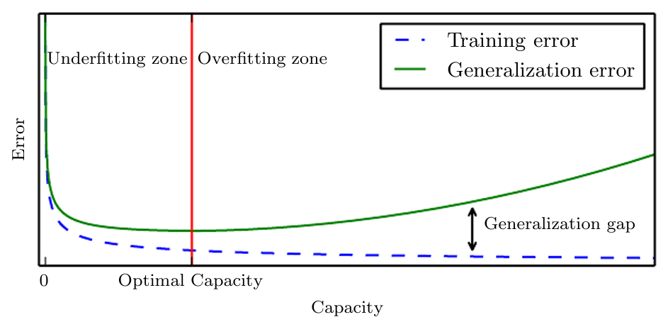
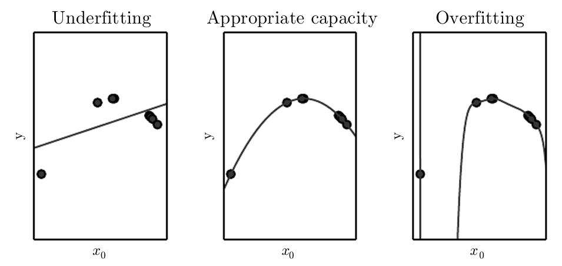
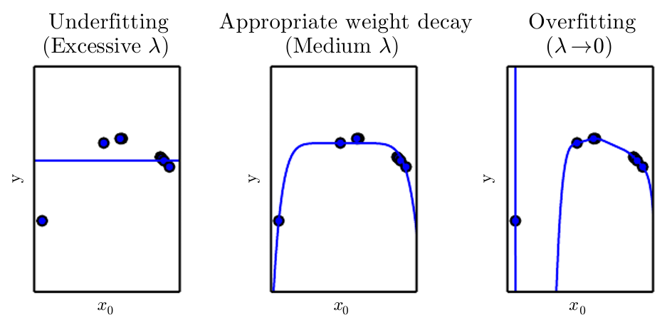

* [Back to Deep Learning MIT](../../main.md)

# 5.2 Capacity, Overfitting and Underfitting

#### Concept) Generalization
- Desc.)
  - The central challenge in machine learning is that we must perform well on new, **previously unseen** inputs.
    - The ability to perform well on previously unobserved inputs is called the **generalization**.
  - Optimization during the training reduces the **training error**.
    - e.g.)
      - $`\displaystyle \min_w \textrm{MSE}_{(\textrm{train})} = \frac{1}{m} ||\hat{y}^{(\textrm{train})} - y^{(\textrm{train})}||^2_2`$
  - Meanwhile, the **generalization error (test error)** should also be minimized.
    - e.g.)
      - $`\displaystyle\textrm{MSE}_{(\textrm{test})} = \frac{1}{m} ||\hat{y}^{(\textrm{test})} - y^{(\textrm{test})}||^2_2`$
  - If the **training** and the **test set** are collected arbitrarily, reducing the **training error** can achieve reducing the **test error**.
    - Concept) Data Generating Process
      - Desc.)
        - The **train** and **test data** are generated by a probability distribution over datasets called the **data generating process**.
        - Assume iid. (Independent and Identically Distributed)
          - i.e.) The examples in each dataset are **independent** from each other, and that the train set and test set are **identically distributed**, drawn from the same probability distribution as each other. 
            - This shared underlying distribution is called the **data generating distribution**, $`p_{\textrm{data}}`$.
      - Prop.)
        - The **expected training error** of a randomly selected model is equal to the **expected test error** of that model.
          - In reality, the **expected test error** is greater than or equal to the **expected value of training error**.
            - Why?)
              - In practice we sample according to the following sequence.
                - Sample training set first.
                - Use it to choose parameters to reduce the training set error.
                - Sample the test set.
                - Test.
  - Typically, generalization error has a U-shaped curve as a function of model capacity. 
    

 

#### Concept) Underfitting vs Overfitting
- Desc.)
  - **Underfitting** occurs when the model is not able to obtain a sufficiently low error value on the training set.
    - i.e.) Not properly optimized to the training data.
  - **Overfitting** occurs when the gap between the training error and test error is too large.
    - i.e.) Too much optimized to the training data. 
      - Not properly generalizing.
- Sol.)
  - We can control whether a model is more likely to overfit or underfit by altering its [capacity](#concept-capacity).

 

#### Concept) Capacity
- Desc.)
  - Informally, a model’s capacity is its ability to fit a wide variety of functions.
    - Models with **low capacity** may struggle to fit the training set.
    - Models with **high capacity** can overfit by memorizing properties of the training set that do not serve them well on the test set.   
      
  - One way to control the capacity of a learning algorithm is by choosing its **hypothesis space**.
    - i.e.) By changing the **number of input features** it has, and simultaneously **adding new parameters** associated with those features.
- Concept) **Representational Capacity**
  - The model specifies **which family of functions** the learning algorithm can choose from when varying the parameters in order to reduce a training objective.
    - In practice, the learning algorithm does not actually find the best function.
    - Instead, it's the one that significantly reduces the training error.
    - Thus, a learning algorithm's **effective capacity** may be less than the **representational capacity** of the model family.
- How to Quantify the Model Capacity)
  - Use [Vapnik-Chervonenkis dimension (VC dimension)](../../../ml_tom_mitchell/ch07/04/note.md#def-the-vapnik-chervonenkis-dimension).
    - Recall that the [upper/lower bound](../../../ml_tom_mitchell/ch07/04/note.md#concept-upper-bound-on-sample-complexity) of the discrepancy between the training error and generalization error is provided.
      - Increasing the capacity increases the discrepancy.
      - Increasing the number of training example decreases the discrepancy.
    - But they are rarely used in practice when working with deep learning algorithms.
      - Why?)
        - The bounds are often quite loose.
        - It can be quite difficult to determine the capacity of deep learning algorithms.
          - The problem of  determining the capacity of a deep learning model is especially difficult because the effective capacity is limited by the capabilities of the optimization algorithm, and we have little theoretical understanding of the very general non-convex optimization problems involved in deep learning.
- How to reach the extreme capacity of the model)
  - Use [non-parametric](#concept-non-parametric-model) models.

 

#### Concept) Non-Parametric Model
- Desc.)
  - Parametric models learn a function described by a parameter vector whose size is finite and fixed before any data is observed.
  - Non-parametric models have no such limitation.
- e.g.)
  - Nearest Neighbor Regression
  - Wrapping parametric learning algorithm inside another algorithm that increases the number of parameters as needed.
    - e.g.)
      - An outer loop of learning that changes the degree of the polynomial learned by linear regression on top of a polynomial expansion of the input.

 

#### Concept) Bayes Error
- Desc.)
  - Suppose there exists an ideal oracle model that knows the true probability distribution that generates the data.
  - Even such a model will still incur some error on many problems, because there may still be some noise in the distribution.
  - The error incurred by an oracle making predictions from the true distribution is called the **Bayes Error**.
- Props.)
  - The size of the training set and errors.
    - Expected generalization error can never increase as the number of training examples increases.
    - For non-parametric models, more data yields better generalization until the best possible error is achieved.
    - Any fixed parametric model with less than optimal capacity will asymptote to an error value that exceeds the Bayes error.
    - Note that it is possible for the model to have optimal capacity and yet still have a large gap between training and generalization error.

  

### Theorem) The No Free Lunch Theorem
- Theorem)
  - Averaged over all possible data generating distributions, every **classification algorithm** has the **same error rate** when classifying previously **unobserved points**.
    - i.e.) No machine learning algorithm is universally any better than any other.
- Props.)
  - These results hold only when we average over **all** possible data generating distributions.
    - Thus, if we make assumptions about the kinds of **probability distributions** we encounter in real-world applications, then we can design learning algorithms that perform well on these distributions.
      - i.e.) There is NO best machine learning algorithm.
    - Hence, our goal is to understand 
      - what kinds of **distributions** are relevant to the “real world” that an AI  agent experiences
      - what kinds of machine learning **algorithms** perform well on data drawn from the kinds of data generating distributions we care about.

  

### Concept) Regularization
- Def.)
  - Regularization is any modification we make to a learning algorithm that is intended to **reduce its generalization error** but **not its training error**.
- Desc.)
  - We can also give a learning algorithm a preference for one solution in its hypothesis space to another.
    - i.e.) We can regularize a model that learns a function $`f(x;\theta)`$ by adding a penalty called a regularizer to the cost function.

#### e.g.) Weight Decay
- Desc.)
  - To perform linear regression with weight decay, we minimize a sum comprising both the mean squared error (MSE) on the training and a criterion $`J(w)`$ that expresses a preference for the weights to have smaller squared $`L^2`$ norm.
    - i.e.) $`J(w) = \textrm{MSE}_{\textrm{train}} + \lambda w^\top w`$
      - where $`\lambda`$ : a hyperparameter that controls the strength of our preference for smaller weights
  - Minimizing $`J(w)`$ results in a choice of weights that make a tradeoff between fitting the training data and being small.
    - This gives us solutions that have a **smaller slope**, or put weight on fewer of the features.

 

* [Back to Deep Learning MIT](../../main.md)