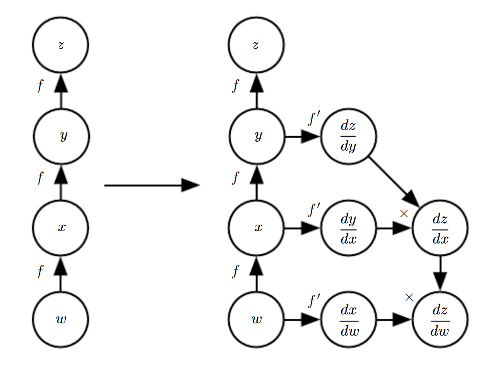

* [Back to Deep Learning MIT](../../main.md)

# 6.5 Back-Propagation and Other Differentiation Algorithms
- Consider a [feedforward neural network](../00/note.md#concept-deep-feedforward-network-multilayer-perceptron-mlp).
  - where
    - $`x`$ : input
    - $`\hat{y}`$ : output
     
#### Concept) Forward Propagation
- Desc.)
  - The inputs $`x`$ provide the initial information that then propagates up to the hidden units at each layer and finally produces.
  - It continues onward until it **produces a scalar [cost](../../ch04/03/note.md#concept-cost-function-loss-function-error-function)** $`J(\theta)`$.

#### Concept) Back-Propagation
- Desc.)
  - It allows the information from the cost to then flow backwards through the network, in order to **compute the [gradient](../../ch04/03/note.md#concept-gradient)**.
    - $`\nabla_x f(x,y)`$ : the gradient
      - where
        - $`f`$ : an arbitrary function
        - $`x`$ : a set of variables whose derivatives are desired
        - $`y`$ : an additional set variables that are inputs to the function but whose derivatives are not required
    - $`\nabla_\theta J(\theta)`$ : the gradient of the cost function with respect to the parameters
  - It refers **only** to the method for computing the gradient.
    - Other algorithms, such as [SGD](../../ch05/09/note.md#59-stochastic-gradient-descent), use the gradient to learn in the whole learning process.
  - In principle it can compute derivatives of any function.
    - i.e.) Not limited to [MLP](../00/note.md#concept-deep-feedforward-network-multilayer-perceptron-mlp)..
  - Back-propagation avoids the exponential explosion in repeated subexpressions.
    - Why?)
      - The back-propagation algorithm is designed to reduce the number of common subexpressions without regard to memory.
      - Specifically, it performs on the order of one Jacobian product per node in the graph.
      - Check that [Algorithm 2](#algorithm-2-back-propagation) visits each node from node $`u^{(j)}`$ to node $`u^{(i)}`$ of the graph exactly one in order to obtain the associated partial derivative $`\displaystyle\frac{\partial u^{(i)}}{\partial u^{(j)}}`$

<br><br>

## 6.5.1 Computational Graphs
Use computational graph language to describe the [back-propagation](#concept-back-propagation) more precisely.

#### Concept) Node
- Desc.)
  - Each node in the graph indicates a variable.
  - The variable may be 
    - scalar
    - vector
    - matrix
    - tensor
    - a variable of another type

#### Concept) Operation
- Desc.)
  - An operation is a **simple function** of one or more variables.
  - Our graph language is accompanied by a set of allowable operations. 
  - Complex functions are composed of multiple operations.
  - Without loss of generality, we define an operation to **return only a single output variable**.
    - The output variable can have multiple entries, such as a vector.

<br>

#### e.g.)


(a) $`z = xy`$ <br>
(b) $`\hat{y} = x^\top w + b`$ <br>
(c) $`H = \max(0, XW + b)`$ <br>
(d) $`\begin{cases}
    \hat{y} = x^\top w & \textrm{the prediction} \\
    u^{(3)} = \lambda \sum_i w_i^2 & \textrm{the weight decay} \\
\end{cases}`$ <br>


<br><br>

## 6.5.2 Chain Rule of Calculus
#### Concept) Scalar Chain Rule
- Let
  - $`f,g: \mathbb{R} \rightarrow \mathbb{R}`$
  - $`y = g(x)`$
  - $`z = f(y)`$
- Then the chain rule states that
  - $`\displaystyle \frac{dz}{dx} = \frac{dz}{dy} \frac{dy}{dx}`$

<br>


#### Concept) Vector Chain Rule
- Let
  - $`g: \mathbb{R}^m \rightarrow \mathbb{R}^n`$
  - $`f: \mathbb{R}^n \rightarrow \mathbb{R}`$
  - $`y = g(x)`$
  - $`z = f(y)`$
- Then the chain rule states that
  - $`\displaystyle \frac{dz}{dx_i} = \sum_j \frac{dz}{dy_j} \frac{dy_j}{dx_i}`$
  - Equivalently in vector notation,
    - $`\displaystyle \nabla_{x}z = \left( \frac{dy}{dx} \right)^\top \nabla_{y}z`$
      - where $`\displaystyle \left( \frac{dy}{dx} \right)`$ is the $`m\times n`$ Jacobian matrix of $`g`$.

<br>


#### Concept) Tensor Chain Rule
- Let
  - $`\mathsf{X}`$ : a tensor
    - where a single variable $`i`$ indices all the elements of $`\mathsf{X}`$.
  - $`\mathsf{Y} = g(\mathsf{X})`$
  - $`z = f(\mathsf{Y})`$
- Then
  - $`\displaystyle \frac{\partial z}{\partial \mathsf{X}}_i = \left( \nabla_\mathsf{X} z \right)_i`$
- Thus,
  - $`\displaystyle \nabla_\mathsf{X} z = \sum_j \left( \nabla_\mathsf{X} \mathsf{Y}_j \right) \frac{\partial z}{\partial \mathsf{Y}_j}`$

<br><br>

## 6.5.3 Recursively Applying the Chain Rule to Obtain Backprop
#### Setting)
- Variables)
  - `x` : an input vector
  - `U` : a vector of nodes $`u^{(1)}, u^{(2)}, \cdots, u^{(n)}`$
    - where
      - $`\{u^{(1)}, u^{(2)}, \cdots, u^{(n_i)}\}`$ : the input nodes
      - $`\{u^{(n_i+1)}, u^{(n_i+2)}, \cdots, u^{(n)}\}`$ : the outputs of the function applications
        - where
          - $`u^{(i)} = f^{(i)}\left(\mathbb{A}^{(i)}\right)`$
            - $`\mathbb{A}^{(i)} = \left\{u^{(j)} | \; j\in \textrm{Parent}\left(u^{(i)}\right)\right\}`$
      - $`u^{(n)}`$ : the final output node of the network
  - `F` : a vector of functions $`f^{(1)}, f^{(2)}, \cdots, f^{(n)}`$
    - i.e.) the edges!
  - `parent(u)` : a function that returns the parents of the node `u`.
```python
U = [None for _ in range(n)]
F = [None for _ in range(n)]

def parents(u)->List:
    # return the parents of u
```

<br>

#### Algorithm 1) Forward Computation
- Objective)
  - Perform computations mapping the $`n_i`$ inputs $`\{u^{(1)}, u^{(2)}, \cdots, u^{(n_i)}\}`$ to the output $`u^{(n)}`$.
    1. Assign $`u^{(i)} \leftarrow x_i \textrm{ for } i=1,2,\cdots,n_i`$.
    2. Assign $`u^{(i)} \leftarrow f^{(i)}\left(\mathbb{A}^{(i)}\right) \textrm{ for } i=n_i+1, n_i+2, \cdots, n`$.
    3. Return $`u^{(n)}`$.
  - The above process will generate a graph $`\mathcal{G}`$.
```python
def forward_computation(x, U, F):    
    for i in range(0, len(x)):
        U[i] = x[i]
    
    for i in range(len(x), len(U)):
        U[i] = F[i](parents(U[i]))

    return U[-1]
```

<br>

#### Algorithm 2) Back-Propagation
- Objective)
  - [Recall](#algorithm-1-forward-computation) that we generated a graph $`\mathcal{G}`$ that describes our network.
  - In order to perform back-propagation, we can construct a **computational graph** that depends on $`\mathcal{G}`$ and adds an extra set of notes to it.
    - These **computational graphs** form a subgraph $`\mathcal{B}`$ with one node per node of $`\mathcal{G}`$.
    - Computation in $`\mathcal{B}`$ proceeds in exactly the reverse of the order of computation in $`\mathcal{G}`$
      - where each node of $`\mathcal{B}`$ computes the derivative $`\displaystyle\frac{\partial u^{(n)}}{\partial u^{(i)}}`$ associated with the forward graph node $`u^{(i)}`$.
        - $`\displaystyle\frac{\partial u^{(n)}}{\partial u^{(j)}} = \sum_{i:j\in \textrm{Parent}(u^{(i)})} \frac{\partial u^{(n)}}{\partial u^{(i)}} \cdot \frac{\partial u^{(i)}}{\partial u^{(j)}}`$
          - i.e.) $`i`$ is a child of $`j`$.
    - $`\mathcal{B}`$ contains exactly one edge for each edge from node $`u^{(j)}`$ to node $`u^{(i)}`$ of $`\mathcal{G}`$ associated with $`\displaystyle\frac{\partial u^{(i)}}{\partial u^{(j)}}`$
```python
from collections import defaultdict

def back_propagation(x, U):

    def partial_derivative(x, y):
        result = 0 # Calculate the partial derivative dx/dy
        return result

    grad_table = defaultdict(float)
    grad_table[U[-1]] = 1

    for j in range(len(U)-1, 0, -1):
        temp =[]
        for i in parents(j):
            temp.append(partial_derivative(i,j))
        grad_table[U[j]] = temp
    
    return grad_table[:len(x)]
```

<br><br>

## 6.5.4 Back-Propagation Computation in Fully-Connected MLP
### E.g.) Example Fully-Connected MLP Back-Propagation
- Settings)
  - $`(x,y)`$ : a training example
  - $`\hat{y}`$ : the output of the neural network when $`x`$ is provided in input.
  - $`L(\hat{y}, y)`$ : the supervised loss

#### Algorithm 3) Forward propagation
An application of the [Algorithm 1](#algorithm-1-forward-computation).
- Settings)
  - Input Parameters)
    - $`l`$ : the depth of the network
    - $`W^{(i)}, i\in\{1,2,\cdots,l\}`$ : the weight matrices of the model
    - $`b^{(i)}, i\in\{1,2,\cdots,l\}`$ : the bias parameters of the model
    - $`x`$ : the input to process
    - $`y`$ : the target output
  - $`\Omega(\theta)`$ : a regularizer
    - where $`\theta`$ contains all the parameters (weights and losses)
- Algorithm)
  - $`h^{(0)} = x`$
  - `for` $`k=1,2,\cdots,l`$ `do`
    - $`a^{(k)} = b^{(k)} + W^{(k)}h^{(k-1)}`$
    - $`h^{(k)} = f\left(a^{(k)}\right)`$
  - `end for`
  - $`\hat{y} = h^{(l)}`$
  - $`J = L(\hat{y}, y) + \lambda\Omega(\theta)`$


<br>

#### Algorithm 4) Back-propagation
An application of the [Algorithm 2](#algorithm-2-back-propagation).
- Objective)
  - Yield the gradients on the activations $`a^{(k)}`$ for each layer $`k`$
- Algorithm)
  - $`g \leftarrow \nabla_{\hat{y}} J = \nabla_{\hat{y}} L(\hat{y}, y) \; \left(\because \frac{\partial \lambda\Omega(\theta)}{\partial \hat{y}} = 0\right)`$
  - `for` $`k=l, l-1, \cdots, 1`$ `do`
    - Convert the gradient on the layer's output into a gradient into the pre-nonlinearity activation:
      - $`g\leftarrow\nabla_{a^{(k)}} J = g \odot f'\left(a^{(k)}\right)`$
    - Compute gradients on weights and biases:
      - $`\nabla_{b^{(k)}} J = g + \lambda\nabla_{b^{(k)}}\Omega(\theta)`$
      - $`\nabla_{W^{(k)}} J = g\;(h^{(k-1)})^\top + \lambda\nabla_{W^{(k)}}\Omega(\theta)`$
    - Propagate the gradients w.r.t. the next lower-level hidden layer's activations:
      - $`g\leftarrow\nabla_{h^{(k-1)}}J = {W^{(k)}}^\top g`$
  - `end for`

<br><br>

## 6.5.5 Symbol-to-Symbol Derivatives
### Concept) Symbolic Representation
- Desc.)
  - Algebraic expressions and computational graphs both operate on symbols, or variables that **do not have specific values**. 
  - These algebraic and graph-based representations are called **symbolic representations**.
  - When we actually use or train a neural network, we must **assign specific values** to these symbols.
    - How?) Replace a symbolic input to the network $`x`$ with a specific numeric value, such as $`[1.2, 3.764, -1.8]^\top`$.

### Concept) Symbol-to-Number Differentiation
- Procedure)
  1. Take a computational graph and a set of numerical values for the inputs to the graph
  2. Return a set of numerical values describing the gradient at those input values.
- e.g.)
  - Torch
  - Caffe

<br>

### Concept) Symbol-to-Symbol Differentiation
- Procedure)
  1. Take a computational graph.
  2. Add additional nodes to the graph that provide a symbolic description of the desired derivatives.   
     
- e.g.)
  - Theano
  - TensorFlow
- Props.)
  - The primary advantage of this approach is that the derivatives are described in the same language as the original expression.
  - The description of the symbol-to-symbol based approach subsumes the [symbol-to-number approach](#concept-symbol-to-number-differentiation).
    - where the symbol-to-number approach does not expose the graph.

<br><br>

## 6.5.6 General Back-Propagation
- Structure)
  - $`\mathcal{G}`$ : the graph
  - $`\mathsf{V}`$ : a tensor which is a node of $`\mathcal{G}`$
    - It subsumes scalars, vectors, and matrices.
    - Each $`\mathsf{V}`$ is associated with the following subroutines.
      - `get_operation(V)`
        - Return the [operation](#concept-operation) that computes $`\mathsf{V}`$, represented by edges coming into $`\mathsf{V}`$.
          - e.g.) Matrix Multiplication
            - Suppose 
              - $`m,n,k \in \mathbb{R}`$
              - $`C = AB`$
                - where $`C\in\mathbb{R}^{m\times n}, A\in\mathbb{R}^{m\times k}, B\in\mathbb{R}^{k\times n}`$
            - Then `get_operation(C)` returns a Python or C++ **class** that represents the matrix multiplication.
      - `get_consumers(V, G)`
        - Return the list of variables that are children of $`\mathsf{V}`$ in $`\mathcal{G}`$.
      - `get_inputs(V, G)`
        - Return the list of variables that are parents of $`\mathsf{V}`$ in $`\mathcal{G}`$.
  - `op` : an [operation](#concept-operation)
    - Each `op` is associated with a `bprop` operation.
      - `bprop` computes a Jacobian-vector product as described by $`\displaystyle \nabla_\mathsf{X} z = \sum_j \left( \nabla_\mathsf{X} \mathsf{Y}_j \right) \frac{\partial z}{\partial \mathsf{Y}_j}`$.
        - Refer to the [tensor chain rule](#concept-tensor-chain-rule).
      - Syntax)
        - `op.bprop(inputs, X, G)` returns $`\displaystyle \sum_i\left(\nabla \mathsf{op.f(inputs)}_i \right) \mathsf{G}_i`$
          - where
            - `inputs` : a list of inputs supplied to `op`
            - `X` : one of the inputs in `inputs` that we want to compute gradient
            - `G` : the gradient on the output of `op`
            - `op.f` : the mathematical function that `op` implements
    - Each `op` is responsible for knowing how to back-propagate through the edges in the graph that it participates in.
      - e.g.) Matrix Multiplication $`C = AB`$.
        - Suppose the gradient of a scalar $`z`$ w.r.t. $`C`$ is given by $`G`$
        - The **matrix multiplication operation** is responsible for defining two back-propagation rules, one for each of its input arguments $`A \textrm{ and } B`$.
        - Thus, if we call `bprop` to request the gradient w.r.t. $`A`$ given that on the output is $`G`$,
          - then the `bprop` of the matrix multiplication operation must state that the gradient w.r.t. $`A`$ is given by $`GB^\top`$
        - Likewise, if we call the `bprop` method to request the gradient w.r.t. $`B`$, then the **matrix operation** is responsible for implementing the `bprop` method and specifying that the desired gradient is given by $`A^\top G`$
    - The back-propagation algorithm itself does not need to know any differentiation rules.
    - It only needs to call each operation’s `bprop` rules with the right arguments.
    - `op.bprop` must always pretend that all of its inputs are distinct from each other, even if they are not.
      - e.g.) Consider back-propagating `mul(x, x)`.
        - `bprop` should return `x` as the derivative w.r.t. both inputs.
        - Later, it adds both of the arguments to obtain `2x`.

#### Algorithm 5) Outermost Skeleton of the Back-Propagation Algorithm
- Input Parameters)
  - $`\mathbb{T}`$ : the target set of variables whose gradients must be computed
  - $`\mathcal{G}`$ : the computational graph
  - $`z`$ : the variable to be differentiated
- Algorithm)
  - Let $`\mathcal{G}'`$ be $`\mathcal{G}`$ pruned to contain only nodes that are ancestors of $`z`$ and descendents of nodes in $`\mathbb{T}`$.
  - Initialize `grad_table`, which is a data structure associating tensors to their gradients.
  - `grad_table[z]` $`\leftarrow 1`$
  - `for` $`\mathsf{V} \in \mathbb{T}`$ `do`
    - `build_grad(V, G, G', grad_table)`
      - Refer to [Algorithm 6) build_grad](#algorithm-6-build_grad).
  - `end for`
  - `return` `grad_table` restricted to $`\mathbb{T}`$

<br>

#### Algorithm 6) build_grad
- Input Parameters)
  - $`\mathsf{V}`$ : the variable whose gradient should be added to $`\mathcal{G}`$ and `grad_table`
  - $`\mathcal{G}`$ : the graph to modify
  - $`\mathcal{G'}`$ : the restriction of $`\mathcal{G}`$ to nodes that participate in the gradient
  - `grad_table`
- Algorithm)
  - `if` $`\mathsf{V}`$ `in` `grad_table` `then`
    - `return` `grad_table(V)`
  - `end if`
  - $`i \leftarrow 1`$
  - `for` $`\mathsf{C} \in`$ `get_consumers(V, G')` `do`
    - `op` $`\leftarrow`$ `get_operation(C)`
    - $`\mathsf{D} \leftarrow`$ `build_grad(C, G, G', grad_table)`
    - $`\mathsf{G}^{(i)} \leftarrow`$ `op.bprop(get_inputs(C, G'), V, D)`
    - $`i \leftarrow i+1`$
  - `end for`
  - $`\displaystyle \mathsf{G} \leftarrow \sum_i \mathsf{G}^{(i)}`$
  - `grad_table[V]` $`= \mathsf{G}`$
  - Insert $`\mathsf{G}`$ and the operations creating it into $`\mathcal{G}`$.
  - `return` $`\mathsf{G}`$.

<br>

### Analysis) Running Time of the Back-Propagation Algorithm
- Assumptions)
  - If we assume that each operation evaluation has roughly the same cost, then we may analyze the computational cost in terms of the number of operations executed.
  - This analysis refer to an operation as the fundamental unit of our computational graph, which might actually consist of very many arithmetic operations.
    - e.g.) A unit may consist of a matrix multiplication.
  - Thus, the runtime of each operation may be highly variable.
- Derivation)
  - Computing a gradient in a graph with n nodes will never execute more than $`O(n^2)`$ operations or store the output of more than $`O(n^2)`$ operations.
  - Computing the gradient requires as most $`O(n^2)`$ operations.
    - Why?) The **forward propagation** stage will at worst execute all $`n`$ nodes in the original graph.
  - The **back-propagation** algorithm adds one Jacobian-vector product, which should be expressed with $`O(1)`$ nodes, per edge in the original graph.
    - Because the computational graph is a **directed acyclic graph** it has **at most** $`O(n^2)`$ edges.
    - In practice, most neural network cost functions are roughly chain-structured, causing back-propagation to have $`O(n)`$ cost.
  - Thus, the potential exponential cost can be denoted as
    - $`\displaystyle \frac{\partial u^{(n)}}{\partial u^{(j)}} = \sum_{\textrm{path}\left( u^{(\pi_{1})}, \cdots, u^{(\pi_{t})} \right)} \prod_{k=2}^t \frac{\partial u^{(\pi_{k})}}{\partial u^{(\pi_{k-1})}} `$
      - where $`\textrm{path}\left( u^{(\pi_{1})}, \cdots, u^{(\pi_{t})} \right)`$ is a path from $`\pi_1 = j`$ to $`\pi_t = n`$
  - We can think of back-propagation as a table-filling algorithm that takes advantage of storing intermediate results $`\frac{\partial u^{(n)}}{\partial u^{(i)}}`$.
    - Each node in the graph has a corresponding slot in a table to store the gradient for that node.
    - By filling in these table entries in order, back-propagation avoids repeating many common subexpressions.
    - This table-filling strategy is sometimes called **dynamic programming**.


<br>

* [Back to Deep Learning MIT](../../main.md)