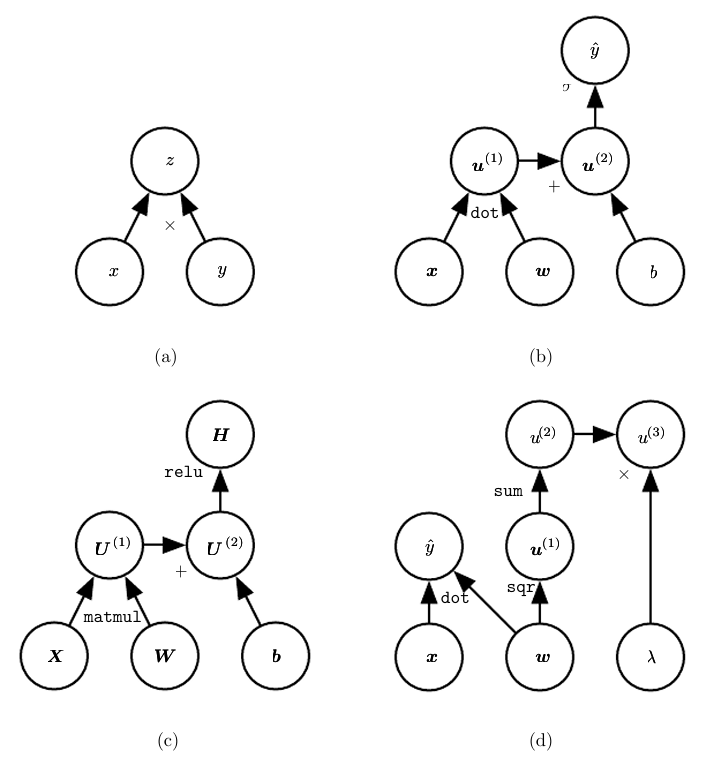

* [Back to Deep Learning MIT](../../main.md)

# 6.5 Back-Propagation and Other Differentiation Algorithms
- Consider a [feedforward neural network](../00/note.md#concept-deep-feedforward-network-multilayer-perceptron-mlp).
  - where
    - $`x`$ : input
    - $`\hat{y}`$ : output
     
#### Concept) Forward Propagation
- Desc.)
  - The inputs $`x`$ provide the initial information that then propagates up to the hidden units at each layer and finally produces.
  - It continues onward until it **produces a scalar [cost](../../ch04/03/note.md#concept-cost-function-loss-function-error-function)** $`J(\theta)`$.

#### Concept) Back-Propagation
- Desc.)
  - It allows the information from the cost to then flow backwards through the network, in order to **compute the [gradient](../../ch04/03/note.md#concept-gradient)**.
    - $`\nabla_x f(x,y)`$ : the gradient
      - where
        - $`f`$ : an arbitrary function
        - $`x`$ : a set of variables whose derivatives are desired
        - $`y`$ : an additional set variables that are inputs to the function but whose derivatives are not required
    - $`\nabla_\theta J(\theta)`$ : the gradient of the cost function with respect to the parameters
  - It refers **only** to the method for computing the gradient.
    - Other algorithms, such as [SGD](../../ch05/09/note.md#59-stochastic-gradient-descent), use the gradient to learn in the whole learning process.
  - In principle it can compute derivatives of any function.
    - i.e.) Not limited to [MLP](../00/note.md#concept-deep-feedforward-network-multilayer-perceptron-mlp)..
  - Back-propagation avoids the exponential explosion in repeated subexpressions.
    - Why?)
      - The back-propagation algorithm is designed to reduce the number of common subexpressions without regard to memory.
      - Specifically, it performs on the order of one Jacobian product per node in the graph.
      - Check that [Algorithm 2](#algorithm-2-back-propagation) visits each node from node $`u^{(j)}`$ to node $`u^{(i)}`$ of the graph exactly one in order to obtain the associated partial derivative $`\displaystyle\frac{\partial u^{(i)}}{\partial u^{(j)}}`$

<br><br>

## 6.5.1 Computational Graphs
Use computational graph language to describe the [back-propagation](#concept-back-propagation) more precisely.

#### Concept) Node
- Desc.)
  - Each node in the graph indicates a variable.
  - The variable may be 
    - scalar
    - vector
    - matrix
    - tensor
    - a variable of another type

#### Concept) Operation
- Desc.)
  - An operation is a **simple function** of one or more variables.
  - Our graph language is accompanied by a set of allowable operations. 
  - Complex functions are composed of multiple operations.
  - Without loss of generality, we define an operation to **return only a single output variable**.
    - The output variable can have multiple entries, such as a vector.

<br>

#### e.g.)


(a) $`z = xy`$ <br>
(b) $`\hat{y} = x^\top w + b`$ <br>
(c) $`H = \max(0, XW + b)`$ <br>
(d) $`\begin{cases}
    \hat{y} = x^\top w & \textrm{the prediction} \\
    u^{(3)} = \lambda \sum_i w_i^2 & \textrm{the weight decay} \\
\end{cases}`$ <br>


<br><br>

## 6.5.2 Chain Rule of Calculus
#### Concept) Scalar Chain Rule
- Let
  - $`f,g: \mathbb{R} \rightarrow \mathbb{R}`$
  - $`y = g(x)`$
  - $`z = f(y)`$
- Then the chain rule states that
  - $`\displaystyle \frac{dz}{dx} = \frac{dz}{dy} \frac{dy}{dx}`$

<br>


#### Concept) Vector Chain Rule
- Let
  - $`g: \mathbb{R}^m \rightarrow \mathbb{R}^n`$
  - $`f: \mathbb{R}^n \rightarrow \mathbb{R}`$
  - $`y = g(x)`$
  - $`z = f(y)`$
- Then the chain rule states that
  - $`\displaystyle \frac{dz}{dx_i} = \sum_j \frac{dz}{dy_j} \frac{dy_j}{dx_i}`$
  - Equivalently in vector notation,
    - $`\displaystyle \nabla_{x}z = \left( \frac{dy}{dx} \right)^\top \nabla_{y}z`$
      - where $`\displaystyle \left( \frac{dy}{dx} \right)`$ is the $`m\times n`$ Jacobian matrix of $`g`$.

<br>


#### Concept) Tensor Chain Rule
- Let
  - $`\mathsf{X}`$ : a tensor
    - where a single variable $`i`$ indices all the elements of $`\mathsf{X}`$.
  - $`\mathsf{Y} = g(\mathsf{X})`$
  - $`z = f(\mathsf{Y})`$
- Then
  - $`\displaystyle \frac{\partial z}{\partial \mathsf{X}}_i = \left( \nabla_\mathsf{X} z \right)_i`$
- Thus,
  - $`\displaystyle \nabla_\mathsf{X} z = \sum_j \left( \nabla_\mathsf{X} \mathsf{Y}_j \right) \frac{\partial z}{\partial \mathsf{Y}_j}`$

<br><br>

## 6.5.3 Recursively Applying the Chain Rule to Obtain Backprop
#### Setting)
- Variables)
  - `x` : an input vector
  - `U` : a vector of nodes $`u^{(1)}, u^{(2)}, \cdots, u^{(n)}`$
    - where
      - $`\{u^{(1)}, u^{(2)}, \cdots, u^{(n_i)}\}`$ : the input nodes
      - $`\{u^{(n_i+1)}, u^{(n_i+2)}, \cdots, u^{(n)}\}`$ : the outputs of the function applications
        - where
          - $`u^{(i)} = f^{(i)}\left(\mathbb{A}^{(i)}\right)`$
            - $`\mathbb{A}^{(i)} = \left\{u^{(j)} | \; j\in \textrm{Parent}\left(u^{(i)}\right)\right\}`$
      - $`u^{(n)}`$ : the final output node of the network
  - `F` : a vector of functions $`f^{(1)}, f^{(2)}, \cdots, f^{(n)}`$
    - i.e.) the edges!
  - `parent(u)` : a function that returns the parents of the node `u`.
```python
U = [None for _ in range(n)]
F = [None for _ in range(n)]

def parents(u)->List:
    # return the parents of u
```

<br>

#### Algorithm 1) Forward Computation
- Objective)
  - Perform computations mapping the $`n_i`$ inputs $`\{u^{(1)}, u^{(2)}, \cdots, u^{(n_i)}\}`$ to the output $`u^{(n)}`$.
    1. Assign $`u^{(i)} \leftarrow x_i \textrm{ for } i=1,2,\cdots,n_i`$.
    2. Assign $`u^{(i)} \leftarrow f^{(i)}\left(\mathbb{A}^{(i)}\right) \textrm{ for } i=n_i+1, n_i+2, \cdots, n`$.
    3. Return $`u^{(n)}`$.
  - The above process will generate a graph $`\mathcal{G}`$.
```python
def forward_computation(x, U, F):    
    for i in range(0, len(x)):
        U[i] = x[i]
    
    for i in range(len(x), len(U)):
        U[i] = F[i](parents(U[i]))

    return U[-1]
```

<br>

#### Algorithm 2) Back-Propagation
- Objective)
  - [Recall](#algorithm-1-forward-computation) that we generated a graph $`\mathcal{G}`$ that describes our network.
  - In order to perform back-propagation, we can construct a **computational graph** that depends on $`\mathcal{G}`$ and adds an extra set of notes to it.
    - These **computational graphs** form a subgraph $`\mathcal{B}`$ with one node per node of $`\mathcal{G}`$.
    - Computation in $`\mathcal{B}`$ proceeds in exactly the reverse of the order of computation in $`\mathcal{G}`$
      - where each node of $`\mathcal{B}`$ computes the derivative $`\displaystyle\frac{\partial u^{(n)}}{\partial u^{(i)}}`$ associated with the forward graph node $`u^{(i)}`$.
        - $`\displaystyle\frac{\partial u^{(n)}}{\partial u^{(j)}} = \sum_{i:j\in \textrm{Parent}(u^{(i)})} \frac{\partial u^{(n)}}{\partial u^{(i)}} \cdot \frac{\partial u^{(i)}}{\partial u^{(j)}}`$
          - i.e.) $`i`$ is a child of $`j`$.
    - $`\mathcal{B}`$ contains exactly one edge for each edge from node $`u^{(j)}`$ to node $`u^{(i)}`$ of $`\mathcal{G}`$ associated with $`\displaystyle\frac{\partial u^{(i)}}{\partial u^{(j)}}`$
- Props.)
  - d
```python
from collections import defaultdict

def back_propagation(U):
    grad_table = defaultdict(float)
    grad_table
```


<br>

* [Back to Deep Learning MIT](../../main.md)