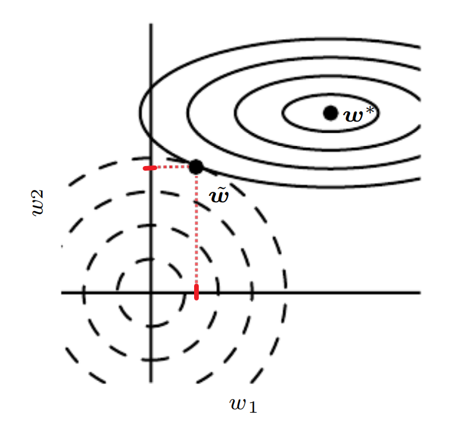

* [Back to Deep Learning MIT](../../main.md)

# 7.1 Parameter Norm Penalties

### Concept) Regularization in Deep Learning
- Def.)
  - Recall our [previous definition](../../ch05/02/note.md#concept-regularization).
  - Reducing the generalization error, not the training error.
- Props.)
  - Regularization of an estimator works by trading **increased** [bias](../../ch05/04/note.md#concept-bias) for **reduced** [variance](../../ch05/04/note.md#concept-variance-and-standard-error-of-estimator).
    - Recall the three situations regarding [underfitting and overfitting](../../ch05/02/note.md#concept-underfitting-vs-overfitting).
      - A model is trained either...
        - (1) excluded the true data generating process—corresponding to underfitting and inducing bias
          - i.e.) Underfitted
        - (2) matched the true data generating process
          - i.e.) Ideal Learning
        - (3) included the generating process but also many other possible generating processes
          - i.e.) Overfitted
      - The goal of regularization is to take a model from the (3) into the (2).

 

### Concept) Parameter Norm Penalty
- Desc.)
  - Used for regularization approaches based on limiting the capacity of models.
    - e.g.) neural networks, linear regression, or logistic regression
- In the Objective Function)
  - $`\tilde{J}(\theta; X, y) = J(\theta; X,y) + \alpha\Omega(\theta)`$
    - where
      - $`J(\theta; X,y)`$ : the standard objective function
      - $`\Omega(\theta)`$ : a parameter norm penalty
        - where $`\theta`$ denotes all of the parameters including weights $`w`$
      - $`\alpha\in[0,\infty)`$ : a hyperparameter that weights the relative contribution of the norm penalty term $`\Omega`$
- Props.)
  - For neural networks, we typically choose to use a parameter norm penalty $`\Omega`$ that **penalizes only the weights of the affine transformation at each layer** and **leaves the biases unregularized**.
    - Why?)
      - The **biases** typically require less data to fit accurately than the **weights**.
        - Each bias controls only a single variable.
      - On the other hand, each **weight** specifies how two variables interact.
        - Thus, fitting the weight well requires observing both variables in a variety of conditions.
      - Therefore, we do not induce too much variance by leaving the **biases** unregularized.
      - Also, regularizing the **bias** parameters can introduce a significant amount of underfitting.
  - $`w`$ indicates all of the **weights** that should be affected by the norm penalty.
    - The vector $`\theta`$ denotes all of the parameters.
  - In the context of neural networks, it is sometimes desirable to use a separate penalty with a different α coefficient for each layer of the network. 
    - Why?) It can be expensive to search for the correct value of multiple hyperparameters.
    - Still, it is reasonable to use the same weight decay at all layers just to reduce the size of search space.

  

## 7.1.1 L2 Parameter Regularization (Weight Decay)
- Def.)
  - $`\Omega(\theta) = \frac{1}{2} ||w||^2_2`$
    - where $`w`$ is the weight vector
- Other Names)
  - Weight Decay
  - Ridge Regression
  - Tikhonov Regularization
- Props.)
  - It **multiplicatively shrink the weight vector** by a constant factor on each step, just before performing the usual gradient update.
    - Refer to $`(1-\epsilon\alpha)`$ from [Analysis 1](#analysis-1-weight-decreasing-effect-in-gradient-descent).
    - Refer to $`\frac{\lambda_i}{\lambda_i + \alpha}`$ from [Analysis 2](#analysis-2-quadratic-approximation-to-the-objective-function)
  - It decays away the unimportant directions in the weight vector.
    - Desc.)
      - Only directions along which the parameters contribute significantly to reducing the objective function are preserved relatively intact.
      - In directions that do not **contribute to reducing the objective function**, a small eigenvalue of the Hessian tells us that **movement in this direction will not significantly increase the gradient**.
      - Components of the weight vector corresponding to such unimportant directions are decayed away through the use of the regularization throughout training.
    - Refer to [Analysis 3](#analysis-3-decaying-the-unimportant-direction) for the graphical description.

 

### Analysis 1) Weight Decreasing Effect in Gradient Descent
- Consider an objective function $`\tilde{J} = \frac{\alpha}{2} w^\top x + J(w;X,y)`$.
- The corresponding parameter gradient can be calculated as
  - $`\nabla_w \tilde{J} = \alpha w + \nabla_w J(w;X,y)`$.
- Then we may update the weight as   
  $`w\leftarrow w - \epsilon \left( \alpha w + \nabla_w J(w;X,y) \right) = (1-\epsilon\alpha)w -\epsilon\nabla_w J(w;X,y)`$
  - Here, the weight is multiplicatively decreasing with the factor $`(1-\epsilon\alpha)`$.

 

### Analysis 2) Quadratic Approximation to the Objective Function
- Objective)
  - We will use the quadratic approximation to derive the equation that explains the relationship between the nonregularized optimal weight $`(w^\ast)`$ and the $`L^2`$ regularized optimal weights $`(\tilde{w})`$.
    - $`\tilde{w} = (H+\alpha I)^{-1}Hw^\ast`$
    - $`\tilde{w} = Q(\Lambda + \alpha I) \Lambda Q^\top w^\ast`$
1. $`\tilde{w} = (H+\alpha I)^{-1}Hw^\ast`$
   - Derivation) 
     - Put $`w^\ast = \arg\min_w J(w)`$.
     - Then the quadratic approximation of $`J`$ near $`w^\ast`$ goes
       - $`\hat{J} = J(w^\ast) + \frac{1}{2}(w-w^\ast)^\top H(w-w^\ast)`$
         - where $`H`$ is the [Hessian matrix](../../ch04/03/note.md#concept-hessian-matrix) of  $`J`$ w.r.t. $`w`$ evaluated at $`w^\ast`$
       - cf.) There is no first-order term in this quadratic approximation, because $`w^\ast`$  is defined to be a minimum where the gradient vanishes.
       - cf.) Also, $`H`$ is [positive semidefinite](../../ch02/07/note. md#concept-positivenegative-definite).
     - The minimum of $`\hat{J}`$ occurs where its gradient $`\nabla_w\hat{J}(w) = H(w-w^\ast)`$  is equal to $`0`$.
     - If we add the $`L^2`$ regularization to $`\hat{J}`$, the gradient goes
       - $`\nabla_w\hat{J}(w) = \alpha w + H(w-w^\ast)`$
         - Why?)
           - Recall that $`\nabla_w \tilde{J} = \alpha w + \nabla_w J(w;X,y)`$.
           - i.e.) If we add the $`L^2`$ regularization, the term $`\alpha w`$ is added to the  gradient.
     - Letting $`\tilde{w}`$ represent the location of the minimum, the equation goes,   
       $`\begin{aligned}
         & \; \nabla_w\hat{J}(w) = 0 \\
         \Leftrightarrow & \; \alpha \tilde{w} + H(\tilde{w}-w^\ast) = 0 \\
         \Leftrightarrow & \; (H+\alpha I)\tilde{w} = Hw^\ast \\
         \Rightarrow & \; \tilde{w} = (H+\alpha I)^{-1}Hw^\ast
       \end{aligned}`$
   - Meaning)
     - $`\alpha\rightarrow 0 \Rightarrow \tilde{w}\rightarrow w^\ast`$.
       - i.e.) The effect of the weight decay diminishes.
2. $`\tilde{w} = Q(\Lambda + \alpha I) \Lambda Q^\top w^\ast`$
   - Derivation)
     - Recall that the [Hessian matrix](../../ch04/03/note.md#concept-hessian-matrix) $`H`$ is real and symmetric.
     - Thus, we can [eigendecompose](../../ch02/07/note.md#concept-eigendecomposition) it as
       - $`H = Q\Lambda Q^\top`$
         - where
           - $`\Lambda`$ : a diagonal matrix
           - $`Q`$ : an orthonormal basis of eigenvectors of $`H`$
     - Hence,     
       $`\begin{aligned}
         \tilde{w} &= (H+\alpha I)^{-1}Hw^\ast \\
         &= (Q\Lambda Q^\top +\alpha I)^{-1} Q\Lambda Q^\top w^\ast \\
         &= (Q (\Lambda + \alpha I) Q^\top)^{-1} Q\Lambda Q^\top w^\ast & \because QQ^\top = I \\
         &= Q(\Lambda + \alpha I) \Lambda Q^\top w^\ast & \because Q^{-1} = Q^\top
       \end{aligned}`$
    - Meaning)
      - Each component of $`w^\ast`$ aligned with the $`i`$-th eigenvector of $`H`$ is rescaled by a factor of $`\frac{\lambda_i}{\lambda_i + \alpha}`$.
      - Thus, if $`\alpha`$ increase, the rescaling effect of the weight decay increases, which in turn reduces the weights more.
        - If $`\lambda_i \gg \alpha`$, the effect of regularization is relatively small.
        - If $`\lambda_i \ll \alpha`$, the components of $`w^\ast`$ will shrunk to have nearly zero magnitude.

 

### Analysis 3) Decaying the Unimportant Direction

- Assumptions)
  - $`w = (w_1,w_2)\in\mathbb{R}^2`$ : the two dimensional weight
  - **(1) The solid ellipses** represent contours of equal value of the **unregularized objective**. 
    - In $`w_1`$ direction (horizontal)
      - The eigenvalue of the Hessian of $`J`$ is small.
      - The objective function does not increase much when moving horizontally away from $`w^\ast`$.
    - In $`w_2`$ direction (vertical)
      - The objective function is very sensitive to vertical movements away from $`w^\ast`$.
  - **(2) The dotted circles** represent contours of equal value of the $`L^2`$ **regularizer**.
- Optimization)
  - At $`w=\tilde{w}`$, the two competing objectives reach an equilibrium.
  - Because **the objective function (1)** does not express a strong preference along the $`w_1`$ direction, **the regularizer (2)** has a strong effect on this axis.
    - Thus, **the regularizer (2)** pulls $`w_1`$ close to zero.
  - In the $`w_2`$ direction, **weight decay (2)** affects the position of $`w_2`$ relatively little.

 

* [Back to Deep Learning MIT](../../main.md)