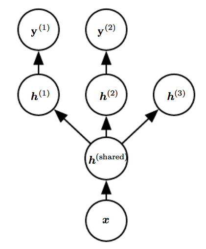

* [Back to Deep Learning MIT](../../main.md)

# 7.7 Multi-Task Learning
- Desc.)
  - Multi-task learning *(Caruana, 1993)* is a way to **improve generalization by pooling the examples** arising out of several tasks.
- Why does this work?)
  - Recall that **additional training examples** put more pressure on the parameters of the model towards values that generalize well.
  - Likewise, when **part of a model is shared across tasks**, that part of the model is more constrained towards good values, often yielding better generalization.
- Assumption)
  - Among the factors that explain the variations observed in the data associated with the different tasks, some are **shared** across two or more tasks.

  

### E.g.) Common Form of Multi-task Learning

- Assumption)
  - There exists a common pool of factors that explain the variations in the input $`\mathbf{x}`$, while each task is associated with a subset of these factors.
- Structure)
  - Different supervised tasks share...
    - the same input $`\mathbf{x}`$ 
    - the intermediate-level representation $`h^{(\textrm{shared})}`$
  - The model can generally be divided into two kinds of parts and associated parameters:
    1. Task-specific parameters
       - They benefit only from the examples of their task to achieve good generalization.
       - These are the upper layers of the neural network : $`h^{(1)}, h^{(2)}`$
         - $`h^{(i)}`$ predicts $`\mathbf{y}^{(i)}`$
       - Some of the top-level factors to be associated with none of the output tasks : $`h^{(3)}`$
         - These are the factors that explain some of the input variations but are not relevant for predicting $`\mathbf{y}^{(i)}`$
    2. Generic parameters
       - They are shared across all the tasks.
         - i.e.) They benefit from the pooled data of all the tasks.
       - These are the lower layers of the neural network : $`h^{(\textrm{shared})}`$

 

* [Back to Deep Learning MIT](../../main.md)