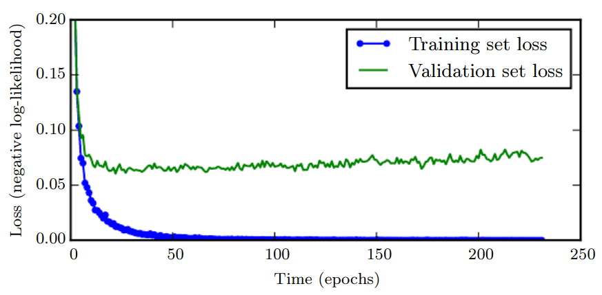
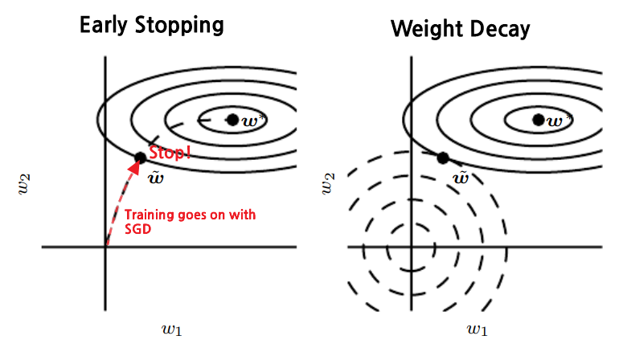

* [Back to Deep Learning MIT](../../main.md)

# 7.8 Early Stopping

### Algorithm) Early Stopping Meta-Algorithm
- Why needed?)
  - Recall the [overfitting](../../ch05/02/note.md#concept-underfitting-vs-overfitting) problem.
    - i.e.)
      - The training error decreases steadily over time.
      - While, validation set error begins to rise again.   
        
  - Thus, we may obtain a model with better validation set error by returning to the parameter setting at the point in time with the lowest validation set error.
    - How?)
      - Store a copy of the model parameters when the validation error decreases.
      - Return the copy with the best performance with the validation error, not the latest parameters.
- Algorithm)
  ```python
  def early_stopping(n, p, theta):
    '''
    n : the number of steps between evaluations
    p : the patience, i.e., the number of times to observe worsening validation set error before giving up
    theta : initial parameters
    '''
    curr_theta = theta
    i = j = 0
    v = maxsize
    final_theta = curr_theta
    final_i = i
    while j < p:
        curr_theta = train(n)   # Train for n times
        i += n
        v_temp = validation_set_error(curr_theta)   # Get the current validation error
        if v_temp < v:
            j, v, final_theta, final_i = 0, v_temp, curr_theta, i
        else:
            j += 1
    return final_theta, final_i  
  ```
- Props.)
  - Advantages)
    - Early stopping is an efficient hyperparameter selection algorithm.
      - Other hyperparameter choosing algorithms are very costly.
    - It requires almost no change in the underlying training procedure, the objective function, or the set of allowable parameters.
      - cf.) [Weight Decay](../01/note.md#711-l2-parameter-regularization-weight-decay)
        - It modifies the objective function.
        - It may trap the network in a bad local minimum by decaying the directions with small weights.
    - Reduces the computation cost of the training procedure by...
      1. Reducing the number of training dataset (trivial)
      2. No additional penalty term to the cost function
  - Costs)
    - Computational Cost
      - Why?) It requires periodic validation set evaluation.
      - Sol)
        - Use GPU or parallel computing.
        - Reduce the size of the validation set.
    - Memory Cost
      - Why?) It has to maintain a copy of the best parameters.
      - Negligible in practice.
        - Since the best parameters are written to infrequently and never read during training, these occasional slow writes have little effect on the total training time.
    - Need for the validation set.
      - i.e.) Less training example!
      - Sol.) Do additional training, with the data including the validation set.
        - Method 1)
          - Procedure)
            - Initialize the model again and retrain on all of the data.
            - In this second training pass, we train for the **same number of steps** as the early stopping procedure determined was optimal in the first pass.
          - Drawback)
            - No guarantee that the performance will improve by re-training for the same number of parameter updates or the same number of passes through the dataset.
            - On the second round of training, each pass through the dataset will require more parameter updates because the training set is bigger.
        - Method 2)
          - Procedure)
            - Keep the parameters obtained from the first round of training. 
            - Continue training but now using all of the data.
          - Drawback)
            - No guide for when to stop in terms of a number of steps.
              - Instead, we can monitor the average loss function on the validation set, and continue training until it falls below the value of the training set objective at which the early stopping procedure halted.
              - Still, there is no guarantee that the objective on the validation set will ever reach the target value

<br>

### Analysis) Early Stopping as a Regularization Method
- *Bishop (1995a)* and *Sjöberg and Ljung (1995)*
  - Early stopping has the effect of restricting the optimization procedure to a relatively small volume of parameter space in the neighborhood of the initial parameter value $`\theta_o`$



- "Early stopping is equivalent to $`L^2`$ regularization
  - pf.)
    - Settings)
      - Consider a cost function with [quadratic approximation](../01/note.md#analysis-7112-quadratic-approximation-to-the-objective-function) in the neighborhood of the empirically optimal value of weights $`w^\ast`$.
        - $`\displaystyle \hat{J}(\theta) = J(w^\ast) + \frac{1}{2}(w-w^\ast)^\top H (w-w^\ast)`$
          - where
            - $`J`$ : the unregularized cost function
            - $`H`$ : the Hessian matrix of $`J`$ w.r.t. $`w`$ evaluated at $`w^\ast`$
      - Given the assumption that $`w^\ast`$ is the minimum of $`J(w)`$, we know that $`H`$ is positive semidefinite.
      - Under a local Taylor series approximation, the gradient is given by
        - $`\nabla_w \hat{J}(w) = H(w-w^\ast)`$
    - Gradient Descent Approximation)
      - Assume the training with gradient descent.
        - where
          - $`\tau`$ : the optimization step
          - $`\epsilon`$ : the learning rate
      - Then, the approximate behavior of gradient descent on $`J`$ by analyzing gradient descent on $`\hat{J}`$ goes as   
        $`\begin{aligned}
           w^{(\tau)} &= w^{(\tau-1)} - \epsilon\nabla_w \hat{J}(w^{(\tau-1)}) \\
          &= w^{(\tau-1)} - \epsilon H(w^{(\tau-1)}-w^\ast) \\
          \Rightarrow w^{(\tau)} - w^\ast &= w^{(\tau-1)} - w^\ast - \epsilon H(w^{(\tau-1)}-w^\ast) \\
          &= \left(I - \epsilon H \right)(w^{(\tau-1)}-w^\ast) \\
        \end{aligned}`$
      - Consider the [eigenvalue decomposition](../../ch02/07/note.md#concept-eigendecomposition) of $`H`$ that goes
        - $`H = Q\Lambda Q^\top`$
          - where
            - $`\Lambda`$ : a diagonal matrix
            - $`Q`$ : an orthonormal basis of eigenvectors.
      - Thus,   
        $`\begin{aligned}
          w^{(\tau)} - w^\ast &= \left(I - \epsilon H \right)(w^{(\tau-1)}-w^\ast) \\
          &= \left(I - \epsilon Q\Lambda Q^\top \right)(w^{(\tau-1)}-w^\ast) \\
          \Rightarrow Q^\top (w^{(\tau)} - w^\ast) &= Q^\top \left(I - \epsilon Q\Lambda Q^\top \right)(w^{(\tau-1)}-w^\ast) \\
          &= \left(Q^\top - \epsilon \Lambda Q^\top \right)(w^{(\tau-1)}-w^\ast) \\
          &= \left(I - \epsilon \Lambda  \right) Q^\top (w^{(\tau-1)}-w^\ast) \\
        \end{aligned}`$
      - Assume that
        - $`w^{(0)} = 0`$
        - $`\epsilon`$ is small enough to satisfy $`|1-\epsilon\lambda_i| \lt 1`$
          - where $`\Lambda = \textrm{diag}(\lambda_i)`$.
      - Then   
        $`\begin{aligned}
          Q^\top (w^{(1)} - w^\ast) &=& \left(I - \epsilon \Lambda  \right) Q^\top (w^{(0)}-w^\ast) \\
          Q^\top (w^{(2)} - w^\ast) &=& \left(I - \epsilon \Lambda  \right) Q^\top (w^{(1)}-w^\ast) \\
          &\vdots&\\
          Q^\top (w^{(\tau)} - w^\ast) &=& \left(I - \epsilon \Lambda  \right) Q^\top (w^{(\tau-1)}-w^\ast) \\
        \end{aligned}`$
      - Thus,   
        $`\begin{aligned}
          Q^\top (w^{(\tau)} - w^\ast) &= (I - \epsilon \Lambda) Q^\top (w^{(\tau-1)}-w^\ast) \\ 
          &= (I - \epsilon \Lambda) Q^\top Q (I - \epsilon \Lambda) Q^\top(w^{(\tau-2)}-w^\ast) = (I - \epsilon \Lambda)^2 Q^\top (w^{(\tau-2)}-w^\ast) &\because Q^\top Q = I \\
          &= (I - \epsilon \Lambda)^3 Q^\top (w^{(\tau-3)}-w^\ast) \\
          &\vdots \\
          &= (I - \epsilon \Lambda)^\tau Q^\top (w^{(0)}-w^\ast) = -(I - \epsilon \Lambda)^\tau Q^\top w^\ast \\
        \end{aligned}`$
      - Hence,   
        $`\begin{aligned}
          Q^\top w^{(\tau)} &= Q^\top w^\ast -(I - \epsilon \Lambda)^\tau Q^\top w^\ast \\
          &= \left[ I-(I - \epsilon \Lambda)^\tau \right] Q^\top w^\ast \\
        \end{aligned}`$
    - Comparison with the $`L^2`$ regularized optimum
      - [Recall that the optimum](../01/note.md#analysis-7112-quadratic-approximation-to-the-objective-function) goes as
        - $`\tilde{w} = Q(\Lambda + \alpha I)^{-1} \Lambda Q^\top w^\ast `$
      - Thus,   
        $`\begin{aligned}
          Q^\top \tilde{w} &= (\Lambda + \alpha I)^{-1} \Lambda Q^\top w^\ast & \because Q^\top Q = I \\
          &= \left[I - (\Lambda+\alpha I)^{-1} \alpha\right] Q^\top w^\ast & \because (A)
        \end{aligned}`$
        - Why $`(A)`$?   
          - Consider that $`\displaystyle \Lambda^{-1} = \textrm{diag}(\lambda_i)^{-1} = \textrm{diag}\left(\frac{1}{\lambda_i}\right)`$.
          - Thus, $`\displaystyle(\Lambda + \alpha I)^{-1} = \textrm{diag}(\lambda_i + \alpha)^{-1} = \textrm{diag}\left(\frac{1}{\lambda_i+\alpha}\right)`$.
          - Hence,    
            $`\begin{aligned}
              (\Lambda + \alpha I)^{-1}\Lambda &= \textrm{diag}\left(\frac{\lambda_i}{\lambda_i+\alpha}\right)  = \textrm{diag}\left( 1 - \frac{\alpha}{\lambda_i+\alpha}\right) \\
              &= \textrm{diag}(1) - \textrm{diag}\left(\frac{1}{\lambda_i+\alpha}\right)\alpha \\
              &= I - (\Lambda+\alpha I)^{-1} \alpha
            \end{aligned}`$.
      - Now, let's compare the $`\tau`$-th parameter update and the $`L^2`$ regularized optimum.   
        $`\begin{cases}
            Q^\top w^{(\tau)} &= \left[ I-(I - \epsilon \Lambda)^\tau \right] Q^\top w^\ast \\
            Q^\top \tilde{w} &= \left[I - (\Lambda+\alpha I)^{-1} \alpha\right] Q^\top w^\ast \\
        \end{cases}`$
      - If $`\tau, \epsilon`$ are chosen to satisfy $`(I - \epsilon \Lambda)^\tau = (\Lambda+\alpha I)^{-1} \alpha`$,
        - the early stopping and the $`L^2`$ regularization becomes equivalent.
      - Further, if all $`\lambda_i`$ are small to satisfy $`\begin{cases} \displaystyle \epsilon\lambda_i \ll 1 \\ \displaystyle \frac{\lambda_i}{\alpha} \ll 1 \end{cases} `$, then $`\begin{cases} \displaystyle \tau \approx\frac{1}{\epsilon\alpha} \\ \displaystyle \alpha \approx \frac{1}{\tau\epsilon} \end{cases} `$
        - Why?)
          - Consider that $`\begin{cases} (I - \epsilon \Lambda)^\tau = \textrm{diag}\left( (1-\epsilon\lambda_i)^\tau \right) \\ (\Lambda+\alpha I)^{-1} \alpha = \displaystyle \textrm{diag}\left( 1 - \frac{\alpha}{\lambda_i+\alpha}\right) \end{cases}`$
          - Thus,   
            $`\begin{aligned}
                 (1-\epsilon\lambda_i)^\tau &= 1 - \frac{\alpha}{\lambda_i+\alpha} = 1 - \frac{1}{\frac{\lambda_i}{\alpha}+1} \\
                \Rightarrow \tau \log(1-\epsilon\lambda_i) &= \log \left(1 - \frac{\alpha}{\lambda_i+\alpha}\right) = \log \left(1 - \frac{1}{\frac{\lambda_i}{\alpha}+1}\right) \\
                \Rightarrow \tau\epsilon &\approx \frac{1}{\alpha}, \tau \approx \frac{1}{\epsilon\alpha}
            \end{aligned}`$
        \end{aligned}`$
    - Comparative advantage of the early stopping over the $`L^2`$ regularization
      - A trajectory of length $`\tau`$ ends at a point that corresponds to a minimum of the $`L^2`$-regularized objective.
      - However, early stopping typically involves monitoring the validation set error in order to stop the trajectory at a particularly good point in space.


<br>

* [Back to Deep Learning MIT](../../main.md)