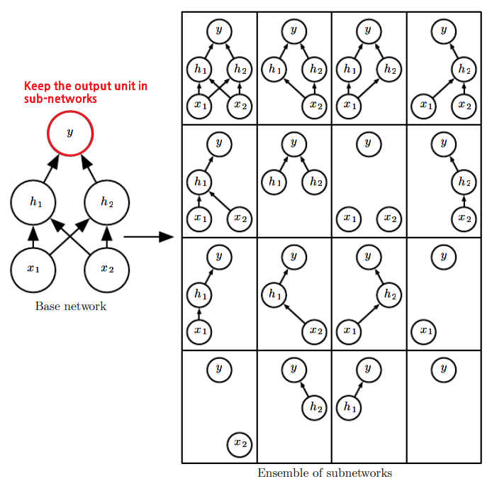
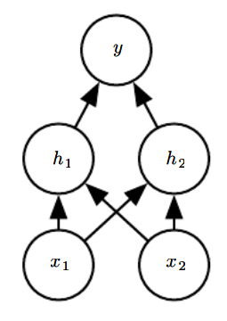
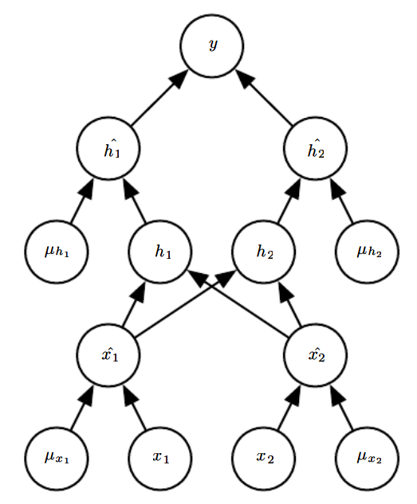

* [Back to Deep Learning MIT](../../main.md)

# 7.12 Dropout

## Desc.)
- A computationally inexpensive but powerful method of [regularizing](../01/note.md#concept-regularization-in-deep-learning) a broad family of models
- A method of making [bagging](../11/note.md#concept-bagging-bootstrap-aggregating) practical for [ensembles](../11/note.md#concept-model-averaging-strategy-ensemble-model) of very many large neural networks
  - Recall that [bagging](../11/note.md#concept-bagging-bootstrap-aggregating) involves training multiple models, and evaluating multiple models on each test example.
  - This can be **impractical** when each model is a **large neural network**.
    - why?) Training and evaluating such networks is costly in terms of runtime and memory.
  - **Dropout** provides an inexpensive approximation to training and evaluating a [bagged ensemble](../11/note.md#concept-bagging-bootstrap-aggregating) of exponentially many neural networks.
    - How?)
      - Set up ensembles consisting of all sub-networks that can be formed by removing non-output units from an underlying base network.   
        
        - cf.) There are multiple ways to remove a unit
          - We can effectively remove a unit from a network by **multiplying its output value by zero**.
          - For the [radial basis function](../../ch05/07/note.md#eg-gaussian-kernel-radial-basis-function-rbf) networks, take the difference between the unit's state and some reference value.
- Props.)
  - Advantages)
    - Dropout is computationally cheap.
      - $`O(n)`$ computation per example per update during training to generate $`n`$ random binary numbers and multiply them by the state.
      - Depending on the implementation, it may also require $`O(n)`$ memory to store these binary numbers until the back-propagation stage.
      - Running [inference](#tech-inference) in the trained model has the same cost per-example as if dropout were not used.
        - Still, we must [pay the cost of dividing the weights by 2](#concept-weight-scaling-rule) once before beginning to run inference on examples.
    - Dropout does not significantly limit the type of model or training procedure that can be used.
      - It works well with nearly any model that...
        - uses a distributed representation 
        - can be trained with [stochastic gradient descent](../../ch05/09/note.md#59-stochastic-gradient-descent).
      - e.g.)
        - feedforward neural networks, 
        - probabilistic models such as restricted Boltzmann machines (Srivastava et al., 2014)
        - recurrent neural networks
  - Disadvantages)
    - The cost of using **dropout** in a **complete system** can be significant.
      - Because dropout is a regularization technique, it reduces the effective [capacity](../../ch05/02/note.md#concept-capacity) of a model. 
      - To offset this effect, we must increase the size of the model. 
      - Typically the optimal validation set error is much lower when using dropout, but this comes at the cost of a much larger model and many more iterations of the training algorithm. 
      - For very large datasets, regularization confers little reduction in generalization error. 
      - In these cases, the computational cost of using dropout and larger models may outweigh the benefit of regularization.
    - When extremely few labeled training examples are available, dropout is less effective.
      - **Bayesian neural networks** (*Neal, 1996*) outperform dropout on the Alternative Splicing Dataset (*Xiong et al., 2011*) where fewer than 5,000 examples are available (*Srivastava et al., 2014*). 
      - When additional unlabeled data is available, **unsupervised feature learning** can gain an advantage over dropout.
  - Dropout is equivalent to $`L^2`$ weight decay when applied to linear regression.
    - *Wager et al. (2013)*
  - The **stochasticity** used while training with dropout is **not necessary** for the approach’s success.
    - It is just a means of approximating the sum over all sub-models.
    - **Fast dropout**, *Wang and Manning (2013)*
      - It resulted in faster convergence time due to the reduced stochasticity in the computation of the gradient.
  - The **stochasticity** is **not sufficient** to achieve the regularizing effect of dropout.
    - **Dropout Boosting**, *Warde-Farley et al. (2014)*
      - Dropout boosting trains the entire ensemble to jointly maximize the log-likelihood on the training set.
      - This approach is analogous to [boosting](../11/note.md#concept-boosting).
      - Experiments with dropout boosting show almost no regularization effect compared to training the entire network as a single model.
      - This demonstrates that the interpretation of dropout as [bagging](../11/note.md#concept-bagging-bootstrap-aggregating) has value beyond the interpretation of dropout as robustness to noise. 
      - The regularization effect of the bagged ensemble is only achieved when the stochastically sampled ensemble members are trained to perform well **independently** of each other.
    - **DropConnect**, *Wan et al., 2013*
      - It is a special case of dropout where each product between a single scalar weight and a single hidden unit state is considered a unit that can be dropped.
  - There is no need for this model averaging strategy to be based on inclusion and exclusion.
    - e.g.) $`\mu`$ with real-valued entries.
      - i.e.) $`\mu \sim \mathcal{N}(1, I)`$
      - Because $`\mathbb{E}[\mu] = 1`$, the standard network automatically implements approximate inference in the ensemble, without needing any weight scaling.
  - Dropout trains not just a bagged ensemble of models, but an ensemble of models that share hidden units.
    - This means each hidden unit must be able to perform well regardless of which other hidden units are in the model. 
    - Hidden units must be prepared to be swapped and interchanged between models.
  - A large portion of the power of dropout arises from the fact that the masking **noise** is applied to the hidden units.
    - This can be seen as a form of highly intelligent, **adaptive destruction** of the information content of the input 
      - rather than destruction of the raw values of the input.
    - e.g.)
      - If the model learns a hidden unit $`h_i`$ that detects a face by finding the nose, then dropping $`h_i`$ corresponds to erasing the information that there is a nose in the image.
      - The model must learn another $`h_i`$, either that redundantly encodes the presence of a nose, or that detects the face by another feature, such as the mouth.
    - Destroying extracted features rather than original values allows the destruction process to make use of all of the knowledge about the input distribution that the model has acquired so far.
  - The **noise** in dropout is multiplicative.
    - If the noise were additive with fixed scale, then a rectified linear hidden unit $`h_i`$ with added noise $`\epsilon`$ could simply learn to have $`h_i`$ become very large in order to make the added noise $`\epsilon`$ insignificant by comparison. 
    - Multiplicative noise does not allow such a pathological solution to the noise robustness problem.
  - **Batch Normalization**, reparametrizes the model in a way that introduces both additive and multiplicative noise on the hidden units at training time.

 

## Structure)
- Procedures)
  - Construct $`k`$ different datasets by sampling from the training set with replacement.
  - We will perform the [minibatch-based](../../ch05/09/note.md#59-stochastic-gradient-descent) learning algorithm for each $`i`$-th dataset  $`(i=1,2,\cdots,k)`$
    - For $`i`$-th dataset
      - Randomly sample a binary mask vector $`\mu`$ for each unit.
        - Desc.) $`\mu`$
          - The size of $`\mu`$ is equal to the number of units in the underlying base network.
          - If the $`j`$-th entry of $`\mu`$ is $`\begin{cases} 0\\1 \end{cases}`$, the $`j`$-th unit $`\begin{cases} \textrm{is removed} \\ \textrm{remains} \end{cases}`$.
            - e.g.)
              - $`x_1, x_2, h_1, h_2`$ : units
                - where
                  - $`x_i`$ : the input unit
                  - $`h_i`$ : the hidden unit
              - $`\mu = \begin{bmatrix} 1&0&0&1 \end{bmatrix} \Rightarrow`$ $`x_1, h_2`$ are included and $`x_2, h_1`$ are removed.
        - The mask for each unit must be **sampled independently** from all of the others.
          - The probability of sampling a mask value of one is a **hyperparameter** fixed before training begins.
            - Usually, 
              - $`0.5`$ for the hidden units 
              - $`0.8`$ for the input units.
      - Then we can define the cost of the model $`J(\theta, \mu)`$.
      - Optimization : Minimize $`\mathbb{E}_\mu J(\theta, \mu)`$
        - Why expectation?)
          - $`\mu`$ is randomly sampled with probabilities.
          - The expectation contains exponentially many terms but we can obtain an unbiased estimate of its gradient by sampling values of $`\mu`$.
        - Run forward propagation, backward-propagation, and the learning update.
  - To make a prediction, a bagged ensemble must accumulate votes from all of its members.
    - We refer to this process as [inference](#tech-inference) in this context.

- e.g.)    
  |Network|Graphic|Desc.|
  |:-:|:-|:-|
  |Underlying Base Network||- Two input units $`x_1, x_2`$   - Two output units $`h_1, h_2`$|
  |Dropout Network||- $`\mu = \begin{bmatrix} \mu_i \end{bmatrix} \textrm{, where } \mu_i \in \{0,1\}, i=1,2,3,4`$|

 

## Analysis) Comparison with Bagging
- Differences)
  ||[Bagging](../11/note.md#concept-bagging-bootstrap-aggregating)|Dropout|
  |:-|:-|:-|
  |Dependencies between sub-models|- Independent|- Models [share parameters](../09/note.md#tech-2-parameter-sharing).|
  |Training|- Each model is trained to convergence on its respective training set|- Typically most models are not explicitly trained at all.  - Instead, a tiny fraction of the possible sub-networks are each trained for a single step.  - And the parameter sharing causes the remaining sub-networks to arrive at good settings of the parameters.|
- Other than the above differences, **dropout** follows the [bagging]((../11/note.md#concept-bagging-bootstrap-aggregating)) algorithm.

  

## Tech.) Inference
- Objective)
  - Output a probability distribution from the [dropout](#desc) model.
- Desc.)
  - In the case of dropout, each sub-model defined by mask vector $`\mu`$ defines a probability distribution $`p(y|x,\mu)`$
  - Thus, the arithmetic mean over all masks is given by
    - $`\displaystyle\sum_\mu p(\mu)p(y|x,\mu)`$
      - where $`p(\mu)`$ is the probability distribution that was used to sample $`\mu`$
- Problem)
  - It is intractable to evaluate except in cases where the structure of the model permits some form of simplification.
    - why?) There are exponential number of $`\mu`$s
  - So far, deep neural nets are not known to permit any tractable simplification.
- Sols.)
  - Approximate the inference with sampling, by averaging together the output from many masks. 
    - Even 10-20 masks are often sufficient to obtain good performance.
  - Using Geometric Mean by *Warde-Farley et al. (2014)*
    - Settings)
      - To guarantee that the result is a probability distribution, we impose the requirement that none of the sub-models assigns probability $`0`$ to any event, and we re-normalize the resulting distribution.
        - why?) The geometric mean of multiple probability distributions is not guaranteed to be a probability distribution.
      - The **unnormalized probability distribution** defined directly by the geometric mean is given by
        - $`\displaystyle \tilde{p}_{\textrm{ensemble}}(y|x) = \sqrt[^{2^d}]{\prod_\mu p(y|x,\mu)}`$
          - where $`d`$ is the number of units that may be dropped.
      - For simplicity, use a uniform distribution over $`\mu`$
        - cf.) Non-uniform distributions are also possible.
    - Procedures)
      - Get $`\tilde{p}_{\textrm{ensemble}}(y|x)`$ for each $`(y, \mu)`$
      - Re-normalize the ensemble to make predictions.
        - $`\displaystyle p_{\textrm{ensemble}}(y|x) = \frac{\tilde{p}_{\textrm{ensemble}}(y|x)}{\sum_{y'} \tilde{p}_{\textrm{ensemble}}(y'|x)}`$
          - This is the [weight scaling rule](#concept-weight-scaling-rule) approach below.

#### Concept) Weight Scaling Rule
- Desc.)
  - We are trying to approximate $`p_{\textrm{ensemble}}`$ by evaluating $`p(y|x)`$ in the $`i`$-th model
    - where
      - the model has all units
      - the weights going out of unit $`i`$ is multiplied by the probability of including the unit $`i`$
  - The motivation for this approach is to capture the right expected value of the output from that unit.
  - This approach is called the **weight scaling inference rule**.
- e.g.)
  - [Recall](#structure) that we usually assign $`0.5`$ for the inclusion probability of the input units.
  - Then the **weight scaling rule** usually amounts to dividing the weights by 2 at the end of training, and then using the model as usual.
  - Another way to achieve the same result is to multiply the states of the units by 2 during training. 
  - Either way, the goal is to make sure that the **expected total input to a unit at test time** is roughly the same as the **expected total input to that unit at train time**, even though **half the units at train time are missing on average**.
- Props.)
  - For many classes of models that do not have nonlinear hidden units, the weight scaling inference rule is **exact**.
    - e.g.) A [Softmax regression](../../ch04/01/note.md#softmax-function) classifier with $`n`$ input variables represented by the vector $`v`$.
      - $`P(\mathbf{y}=y|\mathbf{v}) = \textrm{softmax}\left(W^\top \mathbf{v} + b\right)_y`$
      - Then the family of sub-models by element-wise multiplication of the input with a binary vector $`d`$ goes as
        - $`P(\mathbf{y}=y|\mathbf{v};d) = \textrm{softmax}\left(W^\top (d\odot \mathbf{v}) + b\right)_y`$
      - The ensemble predictor is defined by re-normalizing the geometric mean over all ensemble members’ predictions:
        - $`\displaystyle P_{\textrm{ensemble}}(\mathbf{y}=y|v) = \frac{\tilde{P}_{\textrm{ensemble}}(\mathbf{y}=y|\mathbf{v})}{\sum_{y'} \tilde{P}_{\textrm{ensemble}}(\mathbf{y}=y'|\mathbf{v})}`$
          - where $`\displaystyle\tilde{P}_{\textrm{ensemble}}(\mathbf{y}=y|\mathbf{v}) = \sqrt[^{2^n}]{\prod_{d\in\{0,1\}^n} P(\mathbf{y}=y|\mathbf{v};d)}`$
      - To see that the weight scaling rule is exact, we can simplify $`\tilde{P}_{\textrm{ensemble}}`$ as   
        $`\begin{aligned}
          \tilde{P}_{\textrm{ensemble}}(\mathbf{y}=y|\mathbf{v})
          &= \sqrt[^{2^n}]{\prod_{d\in\{0,1\}^n} P(\mathbf{y}=y|\mathbf{v};d)} \\
          &= \sqrt[^{2^n}]{\prod_{d\in\{0,1\}^n} \textrm{softmax}\left(W^\top (d\odot \mathbf{v}) + b\right)_y } \\
          &= \sqrt[^{2^n}]{\prod_{d\in\{0,1\}^n} \frac{\exp{\left(W^\top_{y,:} (d\odot \mathbf{v}) + b_y\right)}}{\sum_{y'} \exp{\left(W^\top_{y',:} (d\odot \mathbf{v}) + b_{y'}\right)}} } \\
          &= \frac{\sqrt[^{2^n}]{\prod_{d\in\{0,1\}^n} \exp{\left(W^\top_{y,:} (d\odot \mathbf{v}) + b_y\right)}}}{\sqrt[^{2^n}]{\prod_{d\in\{0,1\}^n} \sum_{y'} \exp{\left(W^\top_{y',:} (d\odot \mathbf{v}) + b_{y'}\right)}}}
        \end{aligned}`$
      - Because $`\tilde{P}`$ will be normalized, we can safely ignore multiplication by factors that are constant w.r.t. $`y`$ (i.e. the denominator):   
        $`\begin{aligned}
          \tilde{P}_{\textrm{ensemble}}(\mathbf{y}=y|\mathbf{v})
          &\propto \sqrt[^{2^n}]{\prod_{d\in\{0,1\}^n} \exp{\left(W^\top_{y,:} (d\odot \mathbf{v}) + b_y\right)}} & \textrm{ : the numerator} \\
          &=\exp{\left( \frac{1}{2^n} \sum_{d\in\{0,1\}^n} W^\top_{y,:} (d\odot \mathbf{v}) + b_y \right)} \\
          &= \exp{\left(\frac{1}{2} W^\top_{y,:} \mathbf{v} + b_y \right)}
        \end{aligned}`$
  - The weight scaling rule is also exact in other settings, including... 
    - regression networks with conditionally normal outputs
    - deep networks that have hidden layers **without** nonlinearities.
  - However, the weight scaling rule is only an approximation for deep models that have **nonlinearities**.
    - Though the approximation has not been theoretically characterized, it often works well, empirically.
    - *Goodfellow et al. (2013a)* found experimentally that the weight scaling approximation can work better (in terms of classification accuracy) than Monte Carlo approximations to the ensemble predictor.

 

* [Back to Deep Learning MIT](../../main.md)