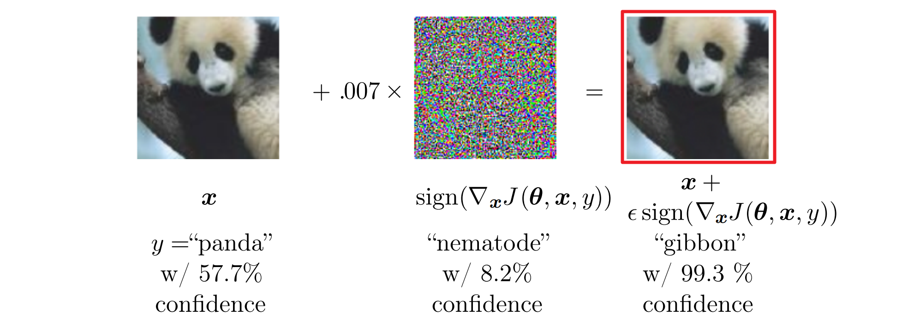

* [Back to Deep Learning MIT](../../main.md)

# 7.13 Adversarial Training

### Concept) Adversarial Example
- Def.)
  - An input $`x'`$ near a data point $`x`$ s.t. the model output is very different at $`x'`$ compared to the one at $`x`$.

- e.g.)   
  

- Props.)
  - In many cases, $`x'`$ is so similar to $`x`$ that human observer cannot distinguish between them.

 

* [Back to Deep Learning MIT](../../main.md)