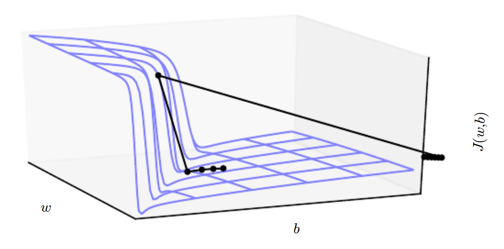

* [Back to Deep Learning MIT](../../main.md)

# 8.2 Challenges in Neural Network Optimization
- Desc.)
  - Recall that **Machine Learning** technically ensures the **convexity** of the optimization problem by carefully choosing the objective function and constraints.
  - However, when training **Neural Networks**, we must confront the general **non-convex** case.
  - Followings are the problems related to this non-convexity.
    - [Ill-Conditioning](#821-ill-conditioning)
    - [Local Minima](#822-local-minima)
    - [Plateaus, Saddle Points and Other Flat Regions](#823-plateaus-saddle-points-and-other-flat-regions)
    - [Cliffs and Exploding Gradients](#824-cliffs-and-exploding-gradients)
    - [Long-Term Dependencies](#825-long-term-dependencies)
    - [Inexact Gradients](#826-inexact-gradients)
    - [Poor Correspondence between Local and Global Structure](#827-poor-correspondence-between-local-and-global-structure)
    - [Theoretical Limits of Optimization](#828-theoretical-limits-of-optimization)

 

## 8.2.1 Ill-Conditioning
### Concept) Ill-Conditioning of the Hessian Matrix
- Desc.)
  - Ill-conditioning can manifest by causing SGD to get “stuck” in the sense that even very small steps increase the cost function.
- e.g.)
  - Recall [the second-order Taylor approximation](../../ch04/03/note.md#concept-directional-second-derivative) predicting that a gradient descent step of $`-\epsilon g`$ would add $`\displaystyle\frac{1}{2}\epsilon^2 g^\top Hg - \epsilon g^\top g`$ to the cost.
  - Suppose $`\displaystyle\frac{1}{2}\epsilon^2 g^\top Hg \gt \epsilon g^\top g`$.
  - Then each optimization and updating process increases the cost, not minimizing it.
  - Thus, the learning becomes very slow despite the presence of the very strong gradient $`(g^\top g)`$.
    - Why?)
      - The learning rate must be shrunk to compensate for even stronger curvature.
- Test)
  - Monitor $`g^\top g`$ and $`g^\top H g`$.
  - If the $`g^\top g`$ does not shrink significantly throughout learning, but the $`g^\top H g`$ term grows by more than an order of magnitude, it may be the problem of the ill-conditioning.

 

## 8.2.2 Local Minima
### Concept) Model Identifiability
- Def.)
  - A model is said to be **identifiable** if a sufficiently large training set can rule out all but one setting of the model’s parameters.
- Prop.)
  - Models with [latent variables](../../ch03/09/note.md#concept-latent-variable) are often **not identifiable** because we can obtain equivalent models by exchanging latent variables with each other.
    - e.g.) Weight Space Symmetry
      - Consider a neural network with $m$ layers each with $`n`$ units.
      - Then each layer can be rearranged in $`n!`$ ways.
      - Thus, there are $`n! \times m`$ ways of rearranging hidden units.
        - i.e.) There are too many equivalent models!
      - This kind of non-identifiability is known as **weight space symmetry**.
    - e.g.) [ReLU](../../ch06/03/note.md#concept-rectified-linear-unit-relu) / [Maxout](../../ch06/03/note.md#model-maxout-unit) Network Case
      - Consider the case that the model does not include the [weight decay](../../ch07/01/note.md#711-l2-parameter-regularization-weight-decay) terms.
      - Then we can scale all of the incoming weights and biases of a unit by $`\alpha`$ if we scale all of its outgoing weights by $`\frac{1}{\alpha}`$.
      - Thus, every local minium lies on an $`m\times n`$ - dimensional hyperbola of equivalent local minima.

### Concept) Convex vs Non-Convex
- Desc.)
  - Convex optimization problem)
    - Any local minimum is guaranteed to be a global minium.
    - Some convex functions have a flat region at the bottom, but any point within that region is an acceptable solution.
  - Non-Convex optimization problem)
    - It is possible that there are multiple local minima.
      - why?)
        - Non-[identifiable](#concept-model-identifiability) models tend to have multiple local minima.
        - Moreover, there can be an extremely large or even uncountably infinite amount of local minima in a neural network cost function.
    - Local minima can be problematic if they have high cost in comparison to the global minimum.
      - If local minima with high cost are common, this could pose a serious problem for gradient-based optimization algorithms.
    - Recent studies say...
      - For sufficiently large neural networks, most local minima have a low cost function value
      - It is more important to find a point in parameter space that has low but not minimal cost than to find a true global minimum.
- In practice)
  - Conduct a test that can rule out local minima.
    - How?) Negative Test for Local Minima 
      - While optimizing the target problem, plot the norm of the gradient over time.
      - If the norm of the gradient does not shrink to insignificant size, the problem is neither a local minima nor any kind of critical point.
      - Rule out such problems.

 

## 8.2.3 Plateaus, Saddle Points and Other Flat Regions
### Concept) Saddle Point
- Desc.)
  - A point with... 
    - the zero gradient (i.e. a critical point)
    - the Hessian matrix having both positive and negative value.
      - Points lying along eigenvectors associated with...
        - positive eigenvalues have greater cost than the saddle point
        - negative eigenvalues have lower cost than the saddle point
      - i.e.) Saddle point is the...
        - local minimum along one cross-section of the cost function 
        - local maximum along another cross-section
- Props.)
  - Many classes of random functions exhibit the following behavior:
    - **Proliferation of Saddle Points in Higher Dimensional Spaces)**
      - In low-dimensional spaces, **local minima** are common. 
      - In higher dimensional spaces, local minima are rare and **saddle points** are more common.
      - For a function $`f:\mathbb{R}^n \rightarrow \mathbb{R}`$,
        - the expected ratio of the number of saddle points to local minima grows **exponentially** with $`n`$.
      - Why does this happen?) *Dauphin et al. (2014)*
        - Imagine that the sign of each eigenvalue is generated by flipping a coin.
        - In a single dimension, it is easy to obtain a local minimum by tossing a coin and getting heads once.
        - In $`n`$-dimensional space, it is exponentially unlikely that all $`n`$ coin tosses will be heads.
    - **Costs and Critical Points)**
      - For random functions...
        - **Local minima** are much likely to have low cost.
        - Critical points with high cost are far more likely to be **saddle points**.
        - Critical points with extremely high cost are more likely to be **local maxima**.
      - Why?)
        - The eigenvalues of the Hessian become more likely to be positive as we reach regions of lower cost.
        - In our coin tossing analogy, this means we are more likely to have our coin come up heads $`n`$ times if we are at a critical point with low cost.
      - Neural networks follow the behaviors as well.
        - *Baldi and Hornik (1989)* showed theoretically that shallow autoencoders with no nonlinearities have global minima and saddle points but no local minima with higher cost than the global minimum.
          - They observed without proof that these results extend to deeper networks without nonlinearities.
          - The output of such networks is a linear function of their input, but they are useful to study as a model of nonlinear neural networks because their loss function is a non-convex function of their parameters.
        - *Saxe et al. (2013)* provided exact solutions to the complete learning dynamics in such networks and showed that learning in these models captures many of the qualitative features observed in the training of **deep models with nonlinear activation functions**.
        - *Dauphin et al. (2014)* showed experimentally that **real neural networks** also have loss functions that contain very many high-cost saddle points. 
        - *Choromanska et al. (2014)* provided additional theoretical arguments, showing that another class of high-dimensional random functions related to neural networks does so as well.
  - [Gradient descent](../../ch04/03/note.md#432-gradient-descent) algorithms tend to rapidly escape saddle point regions. (*Goodfellow et al. 2015*)
    - cf.) Not for the Newton's method.
      - Why?)
        - Newton’s method is designed to solve for a point where the gradient is zero.
        - Thus, without appropriate modification, it can jump to a saddle point or a local maximum.
        - The proliferation of saddle points in high dimensional spaces presumably explains why [second-order methods](../../ch04/03/note.md#concept-firstsecond-order-optimization-algorithm) have not succeeded in replacing gradient descent for neural network training.
          - *Dauphin et al. (2014)* introduced a saddle-free Newton method for second-order optimization and showed that it improves significantly over the traditional version. 
          - [Second-order methods](../../ch04/03/note.md#concept-firstsecond-order-optimization-algorithm) remain difficult to scale to large neural networks, but this saddle-free approach holds promise if it could be scaled.

 

## 8.2.4 Cliffs and Exploding Gradients
### Concept) Cliff
- Desc.)
  - Neural networks with many layers often have extremely steep regions resembling cliffs.   
    
  - These result from the multiplication of several large weights together.
  - On the face of an extremely steep cliff structure, the [gradient update](../../ch04/03/note.md#432-gradient-descent) step can move the parameters extremely far, usually jumping off of the cliff structure altogether.
    - This can be avoided using the [gradient clipping heuristic (TBD)](../../ch10/11.note.md).
      - How this works?)
        - Recall that the gradient does not specify the optimal step size, but only the optimal **direction** within an infinitesimal region.
        - The **gradient clipping heuristic** intervenes to reduce the step size to be small enough that it is less likely to go outside the region where the gradient indicates the direction of approximately steepest descent.
  - Cliff structures are most common in the cost functions for recurrent neural networks (RNNs).
    - Why?)
      - Such models involve a multiplication of many factors, with one factor for each time step.

 

## 8.2.5 Long-Term Dependencies
### Concept) Vanishing and Exploding Gradient Problem
- Desc.)
  - Consider recurrent neural network (RNN) problems.
  - They construct very deep computational graphs by repeatedly applying the same operation at each time step of a long temporal sequence.
    - e.g.)
      - Suppose that a computational graph contains a path that consists of repeatedly multiplying by a matrix $`W`$.
      - After $`t`$ steps, this is equivalent to multiplying by $`W^t`$.
      - Assuming that $`W`$ has an [eigen-decomposition](../../ch02/07/note.md#27-eigendecomposition) $`W = V \textrm{diag}(\lambda) V^{-1}`$, we have
        - $`W^t = V \textrm{diag}(\lambda)^t V^{-1}`$
      - Then, any eigenvalues $`\lambda_i \ne 1`$ will either 
        - explode if $`\lambda_i \gt 1`$
          - Exploding gradients can make learning unstable.
          - Recall the [cliff structure above](#concept-cliff).
        - vanish if $`\lambda_i \lt 1`$
          - Vanishing gradients make it difficult to know which direction the parameters should move to improve the cost function.
    - cf.) Feedforward networks do not use the same matrix $`W`$, so even very deep feedforward networks can largely avoid the vanishing and exploding gradient problem (*Sussillo, 2014*).

 

## 8.2.6 Inexact Gradients
- Desc.)
  - Most optimization algorithms are designed with the assumption that we have access to the exact gradient or Hessian matrix.
  - In practice, we usually only have a **noisy or even biased estimate** of these quantities.
    - Why?)
      - Reliance on sampling-based estimates
        - e.g) a minibatch of training examples to compute the gradient.
      - Sometimes the objective function we want to minimize is intractable.
        - When the objective function is intractable, typically its gradient is intractable as well.
        - In such cases we can only **approximate** the gradient.

 

## 8.2.7 Poor Correspondence between Local and Global Structure
- Desc.)
  - What if improvements in local does not point toward the global optimum?
    - Previous problems and solutions were related to issues happening at a single point $`\theta`$.
      - e.g.) $`\theta`$ is at a saddle point.
    - Even though we somehow overcame those difficulties and found local optima, this does now guarantee the direction to the global optimum.
    - Moreover, neural network sdo not even arrive at a critical point of any kind in practice.
      - e.g.)
        - Consider a loss function $`J(\theta) = -\log p(y| x;\theta)`$.
        - This may lack a global minimum point.
        - Instead, it may asymptotically approach some value as the model becomes more confident.
          - e.g.) Classification problem with $`p(y|x) \in [0,1]`$ estimating $`y \in \{0, 1\}`$ provided by a [softmax function](../../ch04/01/note.md#softmax-function).
            - Then $`p(y|x)`$ can become arbitrarily close to 0 or 1, but cannot reach the exact value of them respectively.
    - Many existing research directions are aimed at **finding good initial points** for problems that have difficult global structure
      - rather than developing algorithms that use non-local moves.

 

## 8.2.8 Theoretical Limits of Optimization

 

 

* [Back to Deep Learning MIT](../../main.md)