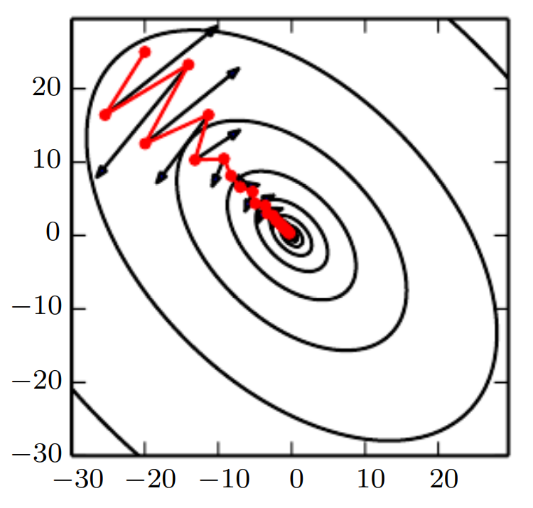

* [Back to Deep Learning MIT](../../main.md)

# 8.3 Basic Algorithms

## 8.3.1 Stochastic Gradient Descent
- Previous Desc.)
  - [Minibatch in 5.9.1](../../ch05/09/note.md#59-stochastic-gradient-descent)
    - $`\theta \leftarrow \theta - \epsilon g`$
      - where
        - $`\displaystyle g = \frac{1}{m'} \nabla_\theta\sum_{i=1}^{m'} L\left(x^{(i)},y^{(i)},\theta\right)`$
        - $`\epsilon`$ : the learning rate
  - [Minibatch in 8.1.3](../../ch08/01/note.md#813-batch-and-minibatch-algorithms)
    - SGD can obtain an **unbiased** estimate of the gradient by taking the average gradient on a minibatch of m examples drawn i.i.d from the data generating distribution.
- Algorithm)
  - Hyper Parameter
    - $`\epsilon_k`$ : the learning rate
  - Procedure)
    - Initialize $`\theta`$.
    - `while` stopping criterion not met `do`
      - Sample a minibatch of $`m`$ examples from the training set $`\{x^{(1)}, \cdots, x^{(m)}\}`$ with corresponding targets $`h^{(i)}`$.
      - Compute gradient estimate as
        - $`\displaystyle\hat{g} \leftarrow \hat{g} + \frac{1}{m}\nabla_\theta \sum_{i=1}^m L\left( f(x^{(i)};\theta), y^{(i)}\right)`$.
      - Apply update as
        - $`\theta \leftarrow \theta - \epsilon\hat{g}`$
    - `end while`
- Desc.)
  - Gradually decrease the **learning rate** $`\epsilon_k`$ at iteration $`k`$.
    - Why doing this?)
      - The SGD gradient estimator introduces a source of noise (the random sampling of m training examples) that does not vanish even when we arrive at a minimum.
        - cf.) For the batch gradient descents can reach 0 gradient, so the fixed learning rate is applicable.
    - Sufficient Condition)
      - $`\displaystyle \sum_{k=1}^\infty \epsilon_k = \infty \wedge \sum_{k=1}^\infty \epsilon_k^2 \lt \infty`$
      - How to implement this?)
        - Decay the learning rate linearly until iteration $`\tau`$:
          - $`\epsilon_k = (1-\alpha)\epsilon_0` + \alpha \epsilon_\tau`$
            - where $`\alpha = \frac{k}{\tau}`$
        - e.g.) Linear schedule
          - We should set $`\epsilon_0, \epsilon_\tau, \textrm{ and } \tau`$.
            - $`\tau`$ may be set to the number of iterations required to make a few hundred passes through the training set.
            - $`\epsilon_\tau`$ should be set to roughly 1% of the value of $`\epsilon_0`$.
            - $`\epsilon_0`$ should be chosen arbitrarily.
              - Monitor the first several iterations and use a learning rate that is higher than the best-performing learning rate at this time, but not so high that it causes severe instability.
                - Why?)
                  - If it is too large, the learning curve will show violent oscillations, with the cost function often increasing significantly. 
                    - Gentle oscillations are fine, especially if training with a stochastic cost function such as the cost function arising from the use of dropout. 
                    - If the learning rate is too low, learning proceeds slowly, and if the initial learning rate is too low, learning may become stuck with a high cost value.
                    - Typically, the optimal initial learning rate, in terms of total training time and the final cost value, is higher than the learning rate that yields the best performance after the first 100 iterations or so.
- Props.)
  - Computation time per update does not grow with the number of training examples.
    - For a large enough dataset, SGD may converge to within some fixed tolerance of its final test set error before it has processed the entire training set.
  - Convergence rate measurement using the **excess error** $`J(\theta) - \min_\theta J(\theta)`$
    - In case of convex problem, the excess error is $`\displaystyle O\left(\frac{1}{\sqrt{k}}\right)`$ after $`k`$ iterations.
      - cf.) For the strongly convex case, it is $`\displaystyle O\left(\frac{1}{k}\right)`$
      - cf.) The Cramer-Rao bound states that generalization error cannot decrease faster than $`\displaystyle O\left(\frac{1}{k}\right)`$.
      - cf.) Bottou and Bousquet (2008) argue that it therefore may not be worthwhile to pursue an optimization algorithm that converges faster than $`\displaystyle O\left(\frac{1}{k}\right)`$.
        - Why?)
          - Faster convergence presumably corresponds to overfitting

  

## 8.3.2 Momentum
### Concept) The Method of Momentum
- Desc.)
  - An optimization technique faster than [SGD](#831-stochastic-gradient-descent) when...
    - in the face of high curvature
    - gradients are small but consistent
    - gradients are noisy
  - It accumulates an exponentially decaying mo**ving average of past gradients** and continues to move in their direction.
- Key Concept)
  - Momentum
    - cf.) In physics, $`(\textrm{Momentum}) = (\textrm{Mass}) \times (\textrm{Velocity})`$.
      - In this method, we assume the unit mass, so $`(\textrm{Momentum}) = (\textrm{Velocity})`$.
  - Velocity $`v`$
    - Def.)
      - The direction and speed at which the parameters move through parameter space.
    - Props.)
      - The velocity is set to an exponentially decaying average of the negative gradient.
  - Updating Rule)
    - Rule)   
      $`\begin{aligned}
        v &\leftarrow \alpha v - \epsilon\nabla_\theta\left( \frac{1}{m}\sum_{i=1}^m L
        \left( f(x^{(i)} ; \theta), y^{(i)} \right) \right), & \alpha \in [0,1) \\
        \theta &\leftarrow \theta + v
      \end{aligned}`$
    - Desc.)
      - The velocity $`v`$ accumulates the gradient elements $`\nabla_\theta\left( \frac{1}{m}\sum_{i=1}^m L \left( f(x^{(i)} ; \theta), y^{(i)} \right) \right)`$.
      - The hyperparameter $`\alpha \in [0,1)`$ determines how quickly the contributions of previous gradients exponentially decay.
        - The larger $`\alpha`$ is relative to the learning rate $`\epsilon`$.
          - The more previous gradients affect the current direction.
- Algorithm) Stochastic Gradient Descent with Momentum
  - Input Hyperparameters)
    - $`\epsilon`$ : the learning rate
    - $`\alpha`$ : the momentum parameter
  - Input Parameters)
    - $`\theta`$ : initial parameter (vector)
    - $`v`$ : initial velocity
  - Procedures)
    - `while` stopping criterion not met `do`
      - Sample a minibatch of $`m`$ examples from the training set $`\{x^{(1)}, \cdots, x^{(m)}\}`$ with corresponding targets $`y^{(i)}`$.
      - Compute gradient estimate:
        - $`\displaystyle g \leftarrow \frac{1}{m} \nabla_\theta \sum_{i=1}^m L \left( f(x^{(i)} ; \theta), y^{(i)} \right)`$.
      - Compute velocity update :
        - $`v \leftarrow \alpha v - \epsilon g`$.
      - Apply update:
        - $`\theta \leftarrow \theta + v`$
    - `end while`
- Props.)
  - Momentum aims primarily to solve two problems:
    1. [Poor conditioning of the Hessian matrix](../02/note.md#821-ill-conditioning)
       - How?)
         - Momentum correctly traverses the canyon lengthwise, while gradient steps waste time moving back and forth across the narrow axis of the canyon.   
           |Graphics|Desc.|
           |:-:|:-|
           ||At each step along the way, we draw an arrow indicating the step  that gradient descent would take at that point. We can see that a poorly conditioned  quadratic objective looks like a long, narrow valley or canyon with steep sides.|
    2. [Variance in the stochastic gradient](../02/note.md#826-inexact-gradients)
  - The size of the step depends on how large and how aligned a sequence of gradients are.
    - Recall that in SGD, the size of the step was $`\epsilon g`$, the norm of the gradient multiplied by the learning rate.
    - The step size is largest when many successive gradients point in exactly the same direction.
    - If the momentum algorithm always observes gradient $`g`$, then it will accelerate in the direction of $`-g`$, until reaching a terminal velocity where the size of each step is $`\displaystyle \frac{\epsilon||g||}{1-\alpha}`$.
  - How to choose $`\alpha`$?
    - e.g.) $`\alpha = 0.9 \Rightarrow \frac{1}{1-\alpha} = 10`$
    - Common values of $`\alpha`$ used in practice include $`0.5, 0.9, \textrm{ and } 0.99`$.
    - Like $`\epsilon`$, $`\alpha`$ may also be adapted over time.

  

## 8.3.3 Nesterov Momentum
- Desc.)
  - A variant of [the momentum algorithm](#concept-the-method-of-momentum)
- Update Rule)   
  $`\begin{aligned}
    v &\leftarrow \alpha v - \epsilon\nabla_\theta\left[ \frac{1}{m}\sum_{i=1}^m L\left( f(x^
    {(i)}; \theta + \alpha v), y^{(i)} \right) \right] \\
    \theta &\leftarrow \theta + v \\
  \end{aligned}`$
  - Desc.)
    - The difference between Nesterov momentum and standard momentum is where the gradient is evaluated.
      - With Nesterov momentum, the gradient is evaluated after the current velocity is applied.
      - Thus one can interpret Nesterov momentum as attempting to add a **correction factor** to the standard method of momentum.
- Algorithm) Stochastic Gradient Descent with Momentum
  - Input Hyperparameters)
    - $`\epsilon`$ : the learning rate
    - $`\alpha`$ : the momentum parameter
  - Input Parameters)
    - $`\theta`$ : initial parameter (vector)
    - $`v`$ : initial velocity
  - Procedures)
    - `while` stopping criterion not met `do`
      - Sample a minibatch of $`m`$ examples from the training set $`\{x^{(1)}, \cdots, x^{(m)}\}`$ with corresponding targets $`y^{(i)}`$.
      - Apply interim update:
        - $`\tilde{\theta} \leftarrow \theta + \alpha v`$
      - Compute gradient at interim point:
        - $`\displaystyle g \leftarrow \frac{1}{m} \nabla_{\tilde{\theta}} \sum_{i=1}^m L \left( f(x^{(i)} ; \tilde{\theta}), y^{(i)} \right)`$.
      - Compute velocity update :
        - $`v \leftarrow \alpha v - \epsilon g`$.
      - Apply update:
        - $`\theta \leftarrow \theta + v`$
    - `end while`
- Prop.)
  - In the **convex** batch gradient case, Nesterov momentum brings the rate of convergence of the excess error from $`\displaystyle O\left(\frac{1}{k}\right)`$ to $`\displaystyle O\left(\frac{1}{k^2}\right)`$
  - Unfortunately, in the stochastic gradient case, Nesterov momentum does not improve the rate of convergence.

 

* [Back to Deep Learning MIT](../../main.md)