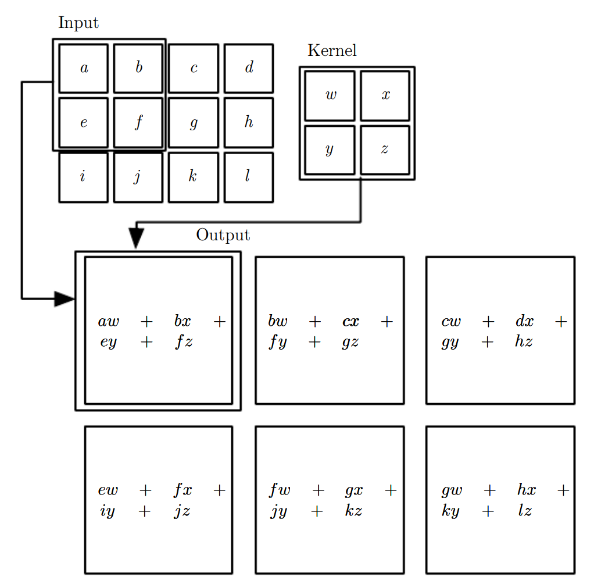

* [Back to Deep Learning MIT](../../main.md)

# 9.1 The Convolution Operation

### Concept) Convolution
- Def.)
  - An operation on two functions of a real-valued argument.
- Notation)
  - One Dimensional Case)
    - $`s(t) = (x * w)(t)`$
      - where
        - $`x`$ : the input
        - $`w`$ : the kernel
        - $`s(t)`$ : the feature map
      - if $`t\in\mathbb{Z}`$
        - $`\displaystyle s(t) = (x * w)(t) = \sum_{a=-\infty}^\infty x(a) w(t-a)`$
      - else if $`t\in\mathbb{R}`$
        - $`\displaystyle s(t) = (x * w)(t) = \int_{\infty}^\infty x(a) w(t-a) da`$
  - Two Dimensional Case)
    - $`\displaystyle S(i,j) = (I*K)(i,j) = \sum_m\sum_nI(m,n)K(i-m, j-n)`$
      - where
        - $`I`$ : the input
        - $`K`$ : the kernel
    - cf.) **Flipping Kernel**
      - What is this?)
        - Flipping kernel relative to the input in the sense that as $`m`$ increase, the index into the input increase.
      - How?)
        - $`\displaystyle S(i,j) = (K*I)(i,j) = \sum_m\sum_nI(i-m, j-n)K(m,n)`$
      - Why doing this?)
        - More straightforward to implement in a machine learning library, because there is less variation in the range of valid values of $`m`$ and $`n`$.
    - cf.) **Cross-Correlation**
      - What is this?)
        - Same as convolution but **without flipping** the kernel
      - How?)
        - $`\displaystyle S(i,j) = (I*K)(i,j) = \sum_m\sum_nI(i+m, j+n)K(m,n)`$
      - Props.)
        - Many machine learning libraries implement cross-correlation but call it convolution.
        - In this text we will follow this convention of calling both operations convolution, and specify whether we mean to flip the kernel or not in contexts where kernel flipping is relevant.
- e.g.)
  - Convolution without kernel flipping applied to a 2-D tensor   
    |Graphic|
    |:-:|
    ||
- Prop.)
  - Convolution usually corresponds to a very sparse matrix.
    - Why?) 
      - The kernel is usually much smaller than the input image.
  - Any neural network algorithm that works with matrix multiplication and does not depend on specific properties of the matrix structure should work with convolution, without requiring any further changes to the neural network.

 

### Concept) Convolution Neural Netowrks (CNN)
- Def.)
  - A specialized kind of neural network for processing data that has a known, grid-like topology
  - Simply, CNNs use [convolution](#concept-convolution) in place of general matrix multiplication in at least one of their layers
- e.g.)
  - time series data
  - 2D image data

 

* [Back to Deep Learning MIT](../../main.md)