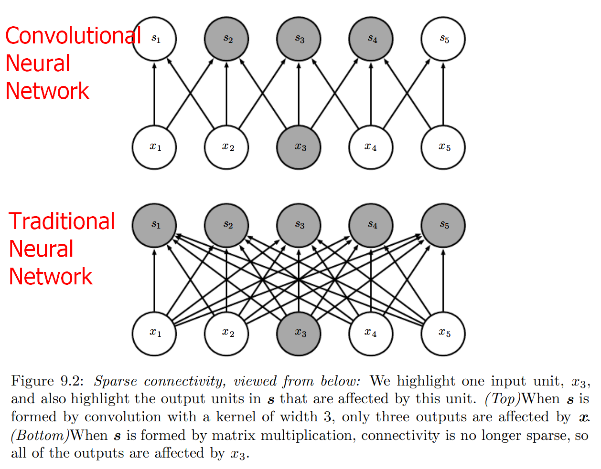
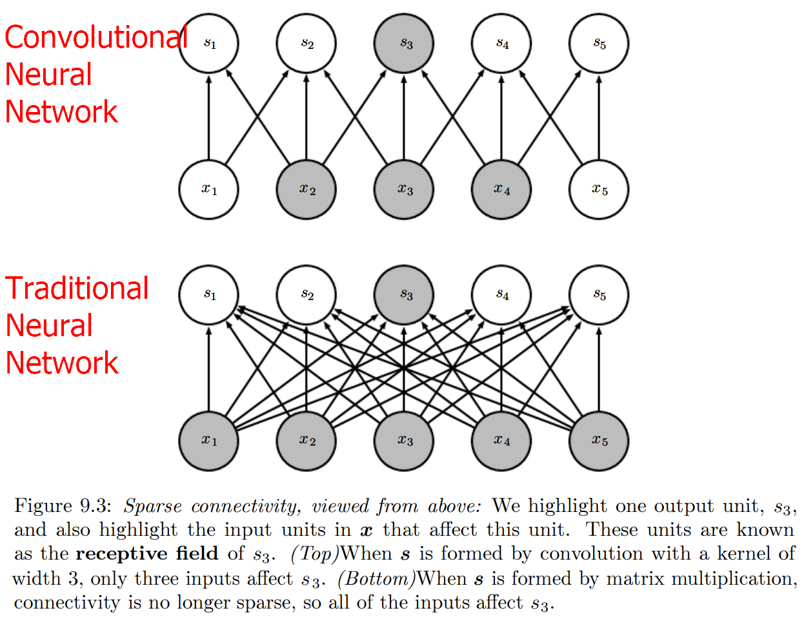

* [Back to Deep Learning MIT](../../main.md)

# 9.2 Motivation
- [Convolution](../01/note.md#concept-convolution) leverages three important ideas that can help improve a machine learning system:
  1. [Sparse Interactions](#concept-sparse-interactions)
  2. [Parameter Sharing]()
  3. [Equivariant Representations]()

### Concept) Sparse Interactions
- Desc.)
  - Convolutional networks typically have sparse interactions.
    - Why sparse?)
      - Recall that traditional neural network layers use matrix multiplication by a matrix of parameters with a separate parameter describing the interaction between each input unit and output unit.
        - i.e.) Every output unit interacts with every input unit.
    - How?)
      - Make [kernel](../01/note.md#concept-convolution) smaller than the input.
        - e.g.) 
          - Consider processing an image.
          - The input image data might have thousands or millions of pixels.
          - But we can detect small, meaningful features such as edges with kernels that occupy only tens or hundreds of pixels.
          - This means that we need to store fewer parameters.
            - Reducing the memory requirements of the model
            - Improving its statistical efficiency   

|Sparse Connectivity viewed from below|Sparse Connectivity viewed from above|
|:-:|:-:|
|||

### Concept) Parameter Sharing

### Concept) Equivariant Representations

 

* [Back to Deep Learning MIT](../../main.md)