* [Back to Dive into Deep Learning](../../main.md)

# 2.1 Data Manipulation

## 2.1.1 Getting Started. 
Pytorch

- Import PyTorch.
  ```python
  import torch
  ```


### Concept) Tensor
- Def.)
  - $n$-dimensional array
- Usages in Deep Learning Frameworks)
  - NumPy and MXNet : ndarray
  - PyTorch and TensorFlow : Tensor 


- ```torch.arange(n)``` 
   - Create a vector of evenly spaced values, starting at 0 (included) and ending at n (not included).
     ```python
     x = torch.arange(12, dtype=torch.float32)
     x
     ```
     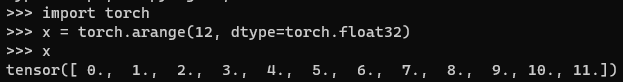
     - Each numbers are called an **element**.
- ```[tensor_obj].numel()``` 
   - Count the number of elements.
     ```python
     x.numel()
     ``` 
    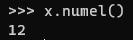
- ```[tensor_obj.shape]```
  - Access a tensor's shape (the length along each axis) by inspecting its shape attribute.
    ```python
    x.shape
    ```
    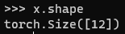
- ```[tensor_obj].reshape(n, m)```
  - Change the shape of a tensor without altering its size or values.
    ```python
    x2 = x.reshape(3, 4)
    x2
    ```
    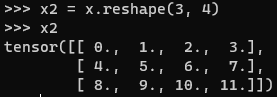
    - -1 can be used to automatically infer one component of the shape.
      ```python
      x3 = x.reshape(3, -1)
      x3
      x4 = x.reshape(-1, 4)
      x4
      ```
      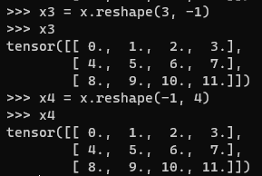
- ```torch.zeros([shape])```
  - Construct a tensor with all elements set to 0 with a specified shape.
    ```python
    x = torch.zeros((2,3,4))
    x
    ```
    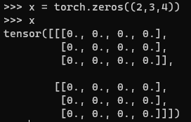

- ```torch.ones([shape])```
  - Construct a tensor with all elements set to 1 with a specified shape.
    ```python
    x = torch.ones((4,3,2))
    x
    ```
    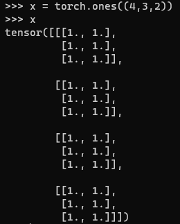

- ```torch.randn([shape])```
  - Sample each element randomly (and independently) from a given probability distribution.
    - $N(0,1)$
      ```python
      x = torch.randn(3,4)
      x
      ```
      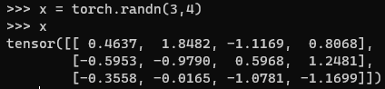

- ```torch.tensor([tensor])```
  - Construct tensors by supplying the exact values for each element by supplying (possibly nested) Python list(s) containing numerical literals.
    ```python
    x = torch.tensor([[2, 1, 4, 3], [1, 2, 3, 4], [4, 3, 2, 1]])
    x
    ```
    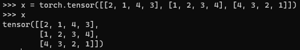


<br><br>

## 2.1.2 Indexing and Slicing
- Setting
  ```python
  x = torch.arange(12, dtype=torch.float32)
  X = x.reshape(3,4)
  X
  ```
  

- Indexing the last row
    ```python
    X[-1]
    ```
    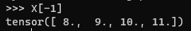

- Indexing multiple rows.
    ```python
    X[1:3]
    ```
    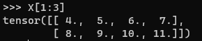

- Writing an element of a matrix.
    ```python
    X[1,2] = 17
    X
    ```
    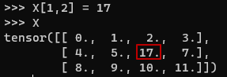

- Writing multiple elements of a matrix.
    ```python
    X[:2, :] = 12
    X
    ```
    - In the first and second row ```:2```, for every column ```:```, write 12.   
      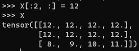


<br>

* [Back to Dive into Deep Learning](../../main.md)