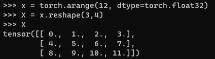

* [Back to Dive into Deep Learning](../../main.md)

# 2.1 Data Manipulation

## 2.1.1 Getting Started. 
Pytorch

- Import PyTorch.
  ```python
  import torch
  ```


### Concept) Tensor
- Def.)
  - $n$-dimensional array
- Usages in Deep Learning Frameworks)
  - NumPy and MXNet : ndarray
  - PyTorch and TensorFlow : Tensor 


- ```torch.arange(n)``` 
   - Create a vector of evenly spaced values, starting at 0 (included) and ending at n (not included).
     ```python
     x = torch.arange(12, dtype=torch.float32)
     x
     ```
     
     - Each numbers are called an **element**.
- ```[tensor_obj].numel()``` 
   - Count the number of elements.
     ```python
     x.numel()
     ``` 
    
- ```[tensor_obj.shape]```
  - Access a tensor's shape (the length along each axis) by inspecting its shape attribute.
    ```python
    x.shape
    ```
    
- ```[tensor_obj].reshape(n, m)```
  - Change the shape of a tensor without altering its size or values.
    ```python
    x2 = x.reshape(3, 4)
    x2
    ```
    
    - -1 can be used to automatically infer one component of the shape.
      ```python
      x3 = x.reshape(3, -1)
      x3
      x4 = x.reshape(-1, 4)
      x4
      ```
      
- ```torch.zeros([shape])```
  - Construct a tensor with all elements set to 0 with a specified shape.
    ```python
    x = torch.zeros((2,3,4))
    x
    ```
    
    - cf.) ```zeros_like([existing_tensor])```
      - Initialize a new tensor with elements 0 in the shape of an existing tensor.

- ```torch.ones([shape])```
  - Construct a tensor with all elements set to 1 with a specified shape.
    ```python
    x = torch.ones((4,3,2))
    x
    ```
    

- ```torch.randn([shape])```
  - Sample each element randomly (and independently) from a given probability distribution.
    - $N(0,1)$
      ```python
      x = torch.randn(3,4)
      x
      ```
      

- ```torch.tensor([tensor])```
  - Construct tensors by supplying the exact values for each element by supplying (possibly nested) Python list(s) containing numerical literals.
    ```python
    x = torch.tensor([[2, 1, 4, 3], [1, 2, 3, 4], [4, 3, 2, 1]])
    x
    ```
    


<br><br>

## 2.1.2 Indexing and Slicing
- Setting
  ```python
  x = torch.arange(12, dtype=torch.float32)
  X = x.reshape(3,4)
  X
  ```
  

- Indexing the last row
    ```python
    X[-1]
    ```
    

- Indexing multiple rows.
    ```python
    X[1:3]
    ```
    

- Writing an element of a matrix.
    ```python
    X[1,2] = 17
    X
    ```
    

- Writing multiple elements of a matrix.
    ```python
    X[:2, :] = 12
    X
    ```
    - In the first and second row ```:2```, for every column ```:```, write 12.   
      

<br><br>

## 2.1.3 Operations
### 2.1.3.1 Unary Scalar Operators
- Desc.)
  - The function maps from any real number onto some other real number.
    - i.e.) $f:\mathbb{R} \rightarrow \mathbb{R}$

#### e.g.) Exponential
```python
X
torch.exp(X)
```


<br>

### 2.1.3.2 Binary Scalar Operators
- Desc.)
  - Map pairs of real numbers to a (single) real number via the signature.
- e.g.) Arithmetic Operators
  - Addition : +
  - Subtraction : -
  - Multiplication : *
  - Division : /
  - Exponentiation : **   
    
- e.g.) Logical Operators
  - Equality : ==
  - Inequalities : <, >   
       
    


<br>

### 2.1.3.3 Concatenation
- Syntax)
  - ```cat([list_of_tensors], dim=[axis_to_concat])```
- e.g.)
  ```python
  X = torch.arange(12, dtype=torch.float32).reshape((3,4))
  Y = torch.tensor([[2.0, 1, 4, 3], [1, 2, 3, 4], [4, 3, 2, 1]])
  ```
  
  1. Concatenate two matrices along rows
     ```python
     # Concatenate two matrices along rows : dim=0
     torch.cat((X,Y), dim=0)
     ```
     
  2. Concatenate two matrices along columns
     ```python
     # Concatenate two matrices along columns : dim=1
     torch.cat((X,Y), dim=1)
     ```
     

<br><br>

## 2.1.4 Broadcasting
Under certain conditions, even when shapes differ, we can still perform element-wise binary operations by invoking the **broadcasting mechanism**.

Broadcasting works according to the following two-step procedure: 
 1. Expand one or both arrays by copying elements along axes with length 1 so that after this transformation, the two tensors have the same shape; 
 2. Perform an element-wise operation on the resulting arrays.

#### e.g.) Broadcasting
```python
a = torch.arange(3).reshape((3, 1))
b = torch.arange(2).reshape((1, 2))
a
b
a+b
```


<br><br>

## 2.1.5 Saving Memory
Running operations can cause new memory to be allocated to host results.
- e.g.)
  ```python
  X = torch.arange(12, dtype=torch.float32).reshape((3,4))
  Y = torch.tensor([[2.0, 1, 4, 3], [1, 2, 3, 4], [4, 3, 2, 1]])
  before = id(Y)
  Y = X+Y
  id(Y) == before
  ```
  

<br>

We can assign the result of an operation to a previously allocated array Y by using slice notation: ```Y[:] = [expression]```.
```python
Z = torch.zeros_like(Y)
print('id(Z): {}'.format(id(Z)))
Z[:] = X+Y
print('id(Z): {}'.format(id(Z)))
```


<br>

Or, use the following syntax instead.
```python
before = id(Y)
Y += X
before == id(Y)
```


<br><br>

## 2.1.6 Conversion to Other Python Objects
1. Pytorch tensor to Numpy's ndarray and vice versa
   1. Tensor to ndarray : ```[tensor_obj].numpy()```
   2. ndarray to tensor : ```torch.from_numpy([ndarray_obj])```
   ```python
   X = torch.arange(12, dtype=torch.float32).reshape((3,4))
   # tensor to ndarray
   A = X.numpy()
   type(A)
   # ndarray to tensor
   B = torch.from_numpy(A)
   type(B)
   ```
   
2. From size-1 tensor to Python scalar
   1. Use ```[tensor_obj].item()```   
   2. Use Python built-in functions
   ```python
   a = torch.tensor([3.5])
   type(a)
   type(a.item())
   type(float(a))
   type(int(a))
   ```
   


<br>

* [Back to Dive into Deep Learning](../../main.md)