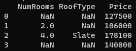
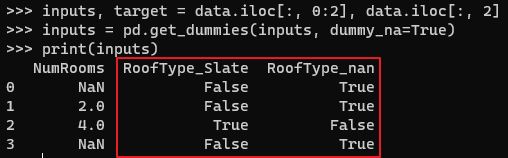
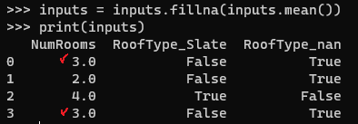
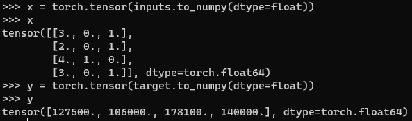

* [Back to Dive into Deep Learning](../../main.md)

# 2.2 Data Processing

## 2.2.1 Reading the Dataset
#### Tech) Using pandas for csv file 
1. Create a csv file.
   ```python
   import os

   os.makedirs(os.path.join('..', 'data'), exist_ok=True)
   data_file = os.path.join('..', 'data', 'house_tiny.csv')
   with open(data_file, 'w') as f:
        f.write('''NumRooms,RoofType,Price
        NA,NA,127500
        2,NA,106000
        4,Slate,178100
        NA,NA,140000''')
   ```

2. Import pandas and load the dataset.
   ```python
   import pandas as pd
   data = pd.read_csv(data_file)
   print(data)
   ```
   

<br>

#### Tech) Dealing with missing values.
In the previous example, the variable RoofType had two values, either "Slate" or NaN (not a number).    
- There are two heuristics to deal with NaN values.
  1. Discard the row or the column
  2. One Hot Encoding
     - i.e.) Change the variable in to binary variables.   
       |Before|After|
       |:----:|:---:|
       |RoofType = {Slate, NaN}| RoofType_Slate={True, False} <br> RoofType_Nan={True, False} |
       - Hands on) How to perform One hot encoding in pandas
         - Use ```get_dummies()``` method.
           ```python
           inputs, target = data.iloc[:, 0:2], data.iloc[:, 2]
           inputs = pd.get_dummies(inputs, dummy_na=True)
           print(inputs)
           ```
           
  3. Replace the missing value with the mean value.
     - Hands on) How to fill the missing values with the mean value in pandas
       - Use ```fillna()``` method with the input value of ```mean()```.
         ```python
         inputs = inputs.fillna(inputs.mean())
         print(inputs)
         ```
         

<br>

#### Tech) Conversion to the Tensor Format
- How to)
  - Use pandas' ```to_numpy()``` method, and convert this ndarray into tensor.
    ```python
    import torch
    x = torch.tensor(inputs.to_numpy(dtype=float))
    x
    y = torch.tensor(target.to_numpy(dtype=float))
    y
    ```
    


<br>

* [Back to Dive into Deep Learning](../../main.md)