* [Back to Dive into Deep Learning](../../main.md)

# 2.3 Linear Algebra
Using tools from linear algebra implemented for tensor.
- Thus, start with importing PyTorch
    ```python
    import torch
    ```

<br>

## 2.3.1 Scalars
- Basic Arithmetic Operations
    ```python
    x = torch.tensor(3.0)
    y = torch.tensor(2.0)
    x+y
    x*y
    x/y
    x**y
    ```

<br>

## 2.3.2 Vectors
- Declaration
    ```python
    x = torch.arange(3)
    x
    ```
    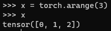
- Indexing Elements
  ```python
  x[2]
  ```
  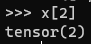
- Size of a vector
  - Python built-in ```len```
    ```python    
    len(x)
    ```
    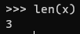
  - tensor's ```shape``` attribute.
    ```python    
    x.shape
    ```
    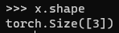

<br>

## 2.3.3 Matrices
- Declaration
  - Create a tensor and use ```reshape``` method.
    ```python
    A = torch.arange(6).reshape(3,2)
    A
    ```
    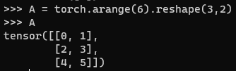
- Transpose
  ```python
  A.T
  ```
  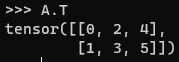

<br>

## 2.3.4 Tensors
- Def.)
  - Tensors give us a generic way of describing extensions to n-th order arrays.
- Declaration
  - Create a tensor and use ```reshape``` method.
    ```python
    T = torch.arange(24).reshape(2,3,4)
    T
    ```
    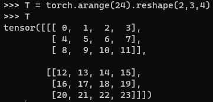

<br>

## 2.3.5 Basic Properties of Tensor Arithmetic
1. Hadamard Product   
   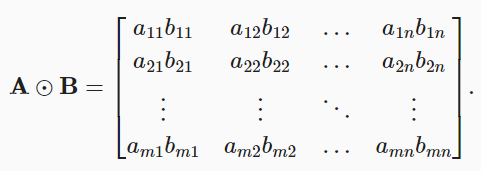
   ```python
   A = torch.arange(6, dtype=torch.float32).reshape(2, 3)
   B = A.clone()
   A*B
   ```
    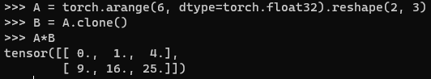

2. Scalar Product
   ```python
   a = 2
   X = torch.arange(24).reshape(2, 3, 4)
   a * X
   ```
   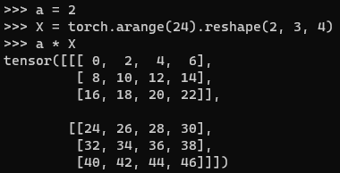

<br>

## 2.3.6 Reduction
- Sum of tensor elements
  ```python
  x = torch.arange(3, dtype=torch.float32)
  x.sum()
  ```
  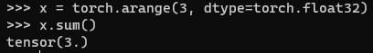
   - Specifying an axis to sum up the elements.
     ```python
     A = torch.arange(6, dtype=torch.float32).reshape(2, 3)
     A
     A.sum(axis=0)  # Sum by columns
     A.sum(axis=1)  # Sum by rows
     A.sum(axis=[0,1]) # Sum all
     ```
     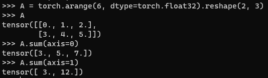
- Mean of a tensor
  ```python
  A.mean()
  A.sum() / A.numel()
  ```
  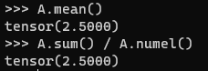
  - Specifying an axis to calculate the mean.
    ```python
    A.mean(axis=0)
    A.mean(axis=1)
    ```
    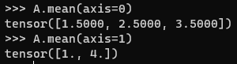

<br>

## 2.3.7 Non-Reduction Sum
- When to use?
  - Keep the number of axes unchanged when invoking the function for calculating the sum or mean.
- Summation
  ```python
  A = torch.arange(6, dtype=torch.float32).reshape(2, 3)
  A
  sum_A = A.sum(axis=1, keepdims=True)
  sum_A
  sum_A.shape
  ```
- Cumulative Sum


<br>

* [Back to Dive into Deep Learning](../../main.md)