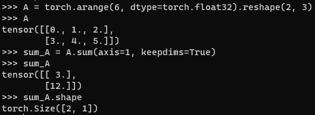
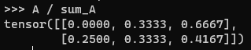
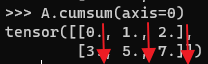
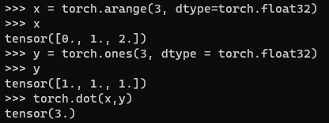
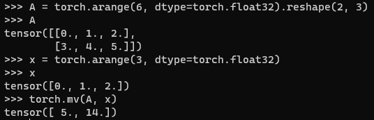
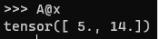
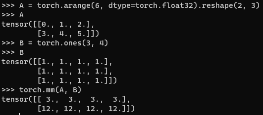
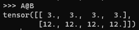
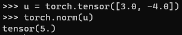
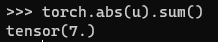

* [Back to Dive into Deep Learning](../../main.md)

# 2.3 Linear Algebra
Using tools from linear algebra implemented for tensor.
- Thus, start with importing PyTorch
    ```python
    import torch
    ```

<br>

## 2.3.1 Scalars
- Basic Arithmetic Operations
    ```python
    x = torch.tensor(3.0)
    y = torch.tensor(2.0)
    x+y
    x*y
    x/y
    x**y
    ```

<br>

## 2.3.2 Vectors
- Declaration
    ```python
    x = torch.arange(3)
    x
    ```
    
- Indexing Elements
  ```python
  x[2]
  ```
  
- Size of a vector
  - Python built-in ```len```
    ```python    
    len(x)
    ```
    
  - tensor's ```shape``` attribute.
    ```python    
    x.shape
    ```
    

<br>

## 2.3.3 Matrices
- Declaration
  - Create a tensor and use ```reshape``` method.
    ```python
    A = torch.arange(6).reshape(3,2)
    A
    ```
    
- Transpose
  ```python
  A.T
  ```
  

<br>

## 2.3.4 Tensors
- Def.)
  - Tensors give us a generic way of describing extensions to n-th order arrays.
- Declaration
  - Create a tensor and use ```reshape``` method.
    ```python
    T = torch.arange(24).reshape(2,3,4)
    T
    ```
    

<br>

## 2.3.5 Basic Properties of Tensor Arithmetic
1. Hadamard Product   
   
   ```python
   A = torch.arange(6, dtype=torch.float32).reshape(2, 3)
   B = A.clone()
   A*B
   ```
    

2. Scalar Product
   ```python
   a = 2
   X = torch.arange(24).reshape(2, 3, 4)
   a * X
   ```
   

<br>

## 2.3.6 Reduction
- Sum of tensor elements
  ```python
  x = torch.arange(3, dtype=torch.float32)
  x.sum()
  ```
  
   - Specifying an axis to sum up the elements.
     ```python
     A = torch.arange(6, dtype=torch.float32).reshape(2, 3)
     A
     A.sum(axis=0)  # Sum by columns
     A.sum(axis=1)  # Sum by rows
     A.sum(axis=[0,1]) # Sum all
     ```
     
- Mean of a tensor
  ```python
  A.mean()
  A.sum() / A.numel()
  ```
  
  - Specifying an axis to calculate the mean.
    ```python
    A.mean(axis=0)
    A.mean(axis=1)
    ```
    

<br>

## 2.3.7 Non-Reduction Sum
- When to use?
  - Keep the number of axes unchanged when invoking the function for calculating the sum or mean.
- Summation
  ```python
  A = torch.arange(6, dtype=torch.float32).reshape(2, 3)
  A
  sum_A = A.sum(axis=1, keepdims=True)
  sum_A
  sum_A.shape
  ```
  
  - Usage
    - ```sum_A``` keeps its two axes after summing each row, we can divide ```A``` by ```sum_A``` with broadcasting to create a matrix where each row sums up to 1.
      ```python
      A / sum_A
      ```
      

- Cumulative Sum
  ```python
  A.cumsum(axis=0)
  ```
  

<br>

## 2.3.8 Dot Products
- Syntax
  - ```torch.dot([vector_obj_1], [vector_obj_2])```
    - e.g.)
      ```python
      x = torch.arange(3, dtype=torch.float32)
      x
      y = torch.ones(3, dtype = torch.float32)
      y
      torch.dot(x,y)
      ```
      

<br>

## 2.3.9 Matrix-Vector Products
- Syntax
  - ```torch.mv([matrix_obj], [vector_obj])```
    - e.g.)
      ```python
      A = torch.arange(6, dtype=torch.float32).reshape(2, 3)
      A
      x = torch.arange(3, dtype=torch.float32)
      x
      torch.mv(A, x)
      ```
      
  - Python's ```@``` operator
    - e.g.)
      ```python
      A@x
      ```
      

<br>

## 2.3.10 Matrix-Matrix Multiplication
- Syntax
  - ```torch.mm([matrix_obj_1], [matrix_obj_2])```
    - e.g.)
      ```python
      A = torch.arange(6, dtype=torch.float32).reshape(2, 3)
      A
      B = torch.ones(3, 4)
      B
      torch.mm(A, B)
      ```
      
  - Python's ```@``` operator
    - e.g.)
      ```python
      A@B
      ```
      

<br>

## 2.3.11 Norms
- Desc.)
  - Some of the most useful operators in linear algebra are *norms*. Informally, the norm of a vector tells us how *big* it is. For instance, the $\ell_2$ norm measures the (Euclidean) length of a vector. Here, we are employing a notion of *size* that concerns the magnitude of a vector's' components (not its dimensionality).
  - A norm is a function $`\| \cdot \|`$ that maps a vector to a scalar and satisfies the following three properties:
    1. Given any vector $\mathbf{x}$, if we scale (all elements of)
       the vector by a scalar $\alpha \in \mathbb{R}$, its norm scales
       accordingly: 
       - $`\|\alpha \mathbf{x}\| = |\alpha| \|\mathbf{x}\|`$
    2. For any vectors $\mathbf{x}$ and $\mathbf{y}$: norms
       satisfy the triangle inequality:
       - $`\|\mathbf{x} + \mathbf{y}\| \leq \|\mathbf{x}\| + \|\mathbf{y}\|`$
    3. The norm of a vector is nonnegative and it only vanishes if the
       vector is zero:
       - $`\|\mathbf{x}\| > 0 \textrm{ for all } \mathbf{x} \neq 0`$
  - Many functions are valid norms and different norms encode different notions of size. The Euclidean norm that we all learned in elementary school geometry when calculating the hypotenuse of a right triangle is the square root of the sum of squares of a vector's' elements. Formally, this is called the $\ell_2$ *norm* and expressed as
    - $`\|\mathbf{x}\|_2 = \sqrt{\Sigma_{i=1}^n{x_i^2}}`$
  - The method ``norm`` calculates the $\ell_2$ norm.
- PyTorch
  - Syntax
    - ```torch.norm([tensor_obj])```
      ```python
      u = torch.tensor([3.0, -4.0])
      torch.norm(u)
      ```
      
    - How to get $\ell_1$ norm.
      - i.e.) $`\|\mathbf{x}\|_1 = \Sigma_{i=1}^{n}{|x_i|}`$
      - Use ```torch.abs([tensor_obj]).sum()```
        ```python
        torch.abs(u).sum()
        ```
        


<br>

* [Back to Dive into Deep Learning](../../main.md)