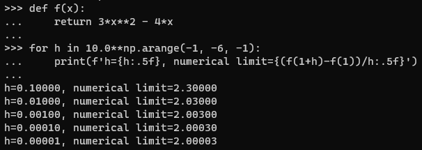

* [Back to Dive into Deep Learning](../../main.md)

# 2.4 Calculus

#### Import Packages
```python
%matplotlib inline
import numpy as np
from matplotlib_inline import backend_inline
from d2l import torch as d2l
```

<br>

## 2.4.1 Derivatives and Differentiation
- e.g.) $f(x) = 3x^2 -4x$
  ```python
  def f(x):
      return 3*x**2 - 4*x
  ```
  - Implementing $f'(x) = \lim_{h \rightarrow 0}\frac{f(x+h)-f(x)}{h}$
    ```python
    for h in 10.0**np.arange(-1, -6, -1):
        print(f'h={h:.5f}, numerical limit={(f(1+h)-f(1))/h:.5f}')
    ```



<br>

## 2.4.2 Visualization Utilities
We can visualize the slopes of functions using the ```matplotlib``` library.
- Implementation)
  - Define a function that outputs graphics in SVG format.
    ```python
    def use_svg_display(): #@save
        """Use the svg format to display a plot in Jupyter."""
        backend_inline.set_matplotlib_formats('svg')
    ```
    - cf.) The comment ```#@save``` is a special modifier that allows us to save any function, class, or other code block to the d2l package so that we can invoke it later without repeating the code.
  - Define a function that sets the sizes of figures.
    ```python
    def set_figsize(figsize=(3.5, 2.5)): #@save
      """Set the figure size for matplotlib."""
      use_svg_display()
      d2l.plt.rcParams['figure.figsize'] = figsize
    ```
    - cf.) The following line was marked via ```#@save``` in the d2l package, we can call ```d2l.plt```
      ```python
      from matplotlib import pyplot as plt
      ```
  - Define a function that set axes properties including labels, ranges, and scales.
    ```python
    #@save
    def set_axes(axes, xlabel, ylabel, xlim, ylim, xscale, yscale, legend):
        """Set the axes for matplotlib."""
        axes.set_xlabel(xlabel), axes.set_ylabel(ylabel)
        axes.set_xscale(xscale), axes.set_yscale(yscale)
        axes.set_xlim(xlim),     axes.set_ylim(ylim)
        if legend:
            axes.legend(legend)
        axes.grid()
    ```
  - Using the functions implemented above, define the function ```plot()``` that actually plots the graphs.
    ```python
    #@save
    def plot(X, Y=None, xlabel=None, ylabel=None, legend=[], xlim=None, ylim=None, xscale='linear', yscale='linear', fmts=('-', 'm--', 'g-.', 'r:'), figsize=(3.5, 2.5), axes=None):
        """Plot data points."""
    
        def has_one_axis(X):  # True if X (tensor or list) has 1 axis
            return (hasattr(X, "ndim") and X.ndim == 1 or isinstance(X, list) and not hasattr(X[0], "__len__"))
    
        if has_one_axis(X): X = [X]
        if Y is None:
            X, Y = [[]] * len(X), X
        elif has_one_axis(Y):
            Y = [Y]
        if len(X) != len(Y):
            X = X * len(Y)
    
        set_figsize(figsize)
        if axes is None:
            axes = d2l.plt.gca()
        axes.cla()
        for x, y, fmt in zip(X, Y, fmts):
            axes.plot(x,y,fmt) if len(x) else axes.plot(y,fmt)
        set_axes(axes, xlabel, ylabel, xlim, ylim, xscale, yscale, legend)
    ```
- Example)
  - Plot $f(x) = 3x^2 -4x$ and its tangent line $y=2x-3$ at $x=1$.
    ```python
    x = np.arange(0, 3, 0.1)
    plot(x, [f(x), 2 * x - 3], 'x', 'f(x)', legend=['f(x)', 'Tangent line (x=1)'])
    ```


<br>

* [Back to Dive into Deep Learning](../../main.md)