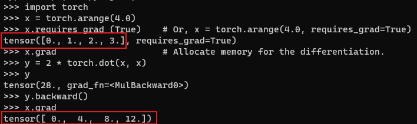
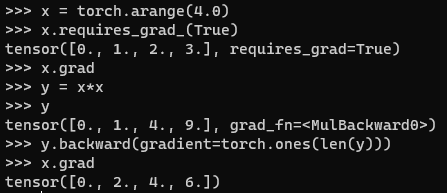
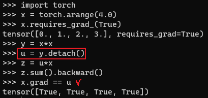
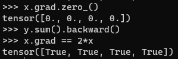

* [Back to Dive into Deep Learning](../../main.md)

# 2.5 Automatic Differentiation

### Concept) Automatic Differentiation and Backproagation
- All modern deep learning frameworks offer automatic differentiation (often shortened to [autograd](#hands-on-autograd-package)). 
- As we pass data through each successive function, the framework builds a computational graph that tracks how each value depends on others. 
- To calculate derivatives, automatic differentiation works backwards through this graph applying the chain rule. 
- The computational algorithm for applying the chain rule in this fashion is called **backpropagation**.

<br>

### Hands on) Autograd Package
- First, import ```torch```
  ```python
  import torch
  ```
- Remind that deep learning packages do not allocate memory for every derivatives.
  - why?)
    - Deep learning requires successively computing derivatives with respect to the same parameters a great many times.
  - Thus, we should allocate memory, A.K.A the gradient buffer, manually using the ```[tensor_obj].grad``` command.
    - Refer to the [Simple function differentiation example](#1-simple-function-differentiation) below.
  - To reset the gradient use the ```[tensor_obj].grad.zero_()``` command.

<br>

#### 1. Simple function differentiation
 - e.g.) For $\mathbf{y} = 2\mathbf{x}^{\top}\mathbf{x}$, get $\nabla_{\mathbf{x}} \mathbf{y}$.
   - Declare $\mathbf{x}$ as ```x``` and allocate memory for the derivative at ```x.grad``` (gradient buffer).
     ```python
     x = torch.arange(4.0)
     x.requires_grad_(True)    # Or, x = torch.arange(4.0, requires_grad=True)
     x.grad                    # Allocate memory for the differentiation.
     ```
    - Declare $\mathbf{y} = 2\mathbf{x}^{\top}\mathbf{x}$
      ```python
      y = 2 * torch.dot(x, x)
      y
      ```
    - Calculate the gradient of $\mathbf{y}$ w.r.t. $\mathbf{x}$ using ```y.backward()``` method.
      ```python
      y.backward()
      ```
    - Check the result, saved at ```x.grad```.
      ```python
      x.grad
      ```
      
    - Reset the gradient buffer.
      ```python
      x.grad.zero_()
      ```

<br>

#### 2. Backward for Non-Scalar Variables
- When $y$ is a vector, the most natural representation of the derivative of $y$ with respect to a vector $x$ is a matrix called the **Jacobian** that contains the partial derivatives of each component of $y$ with respect to each component of $x$.
- PyTorch takes some steps to avoid confusion. 
  - Invoking backward on a non-scalar elicits an error unless we tell PyTorch how to reduce the object to a scalar. 
  - More formally, we need to provide some vector $\mathbf{v}$ such that backward will compute $\mathbf{v}^{\top}\partial_\mathbf{x}\mathbf{y}$ rather than $\partial_\mathbf{x}\mathbf{y}$.
    - Here, this argument representing $\mathbf{v}$ is named gradient.
- e.g.) Consider the case $\mathbf{y} = [x_{i}^2]$. i.e., $\mathbf{x}, \mathbf{y} \in \mathbb{R}^n$
  ```python
  x = torch.arange(4.0)
  x.requires_grad_(True)
  x.grad
  y = x*x
  y
  y.backward(gradient=torch.ones(len(y)))
  x.grad
  ```
  


<br><br>

### Tech.) Detaching Computation
Consider the following example.
- e.g.) 
  - Suppose $y = x \times x$ and $z = x \times x \times x$.
  - Then $z=y*x$.
  - What if we want to focus on the **direct** influence of $x$ on $z$ rather than the influence conveyed via $y$.
    - i.e.) Put $u=y$.
      - Then, $\frac{\partial}{\partial x} z = u$
        - Not $\frac{\partial}{\partial x} z = 3x^2$
    - In this case we use the detaching computation.

- Code
  ```python
  x = torch.arange(4.0)
  x.requires_grad_(True)
  y = x * x
  u = y.detach()
  z = u * x

  z.sum().backward()
  x.grad == u
  ```
  
  - Although the above procedure detaches ```y```’s ancestors from the graph leading to ```z```, the computational graph leading to ```y``` persists and thus we can calculate the gradient of ```y``` with respect to ```x```.
    ```python
    x.grad.zero_()
    y.sum().backward()
    x.grad == 2*x
    ```
    


<br><br>

## 2.5.4 Gradient and Python Control Flow
One benefit of using automatic differentiation is that even if building the computational graph of a function required passing through a maze of Python control flow (e.g., conditionals, loops, and arbitrary function calls), we can still calculate the gradient of the resulting variable.
- e.g.)
  ```python
  def f(a):
    b = a * 2
    while b.norm() < 1000:
      b = b * 2
    if b.sum() <= 0:
      return 100 * b    
    return b

  if __name__ == '__main__':
    a = torch.randn(size=(), requires_grad=True)
    d = f(a)
    d.backward()

    a.grad == d/a
  ```


<br>

* [Back to Dive into Deep Learning](../../main.md)