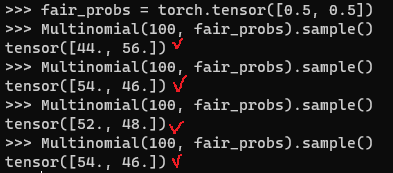
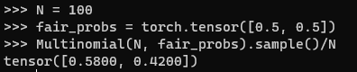

* [Back to Dive into Deep Learning](../../main.md)

# 2.6. Probability and Statistics

#### Import Packages
```python
import random
import torch
from torch.distributions.multinomial import Multinomial
from d2l import torch as d2l
```

<br>

## 2.6.1. A Simple Example: Tossing Coins
1. Assign a probability vector : ```[0.5, 0.5]```
2. Use ```Multinomial``` to sample.
   ```python
   fair_probs = torch.tensor([0.5, 0.5])
   Multinomial(100, fair_probs).sample()
   ```
   
   - Displaying as a probability.
     ```python
     N = 100
     fair_probs = torch.tensor([0.5, 0.5])
     Multinomial(N, fair_probs).sample()/N
     ```
     

- cf.) Central Limit Theorem Verification Simulation
  ```python
  fair_probs = torch.tensor([0.5, 0.5])
  counts = Multinomial(1, fair_probs).sample((10000,))
  cum_counts = counts.cumsum(dim=0)
  estimates = cum_counts / cum_counts.sum(dim=1, keepdims=True)
  estimates = estimates.numpy()
  ```
  ```python
  d2l.set_figsize((4.5, 3.5))
  d2l.plt.plot(estimates[:, 0], label=("P(coin=heads)"))
  d2l.plt.plot(estimates[:, 1], label=("P(coin=tails)"))
  d2l.plt.axhline(y=0.5, color='black', linestyle='dashed')
  d2l.plt.gca().set_xlabel('Samples')
  d2l.plt.gca().set_ylabel('Estimated probability')
  d2l.plt.legend()
  ```


<br>

* [Back to Dive into Deep Learning](../../main.md)