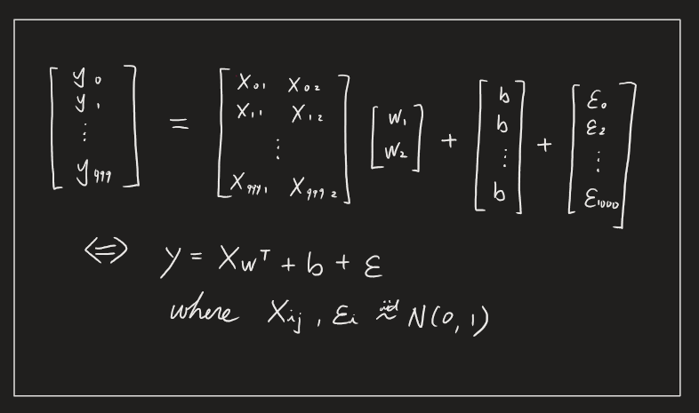
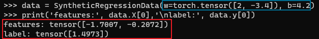
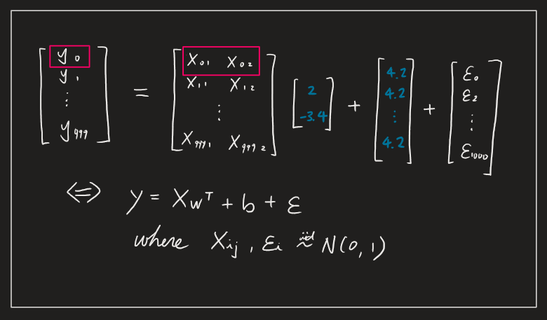
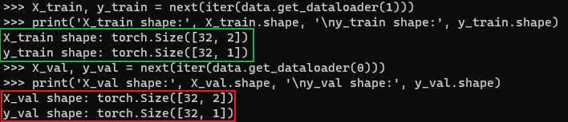
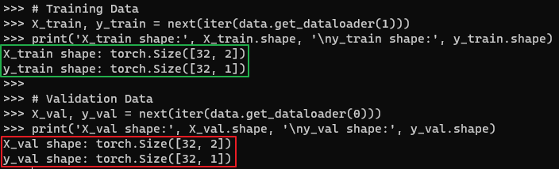

* [Back to Dive into Deep Learning](../../main.md)

# 3.3 Synthetic Regression Data

#### Import Libraries
```python
import random
import torch
from d2l import torch as d2l
```

<br>

## 3.3.1 Generating Dataset
- Goal)
  - Generate 1000 examples with 2-dimensional features drawn from a standard normal distribution
- Settings)
  - The resulting design matrix $`\mathbf{X}`$ belongs to $`\mathbb{R}^{1000 \times 2}`$.
    - $`\mathbb{R}^{1000 \times 2}`$
      - 1000 rows for examples
      - 2 columns for attributes
  - We generate each label by applying a *ground truth* linear function, corrupting them via additive noise $`\boldsymbol{\epsilon}`$, drawn independently and identically for each example:
    - $\mathbf{y}= \mathbf{X} \mathbf{w} + b + \boldsymbol{\epsilon}$
      - For convenience we assume that $`\boldsymbol{\epsilon} \sim N(0, 0.1^2)`$.




- Implementation)
  ```python
  class SyntheticRegressionData(d2l.DataModule):  #@save
      """Synthetic data for linear regression."""
      def __init__(self, w, b, noise=0.01, num_train=1000, num_val=1000,
                   batch_size=32):
          super().__init__()
          self.save_hyperparameters()
          n = num_train + num_val
          self.X = torch.randn(n, len(w)) # 2000 X 2 matrix with values in N(0,1)
          noise = torch.randn(n, 1) * noise
          self.y = torch.matmul(self.X, w.reshape((-1, 1))) + b + noise
  ```
- Test
  - Set parameters as $`\mathbf{w} = [2, -3.4]^\top`$ and $`b = 4.2`$.
    ```
    data = SyntheticRegressionData(w=torch.tensor([2, -3.4]), b=4.2)
    print('features:', data.X[0],'\nlabel:', data.y[0])
    ```


   


<br><br>

## 3.3.2 Reading the Dataset
Training machine learning models often requires multiple passes over a dataset, grabbing one minibatch of examples at a time.   

Let's trace each batch by implementing the ```get_dataloader``` method and registering it to the ```SyntheticRegression``` class via the ```add_to_class``` function.
- More concise implementation for ```get_dataloader``` is provided [below](#333-concise-implementation-of-the-data-loader).

```python
@d2l.add_to_class(SyntheticRegressionData)
def get_dataloader(self, train):
    if train:
        indices = list(range(0, self.num_train))
        # The examples are read in random order
        random.shuffle(indices)
    else:
        indices = list(range(self.num_train, self.num_train+self.num_val))
    for i in range(0, len(indices), self.batch_size):
        batch_indices = torch.tensor(indices[i: i+self.batch_size])
        yield self.X[batch_indices], self.y[batch_indices]
```
- Test
  ```python
  # Training Data
  X_train, y_train = next(iter(data.get_dataloader(1)))
  print('X_train shape:', X_train.shape, '\ny_train shape:', y_train.shape)

  # Validation Data
  X_val, y_val = next(iter(data.get_dataloader(0)))
  print('X_val shape:', X_val.shape, '\ny_val shape:', y_val.shape)
  ```
  

<br><br>

## 3.3.3. Concise Implementation of the Data Loader
Call the existing ```torch.utils.data.DataLoader``` API in a framework to load data, instead of writing our own iterator.

```python
@d2l.add_to_class(d2l.DataModule)  #@save
def get_tensorloader(self, tensors, train, indices=slice(0, None)):
    tensors = tuple(a[indices] for a in tensors)
    dataset = torch.utils.data.TensorDataset(*tensors)
    return torch.utils.data.DataLoader(dataset, self.batch_size,
                                       shuffle=train)

@d2l.add_to_class(SyntheticRegressionData)  #@save
def get_dataloader(self, train):
    i = slice(0, self.num_train) if train else slice(self.num_train, None)
    return self.get_tensorloader((self.X, self.y), train, i)
```
- Test
  ```python
  # Training Data
  X_train, y_train = next(iter(data.get_dataloader(1)))
  print('X_train shape:', X_train.shape, '\ny_train shape:', y_train.shape)

  # Validation Data
  X_val, y_val = next(iter(data.get_dataloader(0)))
  print('X_val shape:', X_val.shape, '\ny_val shape:', y_val.shape)
  ```
  


<br>

* [Back to Dive into Deep Learning](../../main.md)