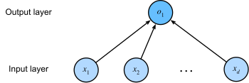

* [Back to Dive into Deep Learning](../../main.md)

# 3.5. Concise Implementation of Linear Regression
Implementing [the same linear regression model](../04/note.md#34-linear-regression-implementation-from-scratch) concisely by using high-level APIs of deep learning frameworks.   

For standard operations, we can use a framework’s predefined layers, which allow us to focus on the layers used to construct the model rather than worrying about their implementation.   



The layer is called fully connected, since each of its inputs is connected to each of its outputs by means of a matrix–vector multiplication.


### Import Packages
```python
import numpy as np
import torch
from torch import nn
from d2l import torch as d2l
```


<br><br>

## 3.5.1 Defining the Model


<br><br>

## 3.5.2 Defining the Loss Function


<br><br>

## 3.5.3 Defining the Optimization Algorithm


<br><br>

## 3.5.4 Training


<br>

* [Back to Dive into Deep Learning](../../main.md)