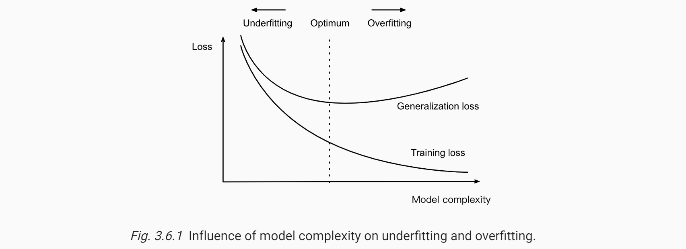

* [Back to Dive into Deep Learning](../../main.md)

# 3.6 Generalization

#### Concept) Overfitting
The phenomenon of fitting closer to our training data than to the underlying distribution is called overfitting.

 

#### Concept) Regularization
Techniques for combatting [overfitting](#concept-overfitting) are often called [regularization methods](../07/note.md#37-weight-decay).

  

## 3.6.1 Training Error and Generalization Error
- Settings)
  - $R_{emp}$ : the training error calculated on the training dataset
  - $R$ : the generalization error which is an expectation taken w.r.t. the underlying distribution
- Then $R_{emp}$ and $R$ can be expressed as below.
  - $`R_\textrm{emp}[\mathbf{X}, \mathbf{y}, f] = \frac{1}{n} \sum_{i=1}^n l(\mathbf{x}^{(i)}, y^{(i)}, f(\mathbf{x}^{(i)}))`$
    - The sum of errors calculated from the training dataset.
  - $`R[p, f] = E_{(\mathbf{x}, y) \sim P} [l(\mathbf{x}, y, f(\mathbf{x}))] =
   \int \int l(\mathbf{x}, y, f(\mathbf{x})) p(\mathbf{x}, y) \;d\mathbf{x} dy`$
    - The sum(integral) of errors from an infinite stream of additional data examples drawn from the same underlying data distribution.
    - But nobody knows what the pdf of the underlying distribution, $p(\mathbf{x}, y)$, is.
- Concept) Generalization Gap
  - $R_{emp}-R$
- Question)
  - When should we expect our training error to be close to the population error?

 

### 3.6.1.1 Model Complexity
#### Prop.) Complexity of a Model and the Size of the Data
- When we have simple models and abundant data, the training and generalization errors tend to be close. 
- When we work with more complex models and/or fewer examples, we expect the training error to go down but the generalization gap to grow.

 

#### Objective)
A hypothesis that **could not explain** any observations we might conceivably make and yet nevertheless **happens to be compatible with** those observations that we in fact make.

  

## 3.6.2 Underfitting or Overfitting?
### Concept) Underfitting
- Situation)
  - The training error and the validation error are both substantial but there is a little gap between them $(R_{emp}\approx R)$.
- Prop.)
  - If the model is unable to reduce the training error, that could mean that our model is too simple to capture the pattern that we are trying to model.
    - i.e.) insufficiently expressive
    - Need more complex model!

 

### Concept) Overfitting
- Situation)
  - The training error is significantly lower than the validation error.
- Prop.)
  - Overfitting is not always a bad thing
    - In deep learning especially, the best predictive models often perform far better on training data than on holdout data.
    - Ultimately, we usually care about driving the generalization error lower, and only care about the generalization gap insofar as it becomes an obstacle to that end.

 

### 3.6.2.1 Polynomial Curve Fitting
- Prop.)
  - A higher-order polynomial function is more **complex** than a lower-order polynomial function, since the higher-order polynomial has more parameters and the model function’s selection range is wider.
  - Higher-order polynomial functions should always achieve lower (at worst, equal) training error relative to lower-degree polynomials.   
    

 

* [Back to Dive into Deep Learning](../../main.md)