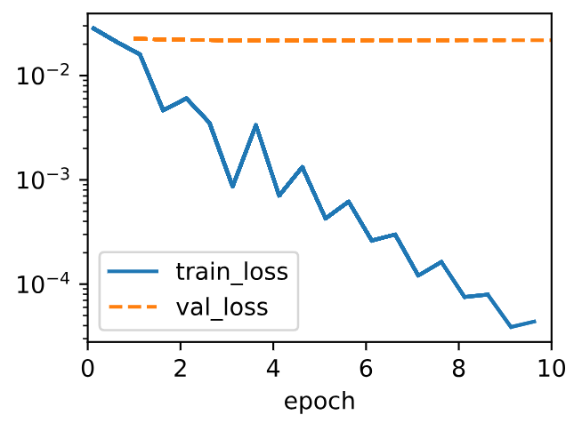
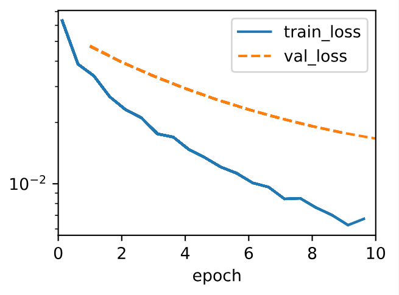
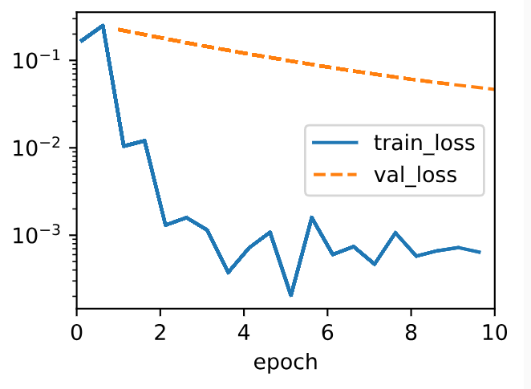

* [Back to Dive into Deep Learning](../../main.md)

# 3.7 Weight Decay

### Concept) Limits of the Previously Covered Regularization Techniques
1. Collecting more training data
   - Costly, time consuming, or entirely out of our control, making it impossible in the short run.
2. Tweaking the degree of the fitted polynomial
   - Simply tossing aside features can be too blunt an instrument
   - The number of terms with degree $d$ blows up rapidly as $d$ grows larger.
     - e.g.)
       - Suppose $k$ variable are given.
       - Then the number of monomials of degree $d$ is $`{}_{k-1++d} C_{k-1}`$
         - where monomials are the natural extensions of polynomials to multivariate data.
           - e.g.) monomials of degree 3 : $`x_1x_2^2, \;x_4^3, \;x_5x_6x_7`$

<br><br>

## 3.7.1 Norms and Weight Decay
### Concept) Weight Decay
- Intuition)
  - We want to restrict the values that the parameters can take.
  - Before that we want to define the value of the parameters.
  - The value of the parameters may be defined as the distance of the from zero.
  - Among all functions $\mathcal{f}$, the function $\mathcal{f}=0$ is the simplest form.
  - Thus, we may measure the distance of its parameters from zero.
  - There is no single right answer. 
    - In fact, entire branches of mathematics, including parts of functional analysis and the theory of Banach spaces, are devoted to addressing such issues.
- Simpler Approach)
  - Consider the $`\ell_2`$ norm of the weight vector : $`\|\mathbf{w}\|^2`$
    - cf.) [Why l_2, not l_1?](#analysis-l1-vs-l2)
    - cf.) Should we include a penalty to the bias $b$?
      - i.e.) $b^2$ in $\mathbf{w}$?
      - The answer may vary across layers of a neural network.
      - Often, we do not regularize the bias term.
  - Add the weight vector's norm as a penalty term to the problem of minimizing the loss.
    - $`L(\mathbf{w}, b) + \frac{\lambda}{2} \|\mathbf{w}\|^2`$
      - where 
        - $`L(\mathbf{w}, b) = \frac{1}{n}\sum_{i=1}^n \frac{1}{2}\left(\mathbf{w}^\top \mathbf{x}^{(i)} + b - y^{(i)}\right)^2`$ is the loss function
        - $\lambda \gt 0$ is the regularization constant which restrict the size of $`\|\mathbf{w}\|^2`$.
  - Update $\mathbf{w}$ using minibatch stochastic gradient descent.
    - $`\mathbf{w} \leftarrow \left(1- \eta\lambda \right) \mathbf{w} - \frac{\eta}{|\mathcal{B}|} \sum_{i \in \mathcal{B}} \mathbf{x}^{(i)} \left(\mathbf{w}^\top \mathbf{x}^{(i)} + b - y^{(i)}\right)`$
      - where $\eta$ is the learning rate
    - cf.) The term *Weight Decay*
      - We shrink the size of $\mathbf{w}$ towards zero.
      - That is why the method is sometimes called “weight decay”: given the penalty term alone, our optimization algorithm decays the weight at each step of training.

<br>

#### Analysis) Why l_2, not l_1?
- $`\ell_2`$-regularized linear models constitute the classic ridge regression algorithm
  - It places an outsize penalty on large components of the weight vector.
  - This biases our learning algorithm towards models that distribute weight evenly across a larger number of features.
  - In practice, this might make them more **robust to measurement error in a single variable**.
- $`\ell_1`$-regularized linear regression is a similarly fundamental method in statistics, popularly known as lasso regression.
  - $`\ell_1`$ penalties lead to models that concentrate weights on a small set of features by clearing the other weights to zero.
  - This gives us an effective method for feature selection, which may be desirable for other reasons.
    - e.g.) If our model only relies on a few features, then we may not need to collect, store, or transmit data for the other (dropped) features.

<br><br>

## Import modules)
```python
import torch
from torch import nn
from d2l import torch as d2l
```

<br><br>

## 3.7.2 High-Dimensional Linear Regression
Generate a dataset as below :
- $\displaystyle y = 0.05 + \sum_{i = 1}^d 0.01 x_i + \epsilon \textrm{, where } \epsilon \sim \mathcal{N}(0, 0.01^2).$
  - Desc.)
    - $d$ : the dimensionality of the problem

Implementation
```python
class Data(d2l.DataModule):
    def __init__(self, num_train, num_val, num_inputs, batch_size):
        self.save_hyperparameters()
        n = num_train + num_val
        self.X = torch.randn(n, num_inputs)
        noise = torch.randn(n, 1) * 0.01
        w, b = torch.ones((num_inputs, 1)) * 0.01, 0.05
        self.y = torch.matmul(self.X, w) + b + noise

    def get_dataloader(self, train):
        i = slice(0, self.num_train) if train else slice(self.num_train, None)
        return self.get_tensorloader([self.X, self.y], train, i)
```

<br><br>

## 3.7.3 Implementation from Scratch
Since minibatch stochastic gradient descent is our optimizer, we just need to add the squared $\ell_2$ penalty to the original loss function.

### 3.7.3.1 Defining l_2 Norm Penalty
```python
def l2_penalty(w):
    return (w ** 2).sum() / 2
```

### 3.7.3.1 Defining the Model
We will reuse ```d2l.LinearRegressionScratch``` from [the previous linear regression implementation](../04/note.md#341-defining-the-model).
```python
class WeightDecayScratch(d2l.LinearRegressionScratch):
    def __init__(self, num_inputs, lambd, lr, sigma=0.01):
        super().__init__(num_inputs, lr, sigma)
        self.save_hyperparameters()

    def loss(self, y_hat, y):
        return (super().loss(y_hat, y) + self.lambd * l2_penalty(self.w))
```

<br>

Let's set the model with the dimensionality of 200.   
We will train it with 20 examples and evaluate it with the validation set of 100 examples.   
The learning rate is 0.01.
```python
data = Data(num_train=20, num_val=100, num_inputs=200, batch_size=5)
trainer = d2l.Trainer(max_epochs=10)

def train_scratch(lambd):
    model = WeightDecayScratch(num_inputs=200, lambd=lambd, lr=0.01)
    model.board.yscale='log'
    trainer.fit(model, data)
    print('L2 norm of w:', float(l2_penalty(model.w)))
```

<br>

Now lets compare the cases [with](#3734-using-weight-decay) and [without](#3733-training-without-regularization) the regularization term.

<br>

### 3.7.3.3. Training without Regularization
$\lambda=0 \Rightarrow L(\mathbf{w}, b)$
```python
train_scratch(0)
```
- Result)
  - The model is overfitted!   
    

<br>

### 3.7.3.4. Using Weight Decay
$\lambda=3 \Rightarrow L(\mathbf{w}, b) + \frac{3}{2} \|\mathbf{w}\|^2$
```python
train_scratch(3)
```
- Result)
  - The training error increases but the validation error decreases.
    


<br><br>

## 3.7.4 Concise Implementation
Using the the ```net.wd``` parameter in PyTorch...
```python
class WeightDecay(d2l.LinearRegression):
    def __init__(self, wd, lr):
        super().__init__(lr)
        self.save_hyperparameters()
        self.wd = wd

    def configure_optimizers(self):
        return torch.optim.SGD([
            {'params': self.net.weight, 'weight_decay': self.wd},
            {'params': self.net.bias}], lr=self.lr)
```

Application.
```python
model = WeightDecay(wd=3, lr=0.01)
model.board.yscale='log'
trainer.fit(model, data)

print('L2 norm of w:', float(l2_penalty(model.get_w_b()[0])))
```



<br>

* [Back to Dive into Deep Learning](../../main.md)