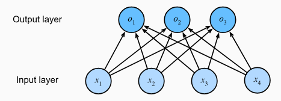

* [Back to Dive into Deep Learning](../../main.md)

# 4.1 Softmax Regression

## 4.1.1 Classification
#### Problem Setting) Image Classification
- Input : $2\times2$ grey scale image
  - Represent each pixel with $x_1, x_2, x_3, x_4$
- Output : Three categories of “cat”, “chicken”, and “dog”.
  - Using [the one-hot encoding](#concept-one-hot-encoding) below, we may represent as $`y \in \{(1, 0, 0), (0, 1, 0), (0, 0, 1)\}`$

#### Concept) One-Hot Encoding
- Desc.)
  - A vector with as many components as we have categories.
  - The component corresponding to a particular instance’s category is set to 1 and all other components are set to 0.

 

### 4.1.1.1 Linear Model
- Model)
  - Recall that we had 
    - 4 features : $x_1, x_2, x_3, x_4$
    - 3 classes of output : $`y \in \{(1, 0, 0), (0, 1, 0), (0, 0, 1)\}`$
      - Denote them as $o_1, o_2, o_3$
  - Thus, the linear model goes...
    - $`\begin{aligned}   o_1 &= x_1 w_{11} + x_2 w_{12} + x_3 w_{13} + x_4 w_{14} + b_1,\\   o_2 &= x_1 w_{21} + x_2 w_{22} + x_3 w_{23} + x_4 w_{24} + b_2,\\ o_3 &= x_1 w_{31} + x_2 w_{32} + x_3 w_{33} + x_4 w_{34} + b_3.   \end{aligned}`$
      - Simply put,
        - $`\mathbf{o} = \mathbf{W} \mathbf{x} + \mathbf{b}`$

- Desc.)
  - Fully connected Layer   
    
- Problems)
  - $\displaystyle \sum_{i=1,2,3}o_i\ne 1$
    - i.e.) There is no guarantee that the outputs $`o_i`$ sum up to $`1`$ in the way we expect probabilities to behave.
  - $\exists o_i \notin [0,1]$
    - There is no guarantee that the outputs $`o_i`$ are even nonnegative, even if their outputs sum up to $`1`$, or that they do not exceed $`1`$.
- **Alternative Sol.)**
  - [Softmax Regression](#4112-softmax-model)

 

### 4.1.1.2 Softmax Model
#### Concept) Softmax Function
- Def.)
  - $\hat{\mathbf{y}} = \mathrm{softmax}(\mathbf{o}) \quad \textrm{where}\quad \hat{y}_i = \frac{\exp(o_i)}{\sum_j \exp(o_j)}$
- Prop.)
  - The softmax operation preserves the ordering among its arguments.
    - Thus, $\displaystyle {\arg\max}_j \hat{y_j} = {\arg\max}_j o_j$
- Vectorization)
  - For
    |Element|Desc.|
    |:-:|:-|
    |$n$ | the number of examples|
    |$d$ | the dimensionality of the problem|
    |$`\mathbf{X} \in \mathbb{R}^{n \times d}`$ | a minibatch|
    |$q$ | the number of categories|
    |$`\mathbf{W} \in \mathbb{R}^{d \times q}`$ | the weights|
    |$`\mathbf{b} \in \mathbb{R}^{1\times q}`$ | the bias, in the matrix form $`\mathbf{B} = \left[\begin{array}{c} \mathbf{b}\\\mathbf{b}\\\vdots\\\mathbf{b} \end{array}\right]\in \mathbb{R}^{n\times q}`$|
  - The Model)
    - $\mathbf{O} = \mathbf{X} \mathbf{W} + \mathbf{B}$
      - $`\displaystyle n \textrm{ examples} \left\{ \left[\begin{array}{cccc} o_{11}&o_{12}&\cdots&o_{1q}\\o_{21}&o_{22}&\cdots&o_{2q}\\\vdots&\vdots&\ddots&\vdots\\o_{n1}&o_{n2}&\cdots&o_{nq} \end{array}\right] \right. = \underbrace{\left[\begin{array}{cccc} x_{11}&x_{12}&\cdots&x_{1d}\\x_{21}&x_{22}&\cdots&x_{2d}\\\vdots&\vdots&\ddots&\vdots\\x_{n1}&x_{n2}&\cdots&x_{nd} \end{array}\right]}_{d \textrm{ features}} \; \underbrace{\left[\begin{array}{cccc} w_{11}&w_{12}&\cdots&w_{1q}\\w_{21}&w_{22}&\cdots&w_{2q}\\\vdots&\vdots&\ddots&\vdots\\w_{d1}&w_{d2}&\cdots&w_{dq}\end{array}\right]}_{q \textrm{ categories}} + \left[\begin{array}{c} \mathbf{b}\\\mathbf{b}\\\vdots\\\mathbf{b} \end{array}\right]`$
        - where $`\mathbf{b} = \left[\begin{array}{cccc} b_{1}&b_{2}&\cdots&b_{q} \end{array}\right]`$
    - $\hat{\mathbf{Y}} = \mathrm{softmax}(\mathbf{O})$
      - $`\displaystyle \left[\begin{array}{c} \hat{\mathbf{y}_1} \\ \hat{\mathbf{y}_2} \\ \vdots \\ \hat{\mathbf{y}_n} \end{array}\right] = \left[\begin{array}{c} \mathrm{softmax}(\mathbf{o}_1) \\ \mathrm{softmax}(\mathbf{o}_2) \\ \vdots \\ \mathrm{softmax}(\mathbf{o}_n) \end{array}\right]`$
        - where $`\mathbf{o}_i = \left[\begin{array}{cccc} o_{i1}&o_{i2}&\cdots&o_{iq} \end{array}\right]`$
- cf.)
  - Care must be taken to avoid exponentiating and taking logarithms of large numbers, since this can cause numerical overflow or underflow.

  

## 4.1.2 Loss Function
### 4.1.2.1 Log-Likelihood
#### Derivation)
- Recall that $\hat{\mathbf{y}}^{(i)} = \textrm{softmax}(\mathbf{o}^{(i)}) = \textrm{softmax}(\mathbf{x}^{(i)}\mathbf{W}+\mathbf{b})$ 
  - where 
    - $i=1,2,\cdots, n$
    - $\hat{\mathbf{y}}^{(i)}, \mathbf{o}^{(i)}, \mathbf{b} \in \mathbb{R}^q$.
    - $\mathbf{x}^{(i)} \in \mathbb{R}^d$.
    - $\mathbf{W} \in \mathbb{R}^{d\times q}$.
- Then $\hat{\mathbf{y}}^{(i)}$ can be interpreted as the (estimated) conditional probability of each class $1,2,\cdots, q$, given the $i$-th input $\mathbf{x}^{(i)}$.
  - i.e.) For $`\hat{\mathbf{y}}^{(i)} = \left[ \begin{array}{cccc} \hat{y}_{1}^{(i)}&\hat{y}_{2}^{(i)}& \cdots&\hat{y}_{q}^{(i)} \end{array} \right]`$
    - $`\hat{y}_{j}^{(i)} = P\left(y_j|\mathbf{x}^{(i)}\right), j=1,2,\cdots, q`$
  - why?)
    - We used one-hot encoding to represent a label $y$ with $q$ multiple values into a vector $\mathbf{y} \in \mathbb{R}^q$.
      - i.e.) $`y \in \{v_1, v_2, \cdots, v_q\} \rightarrow \mathbf{y} = \left[ \begin{array}{cccc} y_1&y_2& \cdots&y_q \end{array} \right]`$ 
        - where $`\displaystyle y_j \in \{0, 1\} \textrm{ and } \sum_{j=1}^q{y_j}=1, \forall j=1,2,\cdots, q`$
    - Also, we normalized them using the softmax function.
      - $\hat{\mathbf{y}} = \mathrm{softmax}(\mathbf{o}) \quad \textrm{where}\quad \hat{y}_i = \frac{\exp(o_i)}{\sum_j \exp(o_j)}$
    - Thus, $`\displaystyle \sum_{j=1}^q` \hat{y}_{j}^{(i)} = 1$, where $`\hat{\mathbf{y}}^{(i)} = \left[ \begin{array}{cccc} \hat{y}_{1}^{(i)}&\hat{y}_{2}^{(i)}& \cdots&\hat{y}_{q}^{(i)} \end{array} \right]`$.
    - Also, $\hat{y}_{j}^{(i)}$ can be interpreted as the conditional probability that the label will have the value of $y_j$ given the $i$-th example : $`P\left(y_j|\mathbf{x}^{(i)}\right)`$
  - e.g.) Suppose $y \in \lbrace \textrm{cat, dog}\rbrace$
    - Then $`\hat{y}_{\textrm{cat}} = P\left(y_{\textrm{cat}}|\mathbf{x}\right)`$
- Thus, for the entire data set $\mathbf{X} \in \mathbb{R}^{n\times d}$ and the label $\mathbf{Y}\in\mathbb{R}^{n\times q}$,
  - $`\displaystyle P(\mathbf{Y}|\mathbf{X}) = \prod_{i=1}^n P(\mathbf{y}^{(i)}|\mathbf{x}^{(i)})`$ : the likelihood of $\mathbf{y}$
  - We are allowed to use the factorization since we assume that each label is drawn independently from its respective distribution $P(\mathbf{y}|\mathbf{x}^{(i)})$
- Hence, the negative log-likelihood goes...
  - $`\displaystyle -\log{P(\mathbf{Y}|\mathbf{X})}=\sum_{i=1}^n{-\log{P(\mathbf{y}^{(i)}|\mathbf{x}^{(i)})}} = \sum_{i=1}^n{l\left(\mathbf{y}^{(i)}, \hat{\mathbf{y}}^{(i)}\right)}`$
    - where $`\displaystyle l\left(\mathbf{y}^{(i)}, \hat{\mathbf{y}}^{(i)}\right)=-\sum_{j=1}^q{y_j} \log{\hat{y}_j}`$ : [the cross-entropy loss](#4133-cross-entropy-revisited)
  - Negative term used due to the loss minimization custom for optimization, instead of likelihood maximization problem.
- The derivation continues [below](#4122-softmax-and-cross-entropy-loss).

#### Prop.) 
- Why do we use likelihood maximization to get the difference between the estimation and the observed data : $y-\hat{y}$?
  - In any exponential family model, **the gradients of the log-likelihood** are given by precisely the difference between the probability assigned by our model and what actually happened.
  - Check [the derivation below](#4122-softmax-and-cross-entropy-loss).
- $`\displaystyle l\left(\mathbf{y}^{(i)}, \hat{\mathbf{y}}^{(i)}\right)`$ is bounded from below by $0$.
  - why?) $`\displaystyle l\left(\mathbf{y}^{(i)}, \hat{\mathbf{y}}^{(i)}\right)=0 \iff \textrm{Prediction with certainty.}`$
    - This can never happen for any finite setting of the weights because taking a softmax output towards 1 requires taking the corresponding input $o_i$ to infinity (or all other outputs $o_j$ for $j\ne i$ to negative infinity).

 

### 4.1.2.2. Softmax and Cross-Entropy Loss
- Derivation)   
  $`\displaystyle \begin{aligned} l(\mathbf{y}, \hat{\mathbf{y}}) &=  - \sum_{j=1}^q y_j \log \frac{\exp(o_j)}{\sum_{k=1}^q \exp(o_k)} \\ &= \sum_{j=1}^q y_j \log \sum_{k=1}^q \exp(o_k) - \sum_{j=1}^q y_j o_j \\ &= \log \sum_{k=1}^q \exp(o_k) \sum_{j=1}^q{y_j} - \sum_{j=1}^q y_j o_j \\ &= \log \sum_{k=1}^q \exp(o_k) - \sum_{j=1}^q y_j o_j \left(\because\sum_{j=1}^q{y_j}=1\right) \end{aligned}`$
- Consider the derivative w.r.t. $o_j$.
  - $`\begin{aligned} \partial_{o_j} l(\mathbf{y}, \hat{\mathbf{y}}) &= \partial_{o_j} \left( \log \sum_{k=1}^q \exp(o_k) - \sum_{j=1}^q y_j o_j \right) \\&= \frac{\exp(o_j)}{\sum_{k=1}^q \exp(o_k)} - y_j \\&= \mathrm{softmax}(\mathbf{o})_j - y_j \end{aligned}`$
    - i.e.) The difference between the probability assigned by our model and what actually happened. 
      - This is not a coincidence. In any exponential family model, **the gradients of the log-likelihood** are given by precisely this term. This fact makes computing gradients easy in practice.

  

## 4.1.3 Information Theory Basics
### 4.1.3.1 Entropy
The central idea in information theory is to quantify the amount of information contained in data. This places a limit on our ability to compress data. For a distribution $P$, its entropy $H[P]$ is defined as
- $\displaystyle H[P] = \sum_j - P(j) \log P(j)$

One of the fundamental theorems of information theory states that in order to encode data drawn randomly from the distribution $P$, we need at least $H[P]$ "nats" to encode it.
- “nat” is the equivalent of bit but when using a code with base $e$ rather than the base of $2$.
- Thus, one nat is $`\frac{1}{\log(2)} \approx 1.44`$ bit.

  

### 4.1.3.2 Surprisal
#### Concept) Surprisal, *Shannon (1948)*
- Def.)
  - For an event $j$ having assigned with a (subjective) probability $P(j)$,
  - the surprisal at observing an event $j$ is $\log \frac{1}{P(j)} = -\log P(j)$
- Desc.)
  - Imagine that we have a stream of data that we want to compress.
  - If it is always easy for us to predict the next token, then this data is easy to compress.
  - In the extreme case where every token in the stream always takes the same value, we do not have to transmit any information to communicate the contents of the stream.
    - $P(j)=1 \Rightarrow -\log P(j) = 0$
  - However if we cannot perfectly predict every event, then we might sometimes be **surprised**.
  - Our surprise is greater when an event is assigned lower probability.
    - $P(j)\approx1 \Rightarrow -\log P(j) \approx \infty$
  - Claude Shannon settled on $\log \frac{1}{P(j)} = -\log P(j)$ to quantify one’s surprisal at observing an event $j$ having assigned it a (subjective) probability $P(j)$

  

### 4.1.3.3. Cross-Entropy Revisited
#### Concept) Cross-Entropy
- Def.) $H(P,Q)$
  - For 
    - $j$ : an event
    - $P(j)$ : the actual probability that $j$ may happen
    - $H(j)$ : the subjective probability that $j$ may happen
  - The Cross-Entropy from $P$ to $Q$ is the expected surprisal of an observer with subjective probabilities $Q$ upon seeing data that was actually generated according to probabilities $P$.
    - $H(P,Q)\equiv\sum_j P(j)(-\log{Q(j)})$

  

 

* [Back to Dive into Deep Learning](../../main.md)