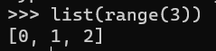
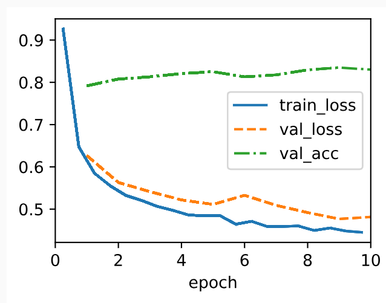
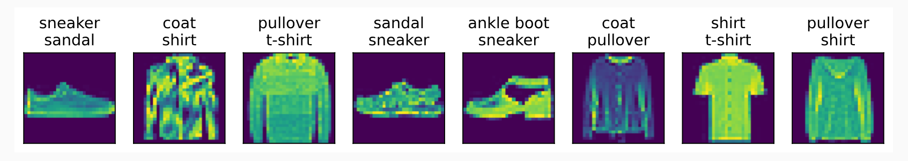

* [Back to Dive into Deep Learning](../../main.md)

# 4.4. Softmax Regression Implementation from Scratch

#### Import packages
```python
import torch
from d2l import torch as d2l
```

## 4.4.1 The Softmax
Use [the built-in Softmax function](#eg-pytorch-built-in-softmax-example)!   
Below is to demonstrate how it works.

- Recall the sum operation along specific dimensions in a tensor.
  - Sum over elements in each column.
    ```python
    X = torch.tensor([[1.0, 2.0, 3.0], [4.0, 5.0, 6.0]])
    X.sum(0, keepdims=True)
    ```
  - Sum over elements in each row.
    ```python
    X = torch.tensor([[1.0, 2.0, 3.0], [4.0, 5.0, 6.0]])
    X.sum(1, keepdims=True)
    ```
- We can use this for calculating the softmax function.
  - Recall that $`\displaystyle\textrm{softmax}(\mathbf{X})_{ij} = \frac{\exp{(\mathbf{X}_{ij})}}{\sum_k \exp{(X_{ik})}}`$
  - Thus calculate by
    1. Exponentiation of each term. 
    2. A sum over each row to compute the normalization constant for each example.
    3. Division of each row by its normalization constant, ensuring that the result sums to 1.  
    ```python
    def softmax(X):
        X_exp = torch.exp(X)
        partition = X_exp.sum(1, keepdims=True)
        return X_exp / partition  # The broadcasting mechanism is applied here
    ```
       - cf.)
         - Caution: the code above is not robust against very large or very small arguments.
         - Thus, we may use the built-in ```softmax()``` instead.

#### e.g.) PyTorch Built-in Softmax Example
```python
X = torch.rand((2, 5))
X_prob = softmax(X)
X_prob, X_prob.sum(1)
```

<br><br>

## 4.4.2 The Model
Implement the ```SoftmaxRegressionScratch``` class.   
```python
class SoftmaxRegressionScratch(d2l.Classifier):
    def __init__(self, num_inputs, num_outputs, lr, sigma=0.01):
        super().__init__()
        self.save_hyperparameters()
        self.W = torch.normal(0, sigma, size=(num_inputs, num_outputs),
                              requires_grad=True)
        self.b = torch.zeros(num_outputs, requires_grad=True)

    def parameters(self):
        return [self.W, self.b]
```
- Desc.)
  - ```num_inputs``` : the number of features.
  - ```num_outputs``` : the number of output classes or the categories.
  - The weight matrix ```self.W``` elements are initialized to $N(0, 0.01^2)$
    - Input should be flattened to the vector format.
    - Refer to [the MNIST example below](#eg-mnist).
  - The bias vector ```self.b``` elements are initialized to $0$ 

#### E.g.) MNIST
- Consider that [MNIST](../02/note.md#tech-mnist--lecun-et-al-1998) raw data consists of $28 \times 28$ pixel images. 
- We can flatten these images into vectors of length $784$.
  - i.e.) ```num_inputs=784```
- Also, remember that we set $10$ classes as outputs.
  - i.e.) ```num_outputs=10```
- Thus, our model goes as follows.
  - $n$ : the number of training/validation examples
  - $\hat{\mathbf{Y}}, \mathbf{O} \in \mathbb{R}^{n\times 10}$
    - where $\hat{\mathbf{Y}} = \textrm{softmax}(\mathbf{O})$
    - and $\mathbf{O} = \mathbf{X}\mathbf{W} + \mathbf{b}$
  - $\mathbf{X} \in \mathbb{R}^{n\times 784}$ : the examples
  - $\mathbf{W} \in \mathbb{R}^{784\times 10}$ : the weight matrix
    - The values of it will be initialized to $N(0, 0.01^2)$ 
    - ```self.W``` in ```SoftmaxRegressionScratch``` above
  - $\mathbf{b} \in \mathbb{R}^{10}$ : the bias
    - The values of it will be initialized to $0$.
    - ```self.b``` in ```SoftmaxRegressionScratch``` above
  - Refer to [the Sofmax structure](../../ch04/01/note.md#concept-softmax-function).

<br>

Also, the input data should be flattened to the vector format as well.   
Finally apply the built-in ```softmax()``` function and return the value.
```python
@d2l.add_to_class(SoftmaxRegressionScratch)
def forward(self, X):
    X = X.reshape((-1, self.W.shape[0]))
    return softmax(torch.matmul(X, self.W) + self.b)
```
- e.g.) MNIST
  - The raw data consists of $n$ images of $28\times 28$ sizes.
  - Thus, it is the $n\times 28 \times 28$ tensor.
  - By applying ```X.reshape((-1, self.W.shape[0]))```, it becomes the $n\times 784$  matrix.

<br><br>

## 4.4.3 The Cross-Entropy Loss


<br><br>

## 4.4.4 Training


<br><br>

## 4.4.5 Prediction


<br>

## 4.4.3 The Cross-Entropy Loss
Recall that cross-entropy takes the negative log-likelihood of the predicted probability assigned to the true label.   
Thus, Implement the ```cross_entropy``` function by averaging over (```mean()```) the logarithms (```-torch.log()```) of the selected probabilities.   
- cf.)
  - Refer to [the fancy indexing](../../ch02/01/note.md#tech-fancy-indexing) for the indexing technique.
```python
def cross_entropy(y_hat, y):
    return -torch.log(y_hat[list(range(len(y_hat))), y]).mean()
```
- cf.) ```list(range(3))```   
  


Add the ```loss``` method for the ```SoftmaxRegressionScratch``` and all the above ```cross_entropy()``` function in it.
```python
@d2l.add_to_class(SoftmaxRegressionScratch)
def loss(self, y_hat, y):
    return cross_entropy(y_hat, y)
```

<br><br>

## 4.4.4 Training
- We reuse [the ```fit``` method](../../ch03/02/note.md#324-training) and [the ```fit_epoch``` method](../../ch03/04/note.md#3441-data-preparation) defined in Section 3 to train the model with 10 epochs.   
- Note that the number of epochs (```max_epochs```), the minibatch size (```batch_size```), and learning rate (```lr```) are adjustable hyperparameters.
  - In practice, these values are chosen based on the validation split of the data
```python
data = d2l.FashionMNIST(batch_size=256)
model = SoftmaxRegressionScratch(num_inputs=784, num_outputs=10, lr=0.1)
trainer = d2l.Trainer(max_epochs=10)
trainer.fit(model, data)
```
- Result)   
  


<br><Br>

## 4.4.5 Prediction
Now that training is complete, our model is ready to classify some images.
```python
X, y = next(iter(data.val_dataloader()))
preds = model(X).argmax(axis=1)
preds.shape
```

Visualize the incorrectly labeled images by comparing their actual labels (first line of text output) with the predictions from the model (second line of text output).
```python
wrong = preds.type(y.dtype) != y
X, y, preds = X[wrong], y[wrong], preds[wrong]
labels = [a+'\n'+b for a, b in zip(data.text_labels(y), data.text_labels(preds))]
data.visualize([X, y], labels=labels)
```


<br><br>

* [Back to Dive into Deep Learning](../../main.md)