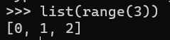
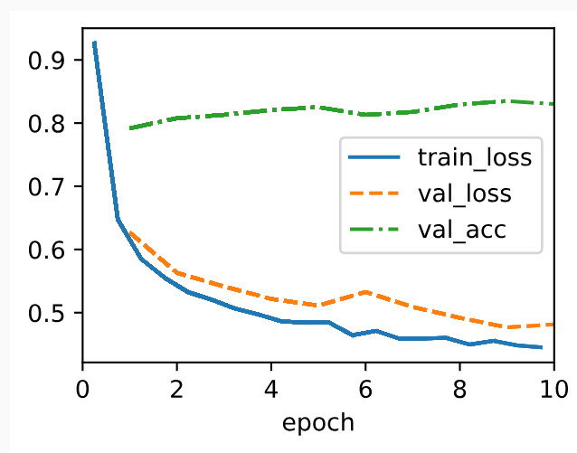
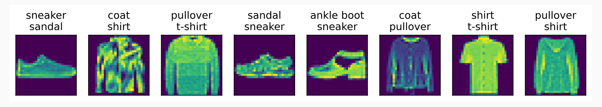

## 4.4.3 The Cross-Entropy Loss
Recall that cross-entropy takes the negative log-likelihood of the predicted probability assigned to the true label.   
Thus, Implement the ```cross_entropy``` function by averaging over (```mean()```) the logarithms (```-torch.log()```) of the selected probabilities.   
- cf.)
  - Refer to [the fancy indexing](../../ch02/01/note.md#tech-fancy-indexing) for the indexing technique.
```python
def cross_entropy(y_hat, y):
    return -torch.log(y_hat[list(range(len(y_hat))), y]).mean()
```
- cf.) ```list(range(3))```   
  


Add the ```loss``` method for the ```SoftmaxRegressionScratch``` and all the above ```cross_entropy()``` function in it.
```python
@d2l.add_to_class(SoftmaxRegressionScratch)
def loss(self, y_hat, y):
    return cross_entropy(y_hat, y)
```

<br><br>

## 4.4.4 Training
- We reuse [the ```fit``` method](../../ch03/02/note.md#324-training) and [the ```fit_epoch``` method](../../ch03/04/note.md#3441-data-preparation) defined in Section 3 to train the model with 10 epochs.   
- Note that the number of epochs (```max_epochs```), the minibatch size (```batch_size```), and learning rate (```lr```) are adjustable hyperparameters.
  - In practice, these values are chosen based on the validation split of the data
```python
data = d2l.FashionMNIST(batch_size=256)
model = SoftmaxRegressionScratch(num_inputs=784, num_outputs=10, lr=0.1)
trainer = d2l.Trainer(max_epochs=10)
trainer.fit(model, data)
```
- Result)   
  


<br><Br>

## 4.4.5 Prediction
Now that training is complete, our model is ready to classify some images.
```python
X, y = next(iter(data.val_dataloader()))
preds = model(X).argmax(axis=1)
preds.shape
```

Visualize the incorrectly labeled images by comparing their actual labels (first line of text output) with the predictions from the model (second line of text output).
```python
wrong = preds.type(y.dtype) != y
X, y, preds = X[wrong], y[wrong], preds[wrong]
labels = [a+'\n'+b for a, b in zip(data.text_labels(y), data.text_labels(preds))]
data.visualize([X, y], labels=labels)
```
