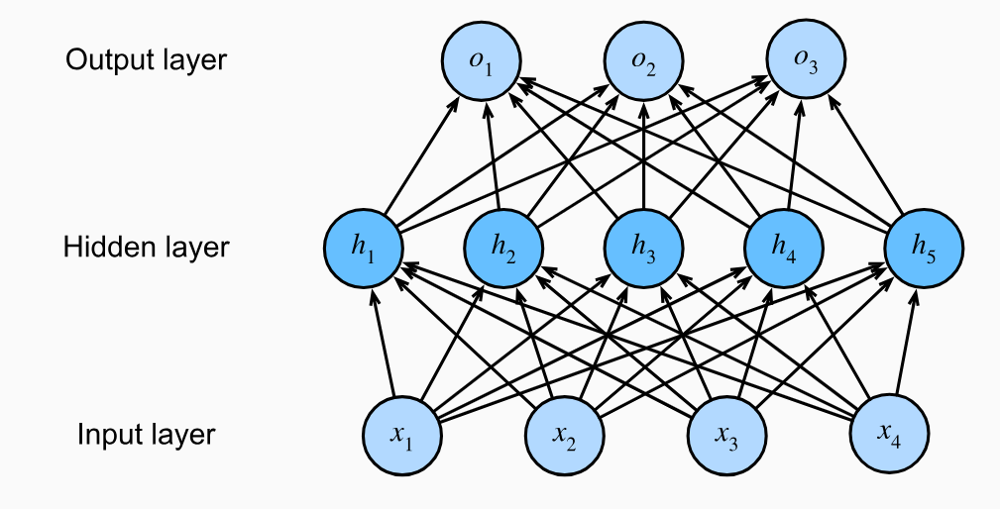

* [Back to Dive into Deep Learning](../../main.md)

# 5.1 Multilayer Perceptrons

#### Import Packages
```python
import torch
from d2l import torch as d21
```

## 5.1.1 Hidden Layers
- Recall that our previous model utilized a simple [affine transformation](../../ch03/01/note.md#concept-affine-transformation-of-input-features).
  - i.e.) Preserving the linearity of the input features.
- However, linearity (in affine transformations) is a **strong** assumption.
  - Why?)
    - There are [limitations of linear models](#5111-limitations-of-linear-models).
      - e.g.) Linearity implies the weaker assumption of monotonicity.
        - Linear model preserves the monotonicity of the input features.
        - This simplicity will lower the accuracy of the prediction of the model.
- We can overcome the limitations of linear models by incorporating one or more **hidden layers**.
  - Concept) Multilayer Perceptron (MLP)
    - Desc.)
      - Stacking many fully connected layers on top of one another.   
        - e.g.)   
          
          - Four inputs, three outputs, and its hidden layer contains five hidden units
          - The number of layers in this MLP is two.
            - why?)
              - The input layer does not involve any calculations, producing outputs with this network requires implementing the computations for both the hidden and output layers.


<br>

* [Back to Dive into Deep Learning](../../main.md)