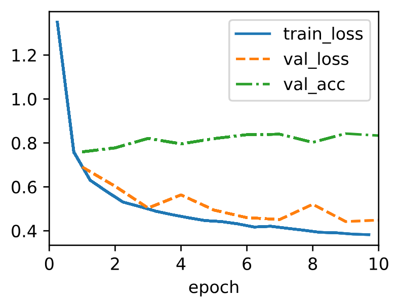

* [Back to Dive into Deep Learning](../../main.md)

# 5.2 Implementation of Multilayer Perceptrons

#### Import packages
```python
import torch
from torch import nn
from d2l import torch as d2l
```

- Contents)
  1. [Implementation from Scratch](#521-implementation-from-scratch)
  2. [Concise Implementation](#522-concise-implementation)

<br>

---

<br>


## 5.2.1 Implementation from Scratch
### 5.2.1.1 Initializing Model Parameters
- Assumptions)
  - A classification data set with $784$ input features and $10$ classes.
    - Just like [the MNIST problem](../../ch04/02/note.md#tech-mnist--lecun-et-al-1998) that we previously covered.
      - $28\times 28=784$ grid of grayscale pixel image
      - $10$ classification output categories
  - One hidden layer and $256$ hidden units (i.e. the width).
    - The number of hidden layer and the hidden units are adjustable with the hyperparameters.
      - cf.) Choose the layer widths to be divisible by larger powers of $2$, which is computationally efficient due to the way memory is allocated and addressed in hardware.
      - cf.) For every layer, we must keep track of **one weight matrix** and **one bias vector**.

```python
class MLPScratch(d2l.Classifier):
    def __init__(self, num_inputs, num_outputs, num_hiddens, lr, sigma=0.01):
        super().__init__()
        self.save_hyperparameters()
        self.W1 = nn.Parameter(torch.randn(num_inputs, num_hiddens) * sigma)
        self.b1 = nn.Parameter(torch.zeros(num_hiddens))
        self.W2 = nn.Parameter(torch.randn(num_hiddens, num_outputs) * sigma)
        self.b2 = nn.Parameter(torch.zeros(num_outputs))
```
- [Recall](../01/note.md#concept-multilayer-perceptron-mlp) $`\;\;\begin{aligned}
        \mathbf{H} & = \mathbf{X} \mathbf{W}^{(1)} + \mathbf{b}^{(1)} \\
        \mathbf{O} & = \mathbf{H}\mathbf{W}^{(2)} + \mathbf{b}^{(2)}
    \end{aligned}, 
    \;\; \exists \left\{ \begin{array}{ll} \mathbf{W}^{(1)} \in \mathbb{R}^{d \times  h} & \textrm{ : the hidden-layer weights} \\ \mathbf{b}^{(1)} \in \mathbb{R}^{1 \times h} &  \textrm{ : the hidden-layer biases} \\ \mathbf{W}^{(2)} \in \mathbb{R}^{h \times q} & \textrm { : the output-layer weights} \\ \mathbf{b}^{(2)} \in \mathbb{R}^{1 \times q} & \textrm{ :  the output-layer biases} \end{array} \right.`$

<br><br>

### 5.2.1.2 Model
#### ReLU Implementation
- ReLU will be the activation function for our program.
- Self-implemented version for the demonstration.

```python
def relu(X):
    a = torch.zeros_like(X)
    return torch.max(X, a)
```

#### Reshaping two-dimensional image into flat vector of length num_input
- Recall [our assumption](#5211-initializing-model-parameters).
```python
@d2l.add_to_class(MLPScratch)
def forward(self, X):
    X = X.reshape((-1, self.num_inputs))
    H = relu(torch.matmul(X, self.W1) + self.b1)
    return torch.matmul(H, self.W2) + self.b2
```

<br><br>

### 5.2.1.3 Training
```python
model = MLPScratch(num_inputs=784, num_outputs=10, num_hiddens=256, lr=0.1)
data = d2l.FashionMNIST(batch_size=256)
trainer = d2l.Trainer(max_epochs=10)
trainer.fit(model, data)
```
- cf.) The training loop for MLPs is exactly the same as for [softmax regression](../../ch04/04/note.md#444-training).
- Result   
  


<br><br>

## 5.2.2 Concise Implementation
### 5.2.2.1 Model
```python
class MLP(d2l.Classifier):
    def __init__(self, num_outputs, num_hiddens, lr):
        super().__init__()
        self.save_hyperparameters()
        self.net = nn.Sequential(nn.Flatten(), nn.LazyLinear(num_hiddens),
                                 nn.ReLU(), nn.LazyLinear(num_outputs))
```
- Compared to the [previous Softmax regression](../../ch04/05/note.md#45-concise-implementation-of-softmax-regression)...
  1. we added two fully connected layers.
     - cf.) Softmax : ```self.net = nn.Sequential(nn.Flatten(), nn.LazyLinear(num_outputs))```
  2. no ```foward``` method is explicitly defined.
     - Recall that we defined as the following in the softmax case.
       ```python
       def forward(self, X):
            return self.net(X)
       ```
     - MLP inherits the forward method from the ```Module``` class to simply invoke ```self.net(X)```, which is now defined as a sequence of transformations via the ```Sequential``` class.

<br>

### 5.2.2.2 Training
```python
model = MLP(num_outputs=10, num_hiddens=256, lr=0.1)
trainer.fit(model, data)
```
- The training loop is exactly the same as when we implemented softmax regression.


<br>

* [Back to Dive into Deep Learning](../../main.md)