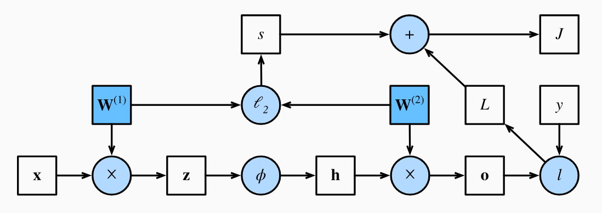

* [Back to Dive into Deep Learning](../../main.md)

# 5.3 Forward Propagation, Backward Propagation, and Computational Graphs

## 5.3.1. Forward Propagation
### Concept) Forward Propagation
- Def.)
  - Forward propagation (or forward pass) refers to the calculation and storage of intermediate variables (including outputs) for a neural network **in order from the input layer to the output layer**. 
- Derivation)
  - Assumptions)
    - $`\mathbf{x} \in \mathbb{R}^d`$ : an input example
    - Hidden layer does not include a bias term.
  - Output)
    - $\mathbf{o}= \mathbf{W}^{(2)} \mathbf{h}$
      - where
        - $`\mathbf{W}^{(2)} \in \mathbb{R}^{q \times h}`$ : the weight parameter of the output layer
        - $\mathbf{h}= \phi (\mathbf{z})$
          - where
            - $`\phi : \mathbb{R}^h \rightarrow \mathbb{R}^h`$ : the hidden activation function
            - $\mathbf{z}= \mathbf{W}^{(1)} \mathbf{x}$
              - where $`\mathbf{W}^{(1)} \in \mathbb{R}^{h \times d}`$ : the weight parameter of the hidden layer
  - Objective Function)
    - $J = L + s$
      - where
        - $L = l(\mathbf{o}, y)$ : the loss function
        - $\displaystyle s = \frac{\lambda}{2} \left(\|\mathbf{W}^{(1)}\|_\textrm{F}^2 + \|\mathbf{W}^{(2)}\|_\textrm{F}^2\right)$ : the regularization term
          - cf.) The Frobenius norm of the matrix is simply the $`\ell_2`$ norm applied after flattening the matrix into a vector.

 

#### Computational Graph of Forward Propagation

  

## 5.3.3 Backpropagation
- Def.)
  - Backpropagation refers to the method of calculating the gradient of neural network parameters.
  - n short, the method traverses the network in **reverse order**, from the output to the input layer, according to the **chain rule** from calculus.

 

* [Back to Dive into Deep Learning](../../main.md)