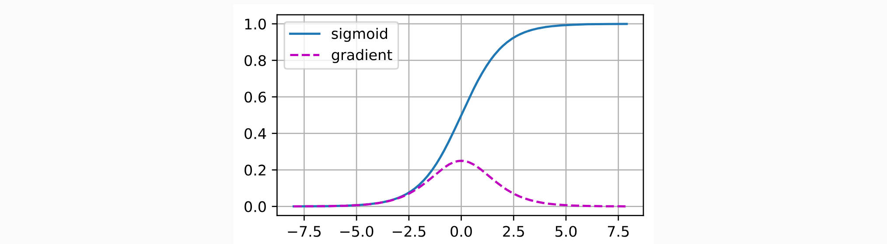

* [Back to Dive into Deep Learning](../../main.md)

# 5.4. Numerical Stability and Initialization
- Ideation)
  - Recall that we initialized parameters.
    - This choice of initialization scheme plays a significant role in neural network learning.
      - why?)
        - It can be crucial for maintaining **numerical stability**.
    - The choice of initialization can be tied up with the choice of the **nonlinear activation function**.
      - why?)
        - Choosing appropriate initial parameters can determine how **quickly** our optimization algorithm converges.
        - Poor choices can cause [exploding or vanishing gradients](#541-vanishing-and-exploding-gradients) while training.

#### Import Packages
```python
import torch
from d2l import torch as d2l
```

<br>

## 5.4.1 Vanishing and Exploding gradients
- Setting)
  - Consider a deep network with...
    - $L$ : the set of layers in the network
      - $l\in L$ : a layer in the network
    - $\mathbf{x}$ : the input to the network
    - $\mathbf{o}$ : the output of the network
    - $f_l$ : a transformation of the layer $l$
      - where $f_l$ is parametrized by weights $\mathbf{W}^{(l)}$
    - $\mathbf{h}^{(l)} = f_l(\mathbf{h}^{(l-1)})$ : the output of the layer $l$
- Derivation)
    - Then, $\mathbf{o}$ can be denoted as $\mathbf{o} = f_L \circ\cdots\circ f_1(\mathbf{x})$
    - Thus, the gradient of $\mathbf{o}$ is...   
      $`\begin{array}{lll}
        \partial_{\mathbf{W}^{(l)}} \mathbf{o} 
        &= \underbrace{\partial_{\mathbf{h}^{(L-1)}} \mathbf{h}^{(L)}}_{ \mathbf{M}^{(L)} \stackrel{\textrm{def}}{=}} \; \cdots \; \underbrace{\partial_{\mathbf{h}^{(l)}} \mathbf{h}^{(l+1)}}_{ \mathbf{M}^{(l+1)} \stackrel{\textrm{def}}{=}} \; \underbrace{\partial_{\mathbf{W}^{(l)}} \mathbf{h}^{(l)}}_{ \mathbf{v}^{(l)} \stackrel{\textrm{def}}{=}} \\
        &= \mathbf{M}^{(L)} \; \cdots \; \mathbf{M}^{(l+1)} \; \mathbf{v}^{(l)}
       \end{array}`$
        - Weakness)
          - Numerical underflow due to the series of multiplication.
          - $M^{(l)}$ may have a wide variety of eigenvalues including very large or very small figures.
              - If the value is very large, numerical underflow may pop up.
                - [Exploding Gradients](#5412-exploding-gradient) below
              - If the value if very small, $\log$ transformation is a terrible choice.
                - [Vanishing Gradients](#5411-vanishing-gradient) below

<br>

### 5.4.1.1 Vanishing Gradient
#### e.g.) Sigmoid Activation Function
- Recall the sigmoid function : $\displaystyle\frac{1}{1+e^{-x}}$
  - Historically, the sigmoid function was popular because it resembles a thresholding function.
    - Since early artificial neural networks were inspired by biological neural networks, the idea of neurons that fire either fully or not at all (like biological neurons) seemed appealing.
  - But due to the vanishing gradient problem, we should be careful using it.
    - Consequently, RELU became the default choice for practitioners.

<br>

- Simulation)
  ```python
  x = torch.arange(-8.0, 8.0, 0.1, requires_grad=True)
  y = torch.sigmoid(x)
  y.backward(torch.ones_like(x))

  d2l.plot(x.detach().numpy(), [y.detach().numpy(), x.grad.numpy()], legend=['sigmoid', 'gradient'], figsize=(4.5, 2.5))
  ```
  - Result)   
    
    - The sigmoid’s gradient **vanishes** both when its inputs are large and when they are small.
    - Unless we are in the Goldilocks zone, where the inputs to many of the sigmoids are close to zero, the gradients of the overall product may vanish.
    - Consequently, ReLUs, which are more stable (but less neurally plausible), have emerged as the default choice for practitioners.

<br>

### 5.4.1.2 Exploding Gradient
#### e.g.) Simple Matrix Multiplication Overflow
```python
M = torch.normal(0, 1, size=(4, 4))
print('a single matrix \n',M)
for i in range(100):
    M = M @ torch.normal(0, 1, size=(4, 4))
print('after multiplying 100 matrices\n', M)
```
- Likewise, the gradient of the output of a deep learning neural network can easily overflow.


<br>

### 5.4.1.3 Breaking the Symmetry
- Concept) Inherent Symmetry in Parametrization
  - e.g.) Permutation Symmetry Case
     - Assume a simple MLP with...
       - One hidden layer
         - Put $\mathbf{W}^{(1)}$ : the weights of the layer
       - Two units
     - Then differentiating the first and the second unit, there is a symmetry among the hidden units of each layer.
     - Suppose we initialized all the parameters of the hidden layer as $`\mathbf{W}^{(1)}=\left[c\right], \; c\in \mathbb{R}`$.
     - Then, during **forward propagation** either hidden unit takes the same inputs and parameters producing the same activation which is fed to the output unit.
     - During **backpropagation**, differentiating the output unit w.r.t. parameters $\mathbf{W}^{(1)}$ gives a gradient all of whose elements take the same value.
     - Thus, after gradient-based iteration (e.g., minibatch stochastic gradient descent), all the elements of $\mathbf{W}^{(1)}$ still take the same value.
     - Such iterations would never **break the symmetry**.

<br><br>

## 5.4.2 Parameter Initialization
- Why needed?)
  - One way of addressing the issues above...
  - Along with the regularization

### Tech.) Xavier Initialization
- Settings)
  - $`\displaystyle o_{i} = \sum_{j=1}^{n_\textrm{in}} w_{ij} x_j`$ : a fully connected layer **without nonlinearities**
    - where
      - $`o_{i}`$ : the output
      - $`n_\textrm{in}`$ : the number of inputs
      - $`x_j`$ : the $j$-th input
      - $`w_{ij}`$ : the $i$-th weight associated with $`x_j`$
        - Further assume that all $`w_{ij}`$ are drawn from the same distribution with **zero mean** and variance $\sigma^2$.
        - Does not necessarily have to be Gaussian.
  - Then,   
    $`\begin{aligned}
      E[o_i] & = \sum_{j=1}^{n_\textrm{in}} E[w_{ij} x_j] \\&= \sum_{j=1}^{n_\textrm{in}} E[w_{ij}] E[x_j] \\&= 0, 
    \end{aligned}`$
    $`\begin{aligned}
       \textrm{Var}[o_i] & = E[o_i^2] - (E[o_i])^2 \\
           & = \sum_{j=1}^{n_\textrm{in}} E[w^2_{ij} x^2_j] - 0 \\
           & = \sum_{j=1}^{n_\textrm{in}} E[w^2_{ij}] E[x^2_j] \\
           & = n_\textrm{in} \sigma^2 \gamma^2.
    \end{aligned}`$


<br>

* [Back to Dive into Deep Learning](../../main.md)