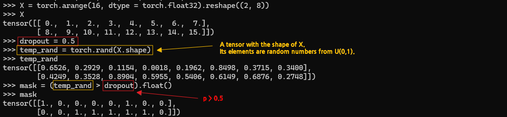
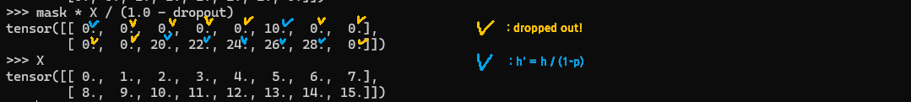
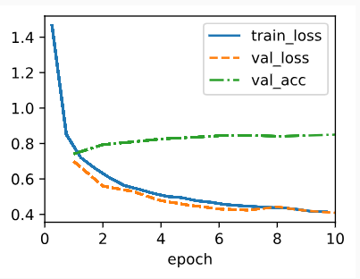
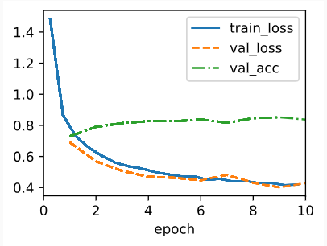

* [Back to Dive into Deep Learning](../../main.md)

# 5.6 Dropout

## Concept) Dropout
### Desc.)
- A technique that applies the advantage of a simple model of the classical learning methods to the neural networks.
  - Recall that simple and not overfitted model tends to be a good predictive model.
  - We performed **regularization** to prevent overfitting in the classical learning methods.
    - e.g.) $\ell_1$ or $\ell_2$ regularization.
  - [Bishop (1995)](https://d2l.ai/chapter_references/zreferences.html#id17) formalized this idea when he proved that **training with input noise** is equivalent to **Tikhonov regularization**.
  - Then, [Srivastava et al. (2014)](https://d2l.ai/chapter_references/zreferences.html#id265) applied Bishop’s idea to the internal layers of a network with the **drop out** technique.
    - The dropout technique has proved enduring and various forms of dropout are implemented in most deep learning libraries.
    - Still, such an justification of this theory is certainly up for debate.

### How it works)
- Inject noise while computing each internal layer during forward propagation.
  - How to Inject Noise?)
     - One idea is to inject an **unbiased** noise.
       - e.g.) Gaussian noise
         - For the original input $\mathbf{x}$, add a noise $\epsilon\sim\mathcal{N}(0,\sigma^2)$.
         - Then, the new input is $\mathbf{x'} = \mathbf{x}+\epsilon$.
         - And $E[\mathbf{x'}] = \mathbf{x}$
     - In standard dropout regularization, one zeros out some fraction of the nodes in each layer and then debiases each layer by normalizing by the fraction of nodes that were retained (not dropped out). 
     - So we may adopt a probability $p$ such that each intermediate activation $h$  is replaced by a random variable $h'$ as follows:   
        $`\begin{aligned}
        h' =
        \begin{cases}
            0 & \textrm{ with probability } p \\
            \displaystyle\frac{h}{1-p} & \textrm{ otherwise}
        \end{cases}
        \end{aligned}`$
       - Why?)
         - We want to design $h'$ such that $E[h']=h$ where the probability for not being dropped out is equal to $1-p$.
- If some neurons **co-adapt**, **dropout** them **out**.
  - Concept) Co-Adaptation
    - A state in which each layer relies on a specific pattern of activations in the previous layer.
    - Refer to [this article](https://hyeonnii.tistory.com/254).
  - Concept) Drop Out
    - Zero out certain neuron that consists some fraction of a node.   
    - Typically, we **disable** dropout at test time. 
      - i.e.) Given a trained model and a new example, we do **NOT** drop out any nodes and thus do not need to normalize. 
    - However, there are some exceptions.
      - Some researchers use dropout at test time as a heuristic for estimating the uncertainty of neural network predictions: 
        - If the predictions agree across many different dropout outputs, then we might say that the network is more confident.

<br>

### E.g.)   


<br>

- Consider a MLP with a hidden layer and five hidden units.
- When we apply dropout to a hidden layer, zeroing out each hidden unit with probability $p$, the result can be viewed as a network containing only a subset of the original neurons.
  - In the image above, $h_2$ and $h_5$ are removed.
  - Consequently, the calculation of the outputs no longer depends on $h_2$ and $h_5$ and their respective gradient also vanishes when performing backpropagation.

<br>


<br>

### Tech.) Implementation
First, import packages
```python
import torch
from torch import nn
from d2l import torch as d2l
```

- Implementation Types
  1. [Implementation from Scratch](#1-implementation-from-scratch)   
  2. [Concise Implementation](#2-concise-implementation)

<br>

#### 1. Implementation from Scratch
1. Implement $p$, which is the probability of being dropped out, using the Bernoulli random variable.
   - How?)
     - Draw samples from the uniform distribution.
     - Keep those nodes for which the corresponding sample is greater than $p$, dropping the rest.
```python
def dropout_layer(X, dropout):
    assert 0 <= dropout <= 1  # Validation for the probability
    if dropout == 1: return torch.zeros_like(X)  # Definitive case that p is equal to 1. No need for further calculation.
    mask = (torch.rand(X.shape) > dropout).float()  # 
    return mask * X / (1.0 - dropout)
```

- Desc.)
  - ```X``` is the tensor input.
  - ```dropout``` is the probability input.
  - ```mask```
    - Desc.)
      - A tensor that has the same shape as ```X```.
      - Each element denotes whether random numbers generated by U(0,1) at the respective position are greater than ```dropout```.
        - If ```True``` 1.
        - Else 0.
    - e.g.) Case when ```dropout = 0.5```   
      
  - ```dropout_layer(X, dropout)```
    - Returns the dropped out or the h' random variable of ```X``` by the probability ```dropout```.   
      

---

2. Define the model.
```python
class DropoutMLPScratch(d2l.Classifier):
    def __init__(self, num_outputs, num_hiddens_1, num_hiddens_2, dropout_1, dropout_2, lr):
        super().__init__()
        self.save_hyperparameters()
        self.lin1 = nn.LazyLinear(num_hiddens_1)
        self.lin2 = nn.LazyLinear(num_hiddens_2)
        self.lin3 = nn.LazyLinear(num_outputs)
        self.relu = nn.ReLU()

    def forward(self, X):
        H1 = self.relu(self.lin1(X.reshape((X.shape[0], -1))))
        if self.training:
            H1 = dropout_layer(H1, self.dropout_1)
        H2 = self.relu(self.lin2(H1)) # Activation function!
        if self.training:
            H2 = dropout_layer(H2, self.dropout_2)
        return self.lin3(H2)
```
- Desc.)
  - Applying dropout to the output of each hidden layer (following the activation function).
  - We can set dropout probabilities for each layer separately. 
    - A common choice is to set a lower dropout probability closer to the input layer. 
  - We ensure that dropout is only active during training.
---
3. Training
```python
hparams = {'num_outputs':10, 'num_hiddens_1':256, 'num_hiddens_2':256, 'dropout_1':0.5, 'dropout_2':0.5, 'lr':0.1}
model = DropoutMLPScratch(**hparams)
data = d2l.FashionMNIST(batch_size=256) # Sample data
trainer = d2l.Trainer(max_epochs=10)
trainer.fit(model, data)
```
- Result)   
  


<br>

#### 2. Concise Implementation
```python
class DropoutMLP(d2l.Classifier):
    def __init__(self, num_outputs, num_hiddens_1, num_hiddens_2, dropout_1, dropout_2, lr):
        super().__init__()
        self.save_hyperparameters()
        self.net = nn.Sequential(
            nn.Flatten(), nn.LazyLinear(num_hiddens_1), nn.ReLU(),
            nn.Dropout(dropout_1), nn.LazyLinear(num_hiddens_2), nn.ReLU(),
            nn.Dropout(dropout_2), nn.LazyLinear(num_outputs))
```

Training
```python
hparams = {'num_outputs':10, 'num_hiddens_1':256, 'num_hiddens_2':256, 'dropout_1':0.5, 'dropout_2':0.5, 'lr':0.1}
model = DropoutMLP(**hparams)
data = d2l.FashionMNIST(batch_size=256) # Sample data
trainer.fit(model, data)
```
- Result)   
  


<br>

* [Back to Dive into Deep Learning](../../main.md)