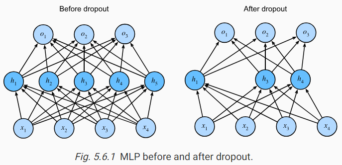

* [Back to Dive into Deep Learning](../../main.md)

# 5.6 Dropout

### Concept) Dropout
#### Desc.)
- A technique that applies the advantage of a simple model of the classical learning methods to the neural networks.
  - Recall that simple and not overfitted model tends to be a good predictive model.
  - We performed **regularization** to prevent overfitting in the classical learning methods.
    - e.g.) $\ell_1$ or $\ell_2$ regularization.
  - [Bishop (1995)](https://d2l.ai/chapter_references/zreferences.html#id17) formalized this idea when he proved that **training with input noise** is equivalent to **Tikhonov regularization**.
  - Then, [Srivastava et al. (2014)](https://d2l.ai/chapter_references/zreferences.html#id265) applied Bishop’s idea to the internal layers of a network with the **drop out** technique.
    - The dropout technique has proved enduring and various forms of dropout are implemented in most deep learning libraries.
    - Still, such an justification of this theory is certainly up for debate.

#### How it works)
- Inject noise while computing each internal layer during forward propagation.
- If some neurons **co-adapt**, **dropout** them **out**.
  - Concept) Co-Adaptation
    - A state in which each layer relies on a specific pattern of activations in the previous layer.
    - Refer to [this article](https://hyeonnii.tistory.com/254).
  - Concept) Drop Out
    - Zero out certain neuron that consists some fraction of a node.   

 

#### How to Inject Noise?)
- One idea is to inject an unbiased noise.
  - e.g.) Gaussian noise
    - For the original input $\mathbf{x}$, add a noise $\epsilon\sim\mathcal{N}(0,\sigma^2)$.
    - Then, the new input is $\mathbf{x'} = \mathbf{x}+\epsilon$.
    - And $E[\mathbf{x'}] = \mathbf{x}$
- In standard dropout regularization, one zeros out some fraction of the nodes in each layer and then debiases each layer by normalizing by the fraction of nodes that were retained (not dropped out). 
- So we may adopt a probability $p$ such that each intermediate activation $h$  is replaced by a random variable $h'$ as follows:   
   $`\begin{aligned}
   h' =
   \begin{cases}
       0 & \textrm{ with probability } p \\
       \frac{h}{1-p} & \textrm{ otherwise}
   \end{cases}
   \end{aligned}`$
  - Why?)
    - We want to implement $E[h']=h$ where the probability for not being dropped out is equal to $1-p$.

 

* [Back to Dive into Deep Learning](../../main.md)