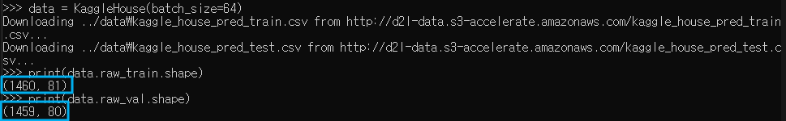
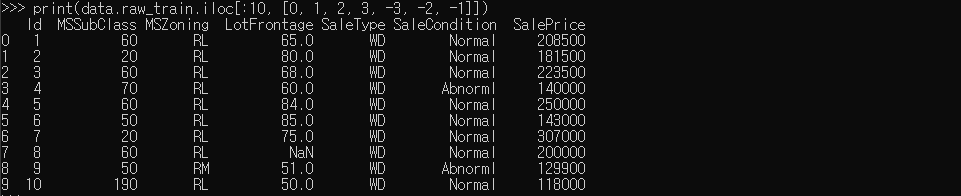
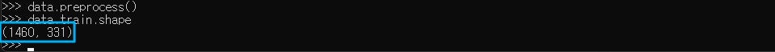
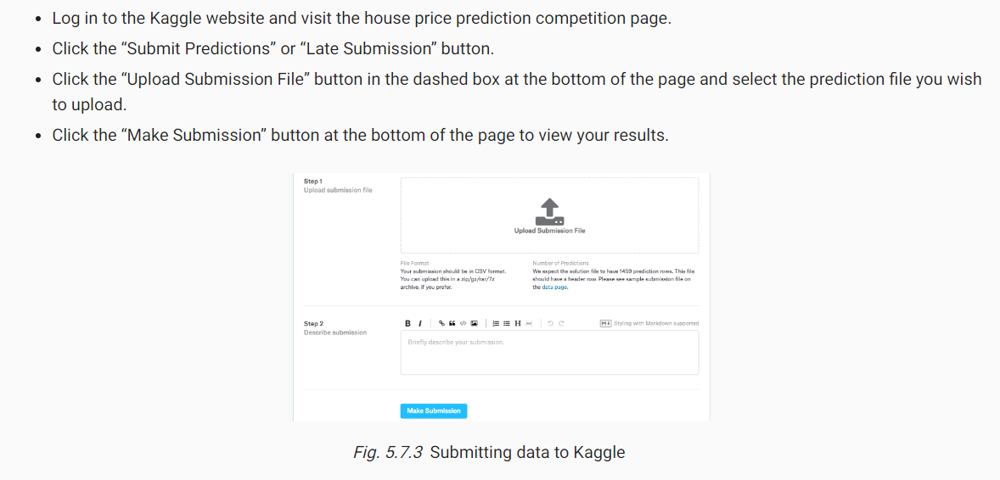

* [Back to Dive into Deep Learning](../../main.md)

# 5.7 Project: Predicting House Prices on Kaggle

#### Import Packages
```python
import pandas as pd
import torch
from torch import nn
from d2l import torch as d2l
```

## 5.7.1 Downloading Data
- The ```download()``` and ```extract()``` function implemented below will be used in the rest of the session.
```python
def download(url, folder, sha1_hash=None):
    """Download a file to folder and return the local filepath."""

def extract(filename, folder):
    """Extract a zip/tar file into folder."""
```

<br>

## 5.7.2 Kaggle
- [URL](https://www.kaggle.com/)
- [House Price Data](https://www.kaggle.com/c/house-prices-advanced-regression-techniques)

<br>

## 5.7.3 Accessing and Reading the Dataset
- Create an object that downloads and save the dataset using pandas.
    ```python
    class KaggleHouse(d2l.DataModule):
        def __init__(self, batch_size, train=None, val=None):
            super().__init__()
            self.save_hyperparameters()
            if self.train is None:
                self.raw_train = pd.read_csv(d2l.download(
                    d2l.DATA_URL + 'kaggle_house_pred_train.csv', 
                    self.root,
                    sha1_hash='585e9cc93e70b39160e7921475f9bcd7d31219ce'
                ))

                self.raw_val = pd.read_csv(d2l.download(
                    d2l.DATA_URL + 'kaggle_house_pred_test.csv', 
                    self.root,
                    sha1_hash='fa19780a7b011d9b009e8bff8e99922a8ee2eb90'
                ))
    ```
  - Desc.)
    - If a file corresponding to this dataset already exists in the cache directory and its SHA-1 matches ```sha1_hash```, our code will use the cached file to avoid clogging up your Internet with redundant downloads.

- Instantiate the ```KaggleHouse``` object and check the data format.
  ```python
  data = KaggleHouse(batch_size=64)
  print(data.raw_train.shape)
  print(data.raw_val.shape)
  ```
    

<br>

## 5.7.4 Data Processing
- Let's check **ten rows** of data for **the starting four and the last three columns**.
    ```python
    print(data.raw_train.iloc[:10, [0, 1, 2, 3, -3, -2, -1]])    # 0~3 Rows / 0~3, -3~-1 Columns
    ```
    

- Data Processing
  - Drop columns that are not needed.
    - The first feature ```Id``` is the identifier which is not needed for the learning.
    - The ```SalePrice``` feature, which is the label in this dataset, should be dropped from the training set for the training.
      - This column will not be provided in the test set.
  - Fill in the feature's mean for the missing values.
  - Standardize every features on common scale with $\displaystyle x\leftarrow \frac{x-\mu}{\sigma}$.
  - Use One-hot encoding for the discrete values.
    - e.g.) ```MSZoning``` feature.
      - ```pandas.get_dummies()``` will automatically do this for us.

- Add the ```preprocess()``` method to the ```KaggleHouse``` class and implement all the processing algorithms as follows.
    ```python
    @d2l.add_to_class(KaggleHouse)
    def preprocess(self):
        # Remove the ID and label columns
        label = 'SalePrice'
        features = pd.concat(
            (self.raw_train.drop(columns=['Id', label]),        # Drop Id and label column from the training data.
            self.raw_val.drop(columns=['Id'])))
        # Standardize numerical columns
        numeric_features = features.dtypes[features.dtypes!='object'].index
        features[numeric_features] = features[numeric_features].apply(
            lambda x: (x - x.mean()) / (x.std()))
        # Replace NAN numerical features by 0
        features[numeric_features] = features[numeric_features].fillna(0)
        # Replace discrete features by one-hot encoding
        features = pd.get_dummies(features, dummy_na=True)
        # Save preprocessed features
        self.train = features[:self.raw_train.shape[0]].copy()
        self.train[label] = self.raw_train[label]
        self.val = features[self.raw_train.shape[0]:].copy()
    ```
- Call the ```preprocess()``` method and check the data shape.
    ```python
    data.preprocess()
    data.train.shape
    data.val.shape
    ```
    

<br>

## 5.7.5 Error Measure
- Why needed?)
  - To evaluate a model's performance on the prediction $(\hat{y})$.
- e.g.)
  - Relative Error
    - $\displaystyle\frac{y-\hat{y}}{y}$
      - Why?) Relative instead of Absolute?
        - Concept.) Absolute Error
          - $y-\hat{y}$
        - e.g.) If our prediction is off by $100,000 when estimating the price of a house in rural Ohio, where the value of a typical house is $125,000, then we are probably doing a horrible job. On the other hand, if we err by this amount in Los Altos Hills, California, this might represent a stunningly accurate prediction (there, the median house price exceeds $4 million).
  - Discrepancy in the Logarithm
    - $\displaystyle\sqrt{\frac{1}{n} \sum_{i=1}^{n} {(\log{y_i} - \log{\hat{y}_i})}^2}$
      - Derivation)
        - $`\exists \delta > 0 \textrm{ such that } |\log{y} - \log{\hat{y}}|\le\delta`$.
        - Then, $`\displaystyle e^{-\delta}\le\frac{\hat{y}}{y}\le e^\delta`$, which is the relative difference between the data and the prediction.
```python
@d2l.add_to_class(KaggleHouse)
def get_dataloader(self, train):
    label = 'SalePrice'
    data = self.train if train else self.val
    if label not in data: return
    get_tensor = lambda x: torch.tensor(x.values.astype(float), dtype=torch.float32)

    # Logarithm of prices
    tensors = (get_tensor(data.drop(columns=[label])),  # X
               torch.log(get_tensor(data[label])).reshape((-1, 1)))  # log Y
    return self.get_tensorloader(tensors, train)
```

<br>

## 5.7.6 K-Fold Cross-Validation
- Objective)
  - Choosing the best-performative model.
- Why $K$-fold Cross Validation?
  - Of course $K$-fold Cross Validation is not the optimal solution.
  - Here, we use this method for the simplicity of our code.
```python
def k_fold_data(data, k):
    rets = []
    fold_size = data.train.shape[0] // k
    for j in range(k):
        idx = range(j * fold_size, (j+1) * fold_size)
        rets.append(
            KaggleHouse(
                data.batch_size, 
                data.train.drop(index=idx),     # Training Data
                data.train.loc[idx]             # Validation Data
            )
        )
    return rets
```
- Desc.)
  - Append the ```KaggleHouse``` objects with each $i$-th validation data to the returning ```list```.
```python
def k_fold(trainer, data, k, lr):
    val_loss, models = [], []
    for i, data_fold in enumerate(k_fold_data(data, k)):
        model = d2l.LinearRegression(lr)        # Linear regression model as a benchmark
        model.board.yscale='log'
        if i != 0: model.board.display = False
        trainer.fit(model, data_fold)           # Train the regression model with each of the K-fold data
        val_loss.append(float(model.board.data['val_loss'][-1].y))
        models.append(model)
    print(f'average validation log mse = {sum(val_loss)/len(val_loss)}')    # Average losses of the K-fold regressions
    return models
```

<br>

## 5.7.7 Model Selection
- Instantiate the ```Trainer``` object and call the ```k_fold``` function we created.
```python
trainer = d2l.Trainer(max_epochs=10)
models = k_fold(trainer, data, k=5, lr=0.01)
```
- Interpretation of the result
  - Case) The number of training errors for a set of hyperparameters is very low while the number of errors on $K$-fold cross-validation grows considerably higher.
    - We should suspect the overfitting problem.

<br>

## 5.7.8 Submitting Predictions on Kaggle
Generate a submission file with the name ```submission.csv``` with the following code.
```python
preds = [model(torch.tensor(data.val.values.astype(float), dtype=torch.float32))
         for model in models]

# Taking exponentiation of predictions in the logarithm scale
ensemble_preds = torch.exp(torch.cat(preds, 1)).mean(1)
submission = pd.DataFrame({'Id':data.raw_val.Id,
                           'SalePrice':ensemble_preds.detach().numpy()})
submission.to_csv('submission.csv', index=False)
```

Upload the file on Kaggle.   



<br>

* [Back to Dive into Deep Learning](../../main.md)