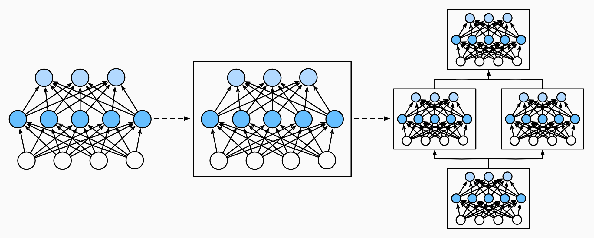

* [Back to Dive into Deep Learning](../../main.md)

# 6.1 Layers and Modules

### Prop.) A single neuron, a layer of neurons, and an entire model share the same structure.
- Entities)
  - A Neuron
  - A Layer
    - A vectorized arithmetic to characterize a group of neurons.
  - A Model
    - Whether it is a Single-Neuron or a Multi-Layer Perceptron Model...
- The Sharing Structure)
  1. Takes some set of inputs
  2. Generates a corresponding scalar output
  3. Has a set of associated parameters that can be updated to optimize some objective function of interest.

<br>

### Concept) Module
- Desc.)
  - A module could describe a single **layer**, a component consisting of **multiple layers**, or the **entire model** itself
  - It's an abstraction that they can be combined into larger artifacts, often recursively.
  - In a programming standpoint, a module is represented by a ```class```.
    - It should possess subclasses that define...
      1. A **forward propagation** method that transforms its input into output 
      2. (Optional) Parameters of the module
         - Some modules do not require parameters.
      3. A **backpropagation** method
         - Mostly supplied by the auto differentiation when defining our model.
           - e.g.) PyTorch
- Illustration)   
  

<br>

## On-hand) Creating Module
Import packages.
```python
import torch
from torch import nn
from torch.nn import functional as F
```
- Strategies)
  1. [Using PyTorch's ```Sequential``` class](#trial-1-fully-connected-layer-using-pytorch-sequential)
  2. [Building Module from Scratch](#trial-2-implementing-module-from-scratch)
  3. [Creating a Customized ```Sequential``` class](#trial-3-building-custom-sequential)

<br>

### Trial 1) Fully connected layer using Pytorch Sequential
```python
net = nn.Sequential(
    nn.LazyLinear(256), # Hidden layer with 256 units
    nn.ReLU(),          # ReLU activation function
    nn.LazyLinear(10)   # Fully connected output layer with ten units (No activation function)
)

X = torch.rand(2, 20)
net(X).shape
```
- Concept) ```Sequential``` of PyTorch
  - ```Sequential``` defines the ```class``` that presents a module in PyTorch.
  - It maintains an ordered list of constituent ```Modules```.
  - Refer to the [anatomy below](#analysis-dissecting-sequential-of-pytorch).
- Desc.)
  - In the above scenario, each of the two fully connected layers (```LazyLinear```) is an instance of the ```Linear``` class which is itself a subclass of ```Module```.
  - ```net(X)``` is the shorthand for ```net.__call__(X)```.

<br>

### Trial 2) Implementing module from scratch
Let's define the basic functionality that each module should provide.
1. Ingest input data as arguments to its forward propagation method.
2. Generate an output by having the **forward propagation** method return a value. 
   - cf.) Note that the output may have a different shape from the input. 
     - e.g.) The first fully connected layer in [our model above](#trial-1-fully-connected-layer-using-pytorch-sequential) ingests an input of arbitrary dimension but returns an output of dimension 256.
3. **Calculate the gradient** of its output with respect to its input, which can be accessed via its **backpropagation** method. 
   - Typically this happens automatically.
4. Store and provide access to those **parameters** necessary for executing the forward propagation computation.
5. Initialize model parameters as needed.

<br>

Implementing [the above model](#trial-1-fully-connected-layer-using-pytorch-sequential) from scratch.
```python
class MLP(nn.Module):
    def __init__(self):
        # Call the constructor of the parent class nn.Module to perform
        # the necessary initialization
        super().__init__()                  # Initiate the parent class, Module!
        self.hidden = nn.LazyLinear(256)    # Hidden layer
        self.out = nn.LazyLinear(10)        # Output layer

    # Define the forward propagation of the model, that is, how to return the
    # required model output based on the input X
    def forward(self, X):
        return self.out(F.relu(self.hidden(X))) # X -> hidden -> ReLU -> out
```
- Desc.)
  - Invoke the parent class’s ```__init__``` method via ```super().__init__()``` 
    - Inherit the properties of the parent, ```Module```.
  - Instantiate two fully connected layers, declaring them as instance variables
    - ```self.hidden``` 
    - ```self.out```
  - Forward propagation is described by the ```forward``` method.
    - It returns ```self.out(F.relu(self.hidden(X)))```.
      - i.e.) ```X``` -> ```hidden``` -> ReLU -> ```out```

<br>

Test!
```python
net = MLP()

X = torch.rand(2, 20)
net(X).shape
```

<br>

### Trial 3) Building a Custom Sequential
Recall the basic methods of the ```Sequential``` class
1. A method for appending modules one by one to a list.
2. A forward propagation method for passing an input through the chain of modules, in the same order as they were appended.

<br>

#### 3-1) Implementing a simple daisy chain structure.
```python
class MySequential(nn.Module):
    def __init__(self, *args):
        super().__init__()
        for idx, module in enumerate(args):
            self.add_module(str(idx), module)   # Add modules using Module's method.

    def forward(self, X):
        for module in self.children():      # Recursively call the children module!
            X = module(X)
        return X
```
- Test!
    ```python
    net = MySequential(nn.LazyLinear(256), nn.ReLU(), nn.LazyLinear(10))

    X = torch.rand(2, 20)
    net(X).shape
    ```


<br>

#### 3-2) Implementing a constant multiplication structure.
- Objective)
  - Implement the following structure.
    - $f(\mathbf{x}, \mathbf{w}) = c \cdot \mathbf{w}^\top \mathbf{x}$
      - where 
        - $\mathbf{x}$ : the input
        - $\mathbf{w}$ : the parameter of the model
        - $c\in \mathbb{R}$ : a constant.
```python
class FixedHiddenMLP(nn.Module):
    def __init__(self):
        super().__init__()
        # Random weight parameters that will not compute gradients and
        # therefore keep constant during training
        self.rand_weight = torch.rand((20, 20))  # Randomly initialize the parameters!
        self.linear = nn.LazyLinear(20)          # Create a linear module.

    def forward(self, X):
        X = self.linear(X)
        X = F.relu(X @ self.rand_weight + 1)
        # Reuse the fully connected layer. This is equivalent to sharing
        # parameters with two fully connected layers
        X = self.linear(X)
        # Control flow
        while X.abs().sum() > 1:
            X /= 2
        return X.sum()
```
- Desc.)
  - ```__init__(self)```
    - Randomly initialize the parameters!
    - Create a linear module.
  - ```forward(self, X)```
    1. Forward the input ```X``` into the linear module.
    2. Multiply the parameter ```rand_weight``` and add ```1``` as the bias and activate using ```relu```.
    3. Again forward the result to the linear module.
    4. (Key Point!) Divide the result by ```2``` while the sum of the absolute values of the elements is greater than 1.
- Test!)
    ```python
    net = FixedHiddenMLP()

    X = torch.rand(2, 20)
    net(X)
    ```


<br>

#### 3-3) Mix and match various ways of assembling modules together.
```python
class NestMLP(nn.Module):
    def __init__(self):
        super().__init__()
        self.net = nn.Sequential(nn.LazyLinear(64), nn.ReLU(),
                                 nn.LazyLinear(32), nn.ReLU())
        self.linear = nn.LazyLinear(16)

    def forward(self, X):
        return self.linear(self.net(X))

# Test!
chimera = nn.Sequential(NestMLP(), nn.LazyLinear(20), FixedHiddenMLP())
X = torch.rand(2, 20)
chimera(X)
```


<br>

* [Back to Dive into Deep Learning](../../main.md)