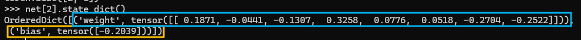
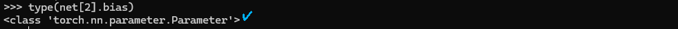
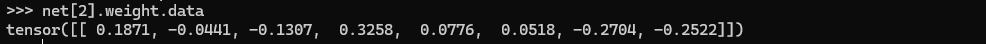
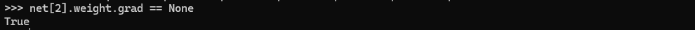

* [Back to Dive into Deep Learning](../../main.md)

# 6.2 Parameter Management

- Objectives)
  - Accessing parameters for debugging, diagnostics, and visualizations.
  - Sharing parameters across different model components.

<br>

#### Import packages.
```python
import torch
from torch import nn
```

#### Model Setting
A simple MLP with one hidden layer.
```python
net = nn.Sequential(
    nn.LazyLinear(8),
    nn.ReLU(),
    nn.LazyLinear(1),
)

X = torch.rand(size=(2,4))
net(X).shape
```

<br>

## 6.2.1. Parameter Access
- Prop.)
  - When a model is defined via the ```Sequential``` class, we can first access any layer by **indexing** into the model as though it were a list. 
  - Each layer’s parameters are conveniently located in its attribute.
- Try
  ```python
  net[2].state_dict()
  ```
  
  - Two parameters can be found : the weight and the bias.
  - Each parameter is represented as an instance of the parameter class.
    - e.g.) Check the type of the bias.
      ```python
      type(net[2].bias)
      ```
      
  - They contain values, gradients, and additional information.
    - e.g.) See the value of the weight parameter by calling the ```data``` property.
      ```python
      net[2].weight.data
      ```
      
    - e.g.) Check the gradient by calling the ```grad``` property.
      ```python
      net[2].weight.grad == None
      ```
      
      - Since we have not invoked backpropagation yet, it's in its initial state.
  - Tech.) Make a list of all parameters using the following syntax.
    ```python
    [(name, param.shape) for name, param in net.named_parameters()]
    ```


<br>

## 6.2.2. Tied Parameters
How to share parameters across multiple layers elegantly.
```python
# We need to give the shared layer a name so that we can refer to its
# parameters
shared = nn.LazyLinear(8)
net = nn.Sequential(nn.LazyLinear(8), nn.ReLU(),
                    shared, nn.ReLU(),
                    shared, nn.ReLU(),
                    nn.LazyLinear(1))
X = torch.rand(size=(2,4))

net(X)
# Check whether the parameters are the same
print(net[2].weight.data[0] == net[4].weight.data[0])

net[2].weight.data[0, 0] = 100
# Make sure that they are actually the same object rather than just having the
# same value
print(net[2].weight.data[0] == net[4].weight.data[0])
```
- Desc.)
  - ```net[2]``` and ```net[4]``` are not just equal, they are represented by the same exact tensor. 


<br>

* [Back to Dive into Deep Learning](../../main.md)