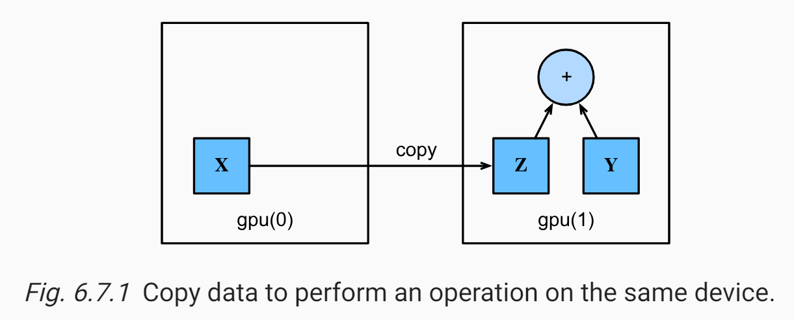

* [Back to Dive into Deep Learning](../../main.md)

# 6.7 GPUs

## PyTorch
- Desc.)
  - In PyTorch, every array has a device.
    - We often refer it as a **context**.
  - By default, all variables and associated computation have been assigned to the **CPU**.
  - By assigning arrays to contexts intelligently, we can minimize the **time spent transferring data between devices**.
    - e.g.)
      - When training neural networks on a server with a GPU, we typically prefer for the model’s parameters to live on the **GPU**.


#### Import Packages
```python
import torch
from torch import nn
from d2l import torch as d2l
```

### 6.7.1 Computing Devices
Indicating devices in PyTorch.
1. CPU
   - Use ```torch.device('cpu')``` to indicate CPU.
2. GPU
   - Use ```torch.device(f'cuda:{i}')``` to indicate ```i```-th GPU.
   - Use ```torch.cuda.device_count()``` to query the number of available GPUs.
     ```python
     def num_gpus():  #@save
         """Get the number of available GPUs."""
         return torch.cuda.device_count()

     num_gpus()
     ```
```python
def cpu():  #@save
    """Get the CPU device."""
    return torch.device('cpu')

def gpu(i=0):  #@save
    """Get a GPU device."""
    return torch.device(f'cuda:{i}')

cpu()
gpu()   # i=0, the first GPU
gpu(1)  # the second GPU
```

Following syntax automatically choose whether to use CPU or GPU.
```python
def try_gpu(i=0):  #@save
    """Return gpu(i) if exists, otherwise return cpu()."""
    if num_gpus() >= i + 1:
        return gpu(i)
    return cpu()

def try_all_gpus():  #@save
    """Return all available GPUs, or [cpu(),] if no GPU exists."""
    return [gpu(i) for i in range(num_gpus())]

try_gpu(), try_gpu(10), try_all_gpus()
```

<br>

### 6.7.2 Tensors and GPUs
- Desc.)
  - By default, tensors are created on the CPU.
  - Use ```device``` property to check the device.
    ```python
    x = torch.tensor([1, 2, 3])
    x.device
    ```
  - Make sure to put the objects on the **same device** before doing operations with them.
    - e.g.)
      - If we sum two tensors, we need to make sure that both arguments live on the same device.
        - why?) Otherwise the framework would not know where to store the result or even how to decide where to perform the computation.

#### 6.7.2.1 How to Store tensors on the GPU
- Methods)
  - Specify a storage device when creating a tensor
  - Create the tensor variable ```X``` on the first gpu.
```python
# Creating on the first GPU.
X = torch.ones(2, 3, device=try_gpu())
X

# Creating on the first GPU.
Y = torch.rand(2, 3, device=try_gpu(1))
Y
```

- Prop.)
  - The tensor created on a GPU only consumes the memory of this GPU.
    - cf.) Use the ```nvidia-smi``` command to view GPU memory usage.
  - Make sure not to create data that exceeds the GPU memory limit.

<br>

#### 6.7.2.2 Copying
When two tensors are located at different devices, copy one and make operations.
- e.g.)   
  
  ```python
  Z = X.cuda(1) # Copy X to the second GPU

  # Compare the devices of X and Z
  print(X)
  print(Z)

  Y + Z         # Addition on the second GPU
  ```

- Props.)
  - GPU may be fast in operations.
  - However, **transferring variables between devices is very slow**!

<br><br>

### 6.7.3 Neural Networks and GPUs
Specify the device of a neural network using the above ```try_gpu()``` function.
```python
net = nn.Sequential(nn.LazyLinear(1))
net = net.to(device=try_gpu())

net(X)      # Give input and check the device.
net[0].weight.data.device   # Check whether the parameters are stored at the second GPU.
```

Let our ```Trainer``` support GPU with the following script.
```python
@d2l.add_to_class(d2l.Trainer)  #@save
def __init__(self, max_epochs, num_gpus=0, gradient_clip_val=0):
    self.save_hyperparameters()
    self.gpus = [d2l.gpu(i) for i in range(min(num_gpus, d2l.num_gpus()))]

@d2l.add_to_class(d2l.Trainer)  #@save
def prepare_batch(self, batch):
    if self.gpus:
        batch = [a.to(self.gpus[0]) for a in batch]   # Transfer to the first GPU!
    return batch

@d2l.add_to_class(d2l.Trainer)  #@save
def prepare_model(self, model):
    model.trainer = self
    model.board.xlim = [0, self.max_epochs]
    if self.gpus:
        model.to(self.gpus[0])
    self.model = model
```
- ```d2l.num_gpus()``` : Refer to [```device_cnt()``` above](#671-computing-devices).


<br>

* [Back to Dive into Deep Learning](../../main.md)