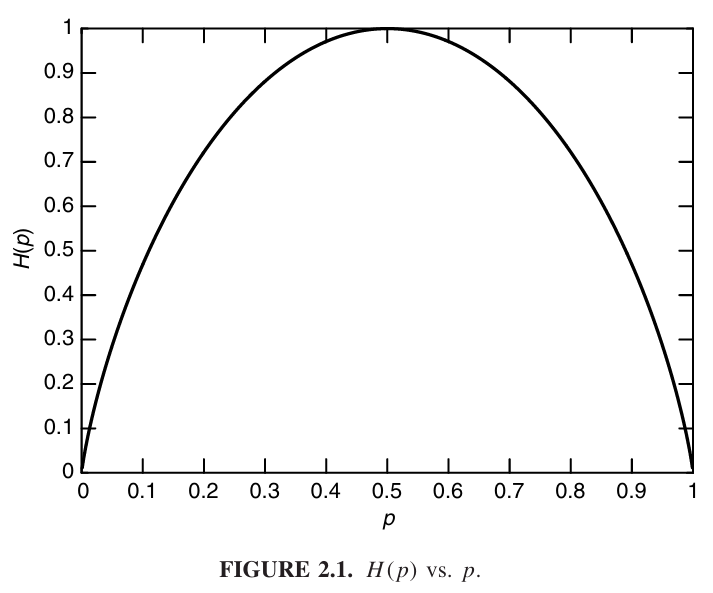

* [Back to Elements of Information Theory](../../main.md)

# 2.1 Entropy

### Convention)
- $`\displaystyle 0\log0 \approx \lim_{x\rightarrow 0} x\log x = 0.`$

 

### Concept) Entropy
- Def.)
  - Let
    - $`X`$ : a discrete random variable
      - such that
        - $`x \in \mathcal{X}`$
        - $`p(x) = Pr\left\lbrace X=x \right\rbrace`$ : the probability mass function
  - The entropy $`H(X)`$ of a discrete random variable $`X`$ is defined by
    - $`\displaystyle H(X) = -\sum_{x\in\mathcal{X}} p(x)\log p(x)`$
    - or simply, $`H(p)`$
      - where 
        - $`\log`$ is to the base $`2`$.
        - Thus, the entropy is expressed in bits.
- Notation)
  - $`H_b(X)`$ : the entropy with the base of $`b`$.
    - cf.) If $`b=e`$, the entropy is measured in nats.
- Props.)
  - Entropy is a functional of the distribution of $`X`$.
    - Thus, it does not depend on the actual values taken by the random variable $`X`$, but only on the probabilities.
  - [Properties](#props-entropy).

 

### Concept) Expectation
- Def.)
  - For a random variable $`g(X)`$, the expected value is defined by
    - $`\displaystyle E_p g(X) = \sum_{x\in\mathcal{X}} g(x)p(x)`$
    - or simply, $`Eg(X)`$

 

### Analysis) Entropy as an Expected Value
- Put $`\displaystyle g(X) = -\log{p(X)} = \log\frac{1}{p(X)}`$.
- Then [the entropy](#concept-entropy) can be seen as the [expected value](#concept-expectation) of the random variable $`\log\frac{1}{p(X)}`$.
  - How?)
    - $`\displaystyle H(X) = -\sum_{x\in\mathcal{X}}p(x)\log p(x) = \sum_{x\in\mathcal{X}}\left(\log \frac{1}{p(x)}\right)p(x) = E_p \log\frac{1}{p(X)}`$

 

### Props.) Entropy
#### Lemma 2.1.1)
$`H(X) \ge 0`$
- pf.)
  - Recall that $`\displaystyle H(X) = \sum_{x\in\mathcal{X}}\left(\log \frac{1}{p(x)}\right)p(x)`$.
  - Thus, $`0 \le p(x) \le 1 \Rightarrow \log \frac{1}{p(x)} \ge 0 \Rightarrow H(X) \ge 0`$

#### Lemma 2.1.2)
$`H_b(X) = (\log_b a) H_a(X)`$
- pf.)
  - $`\displaystyle H_b(X) = -\sum p(x)\log_b(p(x)) = -\sum p(x) \left(\frac{\log_a (p(x))}{\log_a b}\right) = (\log_b a)\left(-\sum p(x) \log_a (p(x))\right)= (\log_b a) H_a(X)`$
- i.e.)
  - Entropy can be changed from one base to  another by multiplying by the appropriate factor.

 

### Question) What is the average length of the shortest description of the random variable?
We can answer this using the concept of the [entropy](#concept-entropy).

 

#### Ex.2.1.1)
- Settings)
  - Let $`X = \begin{cases}
      1 & \textrm{with probability } p \\
      0 & \textrm{with probability } 1-p \\
  \end{cases}`$.
  - Then $`H(X) = -p\log(p) - (1-p)\log(1-p) \stackrel{\textrm{def}}{=} H(p)`$
- Case)
  - $`p = \frac{1}{2}`$
    - Then $`H(X) = -\frac{1}{2}\log\frac{1}{2}-\frac{1}{2}\log\frac{1}{2} = -\log\frac{1}{2} = 1`$ bit.
  - Meaning) 
    - The average length of the shortest description of $`X`$ is 1 bit.

 

#### Ex.2.1.1)
- Settings)
  - Let $`X = \begin{cases}
      a & \textrm{with probability } \frac{1}{2} \\
      b & \textrm{with probability } \frac{1}{4} \\
      c & \textrm{with probability } \frac{1}{8} \\
      d & \textrm{with probability } \frac{1}{8} \\
  \end{cases}`$.
  - Then $`H(X) = -\frac{1}{2}\log\frac{1}{2}-\frac{1}{4}\log\frac{1}{4}-2\frac{1}{8}\log\frac{1}{8} = \frac{7}{4}`$ bits.

 

* [Back to Elements of Information Theory](../../main.md)