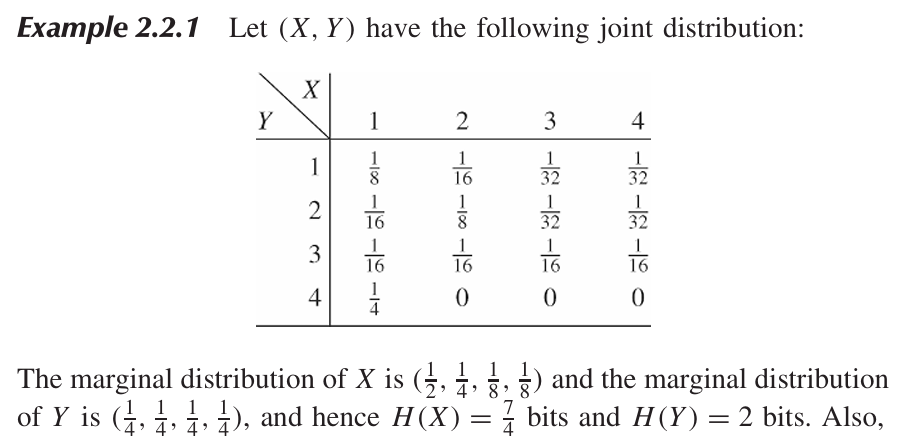
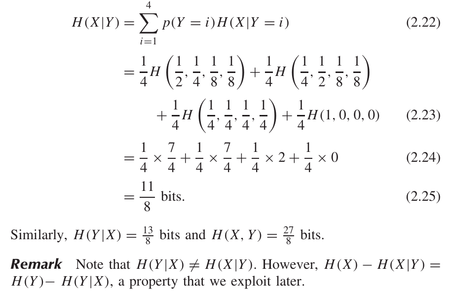

* [Back to Elements of Information Theory](../../main.md)

# 2.2 Joint Entropy and Conditional Entropy

### Concept) Joint Entropy
- Desc.)
  - Entropy for a pair of random variables
- Def.)
  - The joint entropy $`H(X,Y)`$ of a pair of discrete random variables $`(X,Y)`$ with a joint distribution $`p(x,y)`$ is defined as
    - $`\displaystyle H(X,Y) = -\sum_{x\in\mathcal{X}}\sum_{y\in\mathcal{Y}}p(x,y)\log p(x,y)`$
  - or simply,
    - $`H(X,Y) = -E\log p(X,Y)`$

 

### Concept) Conditional Entropy
- Def.)
  - If $`(X,Y)\sim p(x,y)`$, the conditional entropy is defined as
    - $`\begin{aligned}
        H(Y|X) &= \sum_{x\in\mathcal{X}} p(x) H(Y|X=x) \\
        &= -\sum_{x\in\mathcal{X}} p(x) \sum_{y\in\mathcal{Y}} p(y|x) \log p(y|x) \\
        &= -\sum_{x\in\mathcal{X}}\sum_{y\in\mathcal{Y}} p(x,y) \log p(y|x) \\
    \end{aligned}`$
  - or simply
    - $`-E\log p(Y|X)`$

 

### Theorem 2.2.1) Chain Rule
$`H(X,Y) = H(X) + H(Y|X)`$
- pf.)   
  $`\begin{aligned}
    H(X,Y) &= -\sum_{x\in\mathcal{X}}\sum_{y\in\mathcal{Y}} p(x,y)\log p(x,y) \\
    &= -\sum_{x\in\mathcal{X}}\sum_{y\in\mathcal{Y}} p(x,y)\log \left(p(x) p(y|x)\right) \\
    &= -\sum_{x\in\mathcal{X}}\sum_{y\in\mathcal{Y}} p(x,y) \left(\log p(x) + \log p(y|x)\right) \\
    &= -\sum_{x\in\mathcal{X}}\sum_{y\in\mathcal{Y}} p(x,y)\log p(x) -\sum_{x\in\mathcal{X}}\sum_{y\in\mathcal{Y}} p(x,y)\log p(y|x) \\
    &= -\sum_{x\in\mathcal{X}} p(x)\log p(x) -\sum_{x\in\mathcal{X}}\sum_{y\in\mathcal{Y}} p(x,y)\log p(y|x) \\
    &= H(X) + H(Y|X) \\
  \end{aligned}`$

 

### Corollary
$`H(X, Y|Z) = H(X|Z) + H(Y|X, Z)`$

 

### E.g.)
   
   

 

* [Back to Elements of Information Theory](../../main.md)