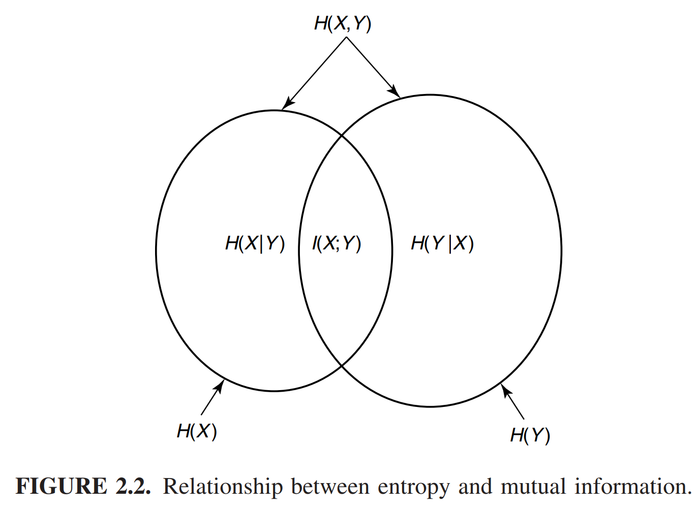

* [Back to Elements of Information Theory](../../main.md)

# 2.4 Relationship between Entropy and Mutual Information

### Theorem 2.4.1)
#### 2.43)
- $`\displaystyle I(X;Y) = H(X) - H(X|Y)`$
  - Derivation)   
      $`\displaystyle \begin{aligned}
      I(X;Y) &= \sum_{x,y} p(x,y) \log\frac{p(x,y)}{p(x)p(y)} \\
      &= \sum_{x,y} p(x,y) \log\frac{p(y)p(x|y)}{p(x)p(y)} \\
      &= \sum_{x,y} p(x,y) \log\frac{p(x|y)}{p(x)} \\
      &= -\sum_{x,y} p(x,y) \log{p(x)} + \sum_{x,y} p(x,y) \log{p(x|y)} \\
      &= -\sum_{x} p(x) \log{p(x)} + \sum_{x,y} p(x,y) \log{p(x|y)} \\
      &= H(X) - H(X|Y) \\
      \end{aligned}`$
  - Meaning)
      - The mutual information $`I(X;Y)`$ is the reduction in the uncertainty of $`X`$ due to the knowledge of $`Y`$.

#### 2.44)
- $`\displaystyle I(X;Y) = H(Y) - H(Y|X)`$

#### 2.45)
- $`\displaystyle I(X;Y) = H(X) + H(Y) - H(X,Y)`$
  - Derivation)
      - Recall that $`\displaystyle I(X;Y) = H(X) - H(X|Y)`$.
      - Also, $`H(X,Y) = H(Y) + H(X|Y)`$. (Refer to the [chain rule](../02/note.md#theorem-221-chain-rule)).
      - Thus,   
      $`\displaystyle \begin{aligned}
          I(X;Y) &=  H(X) - H(X|Y) \\
          &= H(X) + H(Y) - H(X,Y)
      \end{aligned}`$

#### 2.46) Self Information
- $`I(X;X) = H(X)`$

 

#### Analysis) Graphical Description on Entropy and Mutual Information

 

* [Back to Elements of Information Theory](../../main.md)