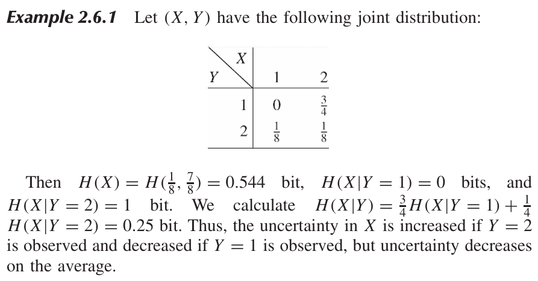

* [Back to Elements of Information Theory](../../main.md)

# 2.6 Jensen's Inequality and Its Consequences

### Concept) Convexity
- Def.)
  - For
    - $`f(x)`$ : a function
    - $`(a,b)`$ : an interval 
  - $`f(x)`$ is convex over $`(a,b)`$
    - if $`f(\lambda x_1 + (1-\lambda)x_2) \le \lambda f(x_1) + (1-\lambda)f(x_2)`$
      - where
        - $`\forall x_1, x_2 \in (a,b) \textrm`$
        - $` 0 \le \lambda \le 1`$
  - Moreover, $`f`$ is **strictly convex** if the equality holds only if $`\lambda = 0 \vee \lambda = 1`$.
- e.g.)
  - $`x^2, |x|, e^x, x\log{x} (x\ge 0)`$
  - Linear functions are both convex and [concave](#concept-concavity).

 

### Concept) Concavity
- Def.)
  - A function $`f`$ is concave if $`-f`$ is [convex](#concept-convexity).
- e.g.)
  - $`\log{x} \; (x\ge 0), \sqrt{x} \; (x\ge 0)`$
  - Linear functions are both [convex](#concept-convexity) and concave.

 

### Theorem 2.6.1)
If the function $`f`$ has a second derivative that is non-negative (positive) over an interval, the function is [convex (strictly convex)](#concept-convexity) over that interval.
- pf.)
  - Consider the Taylor series approximation around $`x_0`$ as below.
    - $`f(x) \approx f(x_0) + f'(x_0)(x-x_0) + \frac{f''(x_0)}{2}(x-x_0)^2`$
  - Assuming $`f''(x) \ge 0, \forall x`$,
    - $`f(x) \approx f(x_0) + f'(x_0)(x-x_0) + \frac{f''(x_0)}{2}(x-x_0)^2 \ge f(x_0) + f'(x_0)(x-x_0)`$
  - Put $`x_0 = \lambda x_1 + (1-\lambda)x_2`$
    - Then, $`f(x) \ge f(x_0) + f'(x_0)(x-\lambda x_1 - (1-\lambda)x_2)`$
  - When $`x=x_1`$,
    - $`f(x_1) \ge f(x_0) + f'(x_0)((1-\lambda)(x_1-x_2)) \cdots (1)`$
  - When $`x=x_2`$,
    - $`f(x_2) \ge f(x_0) + f'(x_0)(\lambda(x_2-x_1)) \cdots (2)`$
  - By multiplying $`\lambda`$ and $`(1-\lambda)`$ on (1) and (2) respectively and adding them we get   
    $`\begin{aligned}
        \lambda f(x_1) + (1-\lambda)f(x_2) &\ge \lambda f(x_0) + f'(x_0)(\lambda(1-\lambda)(x_1-x_2))  + (1-\lambda)f(x_0) + f'(x_0)(\lambda(1-\lambda)(x_2-x_1)) \\
        &= f(x_0) \\
        &= f(\lambda x_1 + (1-\lambda)x_2)
    \end{aligned}`$

  

### Theorem 2.6.2) Jensen's Inequality
1. If $`f`$ is a convex function and $`X`$ is a random variable, $`Ef(X) \ge f(EX)`$.
   - pf.)
     - Consider the discrete distribution case
       - where 
         - $`p_i`$ denotes the probability of $`x=x_i`$.
         - $`i=1,2,\cdots, k`$
     - Put $`\displaystyle p_i' = \frac{p_i}{1-p_k}`$.
     - Then   
       $`\begin{aligned}
        Ef(X) = \sum_{i=1}^k p_i f(x_i) & = p_k f(x_k) + (1-p_k)\sum_{i=1}^{k-1}p_i'f(x_i) \\
        &\ge p_k f(x_k) + (1-p_k)\left(\sum_{i=1}^{k-1}p_i'x_i\right) & \because f\textrm{ is convex.} \\
        &\ge f\left( p_k x_k + (1-p_k)\sum_{i=1}^{k-1}p_i'x_i \right) & \because f\textrm{ is convex.} \\
        &= f\left( \sum_{i=1}^{k} p_i x_i \right) = f(EX)
       \end{aligned}`$
2. Moreover, if $`f`$ is strictly convex, $`X = EX`$ with probability $`1`$.
   - i.e.) $`X`$ is a constant.

  

### Theorem 2.6.3) Information Inequality
Let $`p(x), q(x), x\in\mathcal{X}`$ be probability mass functions.   
Then $`D(p||q) \ge 0`$, with equality if and only if $`p(x) = q(x)`$.
- pf.)
  - Let $`A = \lbrace x: p(x) \gt 0 \rbrace`$ be the support set of $`p(x)`$.
  - Then   
    $`\begin{aligned}
      -D(p||q) &= -\sum_{x\in A}p(x)\log\frac{p(x)}{q(x)} \\
      &=\sum_{x\in A}p(x)\log\frac{q(x)}{p(x)} \\
      &\le \log\sum_{x\in A}p(x)\frac{q(x)}{p(x)} & \because \textrm{Jensen's Inequality} \\
      &= \log\sum_{x\in A}q(x) \\
      &\le \log\sum_{x\in \mathcal{X}}q(x) \\
      &= \log 1 = 0.
    \end{aligned}`$

 

#### Corollary) Non-negativity of Mutual Information
For any random variables $`X, Y`$   
$`I(X;Y)\ge 0`$ with equality iff. $`X`$ and $`Y`$ are independent.
- pf.)
  - $`I(X;Y) = D(p(x,y)||p(x)q(y)) \ge 0 \; (\because \textrm{Theorem 2.6.3})`$

 

#### Corollary) Non-negativity of Conditional Relative Entropy
$`D(p(y|x)||q(y|x)) \ge 0`$   
with equality iff. $`p(y|x) = q(y|x), \forall x,y \textrm{ such that } p(x)\gt 0`$

 

#### Corollary) Non-negativity of Conditional Mutual Information
$`I(X;Y|Z)\ge 0`$   
with equality iff. $`X`$ and $`Y`$ are conditionally independent given $`Z`$.

  

### Theorem 2.6.4)
$`H(X) \le \log{|\mathcal{X}|}`$   
where $`|\mathcal{X}|`$ denotes the number of elements in the range of $`X`$.   
The equality holds iff. $`X`$ has a uniform distribution.
- pf.)
  - Let
    - $`\displaystyle u(x) = \frac{1}{|\mathcal{X}|}`$ : the uniform probability mass function over $`\mathcal{X}`$
    - $`p(x)`$ : the probability mass function for $`X`$.
  - Then    
    $`\begin{aligned}
      D(p||u) &= \sum p(x)\log\frac{p(x)}{u(x)} \\
      &= \sum p(x) \log\frac{1}{u(x)} - \sum p(x) \log\frac{1}{p(x)} \\
      &= \log{|\mathcal{X}|} - H(X) \\
    \end{aligned}`$
  - Hence, by the [Theorem 2.6.3](#theorem-263-information-inequality),
    - $`0 \le D(p||u) = \log{|\mathcal{X}|} - H(X)`$

  

### Theorem 2.6.5) Conditioning reduces entropy.
$`H(X|Y) \le H(X)`$ with equality iff. $`X`$ and $`Y`$ are independent.
- pf.)
  - $`0 \le I(X;Y) = H(X) - H(X|Y)`$.
- Interpretation)
  - Knowing another random variable $`Y`$ reduces the uncertainty in $`X`$.
- Prop.)
  - The above property holds only on average.
    - $`H(X|Y=y)`$ may be greater than or less than or equal to $`H(X)`$.
    - But on average, $`H(X|Y) = \sum_y p(y) H(X|Y=y) \le H(X)`$

  

### Theorem 2.6.6) Independence Bound on Entropy
Let $`X_1, X_2, \cdots, X_n`$ be drawn according to $`p(x_1, x_2, \cdots, x_n)`$.   
Then $`\displaystyle H(X_1, X_2, \cdots, X_n) \le \sum_{i=1}^n H(X_i)`$, with equality iff. $`X_i`$ are independent.
- pf.)   
  $`\begin{aligned}
      H(X_1, X_2, \cdots, X_n) &= \sum_{i=1}^n H(X_i|X_1, X_2, \cdots, X_{i-1}) & (\because \textrm{Chain Rule.}) \\
      & \le \sum_{i=1}^n H(X_i) & (\because \textrm{Theorem 2.6.5}) \\
  \end{aligned}`$

 

* [Back to Elements of Information Theory](../../main.md)