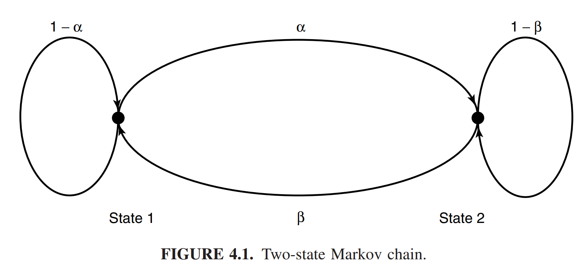

* [Back to Elements of Information Theory](../../main.md)

# 4.1 Markov Chains

### Notations)
- A stochastic process : $`\{X_i\}`$
  - Then $`\{X_i\}`$ can be seen as an indexed sequence of random variables.
- The Joint Probability Mass Function
  - $`\textrm{Pr}\left\{(X_1,\cdots,X_n)=(x_1, \cdots, x_n)\right\} = p(x_1, \cdots, x_n)`$
    - where $`(x_1, \cdots, x_n)\in\mathcal{X}^n \textrm{ for } n=1,2,\cdots`$

 

### Concept) Markov Chain (Markov Process)
- Def.)
  - A discrete stochastic process $`X_1, X_2, \cdots`$ is said to be **a Markov chain or a Markov process** if 
    - For
      - $`n=1,2,\cdots`$
      - every $`x_1, x_2, \cdots, x_n, x_{n+1} \in\mathcal{X}`$
    - $`\textrm{Pr}(X_{n+1}=x_{n+1} | X_1=x_1, \cdots, X_n = x_n) = \textrm{Pr}(X_{n+1}=x_{n+1} | X_n = x_n)`$
- Desc.)
  - Each random variable **depends only on the one preceding it** and is **conditionally independent of all the other preceding random variables**.
- Prop.)
  - The join probability mass function of random variables can be written as
    - $`p(x_1,\cdots,x_n) = p(x_1)p(x_2|x_1)p(x_3|x_2)\cdots p(x_n|x_{n-1})`$

 

#### Concept) State
- Def.)
  - If $`\{X_i\}`$ is a [Markov chain](#concept-markov-chain-markov-process), $`X_n`$ is called the **state** at time $`n`$

#### Concept) Probability Transition Matrix
- Def.)
  - $`P = [P_{ij}], \; i,j \in \{1,2,\cdots,m\}`$
    - where $`P_{ij} = \textrm{Pr}\{X_{n+1} = j | X_n = i\}`$
- Prop.)
  - If the probability mass function of the random variable at time $`n`$ is $`p(x_n)`$
    - the probability mass function at time $`n + 1`$ is
      - $`\displaystyle p(x_{n+1}) = \sum_{x_n} p(x_n)P_{x_n x_{n+1}}`$ 

 

### Concept) Time Invariant Markov Chain
- Def.)
  - The [Markov chain](#concept-markov-chain-markov-process) is said to be **time invariant** if the conditional probability $`p(x_{n+1}|x_n)`$ does not depend on $`n`$.
    - i.e.)
      - For 
        - $`n=1,2,\cdots`$
        - all $`a,b \in\mathcal{X}`$
      - $`\textrm{Pr}\{X_{n+1}=b|X_n=a\} = \textrm{Pr}\{X_{2}=b|X_1=a\}`$
- Prop.)
  - A **time invariant Markov chain** is characterized by its initial [state](#concept-state) and a [probability transition matrix](#concept-probability-transition-matrix) $`P`$.
- cf.)
  - We will assume that the [Markov chain](#concept-markov-chain-markov-process) is **time invariant** unless otherwise stated.

 

### Concept) Irreducible Markov Chain
- Def.)
  - A [Markov chain](#concept-markov-chain-markov-process) is said to be **irreducible**
    - if it is possible to go with positive probability from any [state](#concept-state) of the [Markov chain](#concept-markov-chain-markov-process) to any other [state](#concept-state) in a **finite number of steps**.

 

### Concept) Aperiodic Markov Chain
- Def.)
  - A [Markov chain](#concept-markov-chain-markov-process) is said to be **aperiodic**
    - if the largest common factor of the lengths of different paths from a [state](#concept-state) to itself is $`1`$.

 

### Concept) Stationary
- Def.)
  - A stochastic process is said to be **stationary** if the joint distribution of any subset of the sequence of random variables is invariant w.r.t. shifts in the time index.
    - i.e.)
      - For 
        - every $`n`$ 
        - every shift $`l`$ 
        - $`x_1, \cdots, x_n \in\mathcal{X}`$
      - $`\textrm{Pr}\{X_1=x_1, \cdots, X_n=x_n\} = \textrm{Pr}\{X_{l+1}=x_1, \cdots, X_{l+n}=x_n\}`$

 

### Concept) Stationary Distribution
- Def.)
  - A distribution on the [states](#concept-state) such that the distribution at time $`n+1`$ is the same as the distribution at time $`n`$ is called a **stationary distribution**.
- Prop.)
  - If the initial [state](#concept-state) of a [Markov chain](#concept-markov-chain-markov-process) is drawn according to a **stationary distribution**, the [Markov chain](#concept-markov-chain-markov-process) forms a [stationary](#concept-stationary) process.
  - If the finite-state Markov chain is [irreducible](#concept-irreducible-markov-chain) and [aperiodic](#concept-aperiodic-markov-chain)
    - then
      - The **stationary distribution** is unique
      - From any starting distribution, the distribution of $`X_n`$ tends to the **stationary distribution** as $`n\rightarrow\infty`$

 

### Example 4.1.1)
- Settings)
  - A two-state [Markov chain](#concept-markov-chain-markov-process) 
    - with a [probability transition matrix](#concept-probability-transition-matrix) $`P = \begin{bmatrix}
        1-\alpha & \alpha \\
        \beta & 1-\beta
    \end{bmatrix}`$
- Problem)
  - Find the stationary distribution represented by a vector 
    - $`\mu = \begin{bmatrix} \mu_1 & \mu_2 \end{bmatrix}`$ 
      - where $`\mu_i`$ is the stationary probability of the state $`i`$
- Sol.)
  - By the definition of the [stationary distribution](#concept-stationary-distribution),   
    $`\begin{aligned}
        \mu P = \mu 
        &\Leftrightarrow \begin{bmatrix} \mu_1 & \mu_2 \end{bmatrix} \begin{bmatrix} 1-\alpha & \alpha \\ \beta & 1-\beta \end{bmatrix}  = \begin{bmatrix} \mu_1 & \mu_2 \end{bmatrix} \\
        &\Rightarrow \begin{cases} (1-\alpha)\mu_1 + \beta\mu_2 = \mu_1 \\ \alpha\mu_1 + (1-\beta)\mu_2 = \mu_2 \end{cases} \\
        &\Rightarrow \alpha\mu_1 = \beta\mu_2
    \end{aligned}`$
  - Also, considering $`\mu_1 + \mu_2 = 1`$, we get   
    $`\displaystyle\mu_1 = \frac{\beta}{\alpha + \beta}, \; \mu_2 = \frac{\alpha}{\alpha + \beta}`$ : the stationary distribution

 

* [Back to Elements of Information Theory](../../main.md)