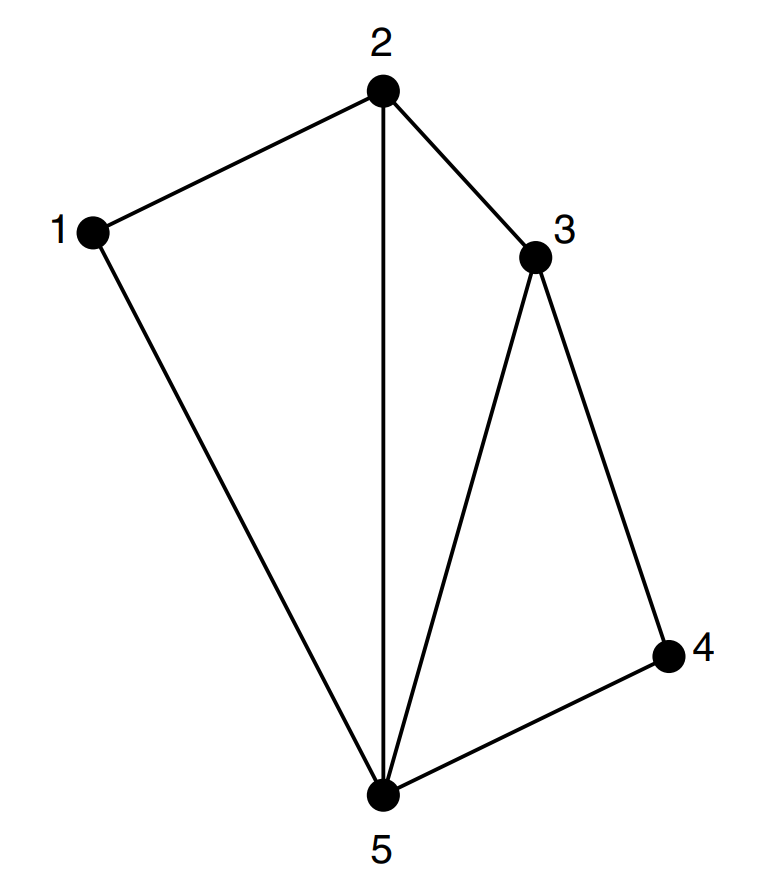

* [Back to Elements of Information Theory](../../main.md)

# 4.3 Example: Entropy Rate of a Random Walk on a Weighted Graph

### Settings)
- A stochastic process of a **random walk** on a connected graph.
  - $`m`$ nodes labeled $`\{1,2,\cdots,m\}`$
  - $`W_{ij} \ge 0`$ : the weight on the edge joining node $`i`$ to node $`j`$.
  - Undirected graph, so $`W_{ij}=W_{ji}`$.
  - $`\{X_n\}`$ : a **sequence** of a graph that denotes the **random walk** of a particle from node to node
    - where $`X_n \in \{1,2,\cdots,m\}`$
- Then $`P_{ij}`$ can be denoted as
  - $`\displaystyle P_{ij} = \frac{W_{ij}}{\sum_k W_{ik}}`$

 

### Prop.) Stationary Distribution
- Desc.)
  - The Stationary Distribution of this example can be denoted as
    - $`\displaystyle \mu_i = \frac{W_i}{2W} = \left[\frac{W_1}{2W}, \cdots, \frac{W_m}{2W}\right]`$
      - where
        - $`\displaystyle W_i = \sum_j W_{ij}`$ : the total weights of edges emanating from node $i$
        - $`\displaystyle W = \sum_{i,j:j\gt i} W_{ij}`$ : the sum of the weights of all edges
- pf.)
  - Recall that the stationary distribution can be verified by checking $`\mu = \mu P`$.
  - Consider all the walks to node $`j`$.   
    $`\begin{aligned}
        \sum_i \mu_i P_{ij} &= \sum_i \frac{W_i}{2W} \frac{W_{ij}}{\sum_k W_{ik}} \\
        &= \sum_i \frac{W_i}{2W} \frac{W_{ij}}{W_i} & \because \sum_k W_{ik} = W_i \\
        &= \sum_i \frac{W_{ij}}{2W} \\
        &= \frac{W_{j}}{2W} \\
        &= \mu_j
    \end{aligned}`$
- Prop.)
  - The stationary probability of node $`i`$ depends only on the total weight $`(W)`$ and the weight of edges connected to node $`i`$ $`(W_i)`$.
  - Weights that are not related to node $`i`$ cannot affect its stationary distribution as long as the total weight is constant.

 

### Calculating the Entropy Rate
$`\begin{aligned}
    H(\mathcal{X}) &= H(X_2|X_1) & \because \textrm{Theorem 4.2.4} \\
    &= -\sum_i \mu_i \sum_j P_{ij}\log P_{ij} & \because \textrm{Theorem 4.2.4} \\
    &= -\sum_i \frac{W_i}{2W} \sum_j \frac{W_{ij}}{W_i}\log \frac{W_{ij}}{W_i} \\
    &= -\sum_i \sum_j \frac{W_{ij}}{2W} \log \frac{W_{ij}}{W_i} \\
    &= -\sum_i \sum_j \frac{W_{ij}}{2W} \log \frac{W_{ij}}{2W} + \sum_i \sum_j \frac{W_{ij}}{2W} \log \frac{W_i}{2W} \\
    &= H\left(\cdots, \frac{W_{ij}}{2W},\cdots\right) - H\left(\cdots, \frac{W_{i}}{2W},\cdots\right)
\end{aligned}`$
- Furthermore, if all the edges have equal weight
  - $`\displaystyle H(\mathcal{X}) = \log(2E) - H\left(\frac{E_1}{2E}, \frac{E_2}{2E}, \cdots,\frac{E_m}{2E}\right)`$
    - where
      - $`E_i`$ : the number of edges emanating from node $`i`$
      - $`E`$ : the total number of edges

  

### E.g.) Random walk on a Chessboard
- Settings)
  - $`8\times 8`$ chess board.
  - A king has
    - 8 moves in the 36 interior positions
    - 5 moves at the 24 edge positions
    - 3 moves at the 4 corner positions
- Then the stationary probability can be calculated as
  - Interior : $`\displaystyle\frac{8}{(8\times 36) + (5\times 24) + (3\times 4)} = \frac{8}{420}`$
  - Edge : $`\displaystyle\frac{5}{(8\times 36) + (5\times 24) + (3\times 4)} = \frac{5}{420}`$
  - Corner : $`\displaystyle\frac{3}{(8\times 36) + (5\times 24) + (3\times 4)} = \frac{3}{420}`$
- Thus, the entropy rate is $`0.92\log{8}`$.
  - where $`0.92`$ is due to edge effects.
- We would have an entropy rate of $`\log{8}`$ on an infinite chessboard.

 

* [Back to Elements of Information Theory](../../main.md)