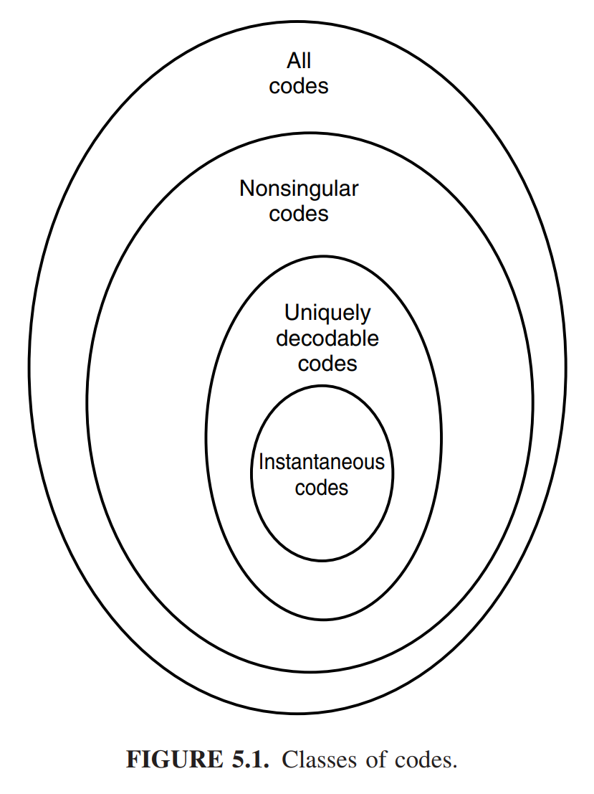
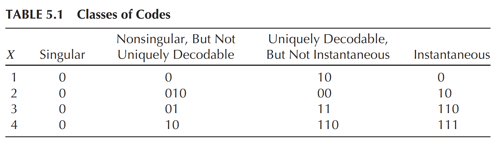

* [Back to Elements of Information Theory](../../main.md)

# 5.1 Examples of Codes

### Concept) Source Code
- Def.)
  - A source code $`C`$ for a random variable $`X`$ is a mapping from $`\mathcal{X}`$ to $`\mathcal{D}^\ast`$.
    - where
      - $`\mathcal{X}`$ : the range of $`X`$
      - $`\mathcal{D}^\ast`$ : the set of finite-length strings of symbols from $`D`$-ary alphabet
  - Let 
    - $`C(x)`$ : the codeword corresponding to $`x`$
    - $`l(x)`$ : the length of $`C(x)`$
- e.g.)
  - $`C(\textrm{red}) = 00, C(\textrm{blue}) = 11`$ is a source code for $`\mathcal{X} = \{\textrm{red, blue}\}`$ with alphabet $`\mathcal{D} = \{0, 1\}`$

 

### Concept) Expected Length of a Source Code
- Def.)
  - The expected length $`L(C)`$ of a source code $`C(x)`$ for a random variable $`X`$ with probability mass function $`p(x)`$ is given by
    - $`\displaystyle L(C) = \sum_{x\in\mathcal{X}} p(x)l(x) = El(X)`$
      - where $`l(x)`$ is the length of the codeword associated with $`x`$

 

#### Example 5.1.1) Entropy and Expected Length Are Equal
- Settings)
  - Let $`X`$ be a random variable with the following distribution and codeword assignment:   
    $`\begin{cases}
        \textrm{Pr}(X=1) = \frac{1}{2} & \textrm{ for the codeword } C(1) = 0 \\
        \textrm{Pr}(X=2) = \frac{1}{4} & \textrm{ for the codeword } C(2) = 10 \\
        \textrm{Pr}(X=3) = \frac{1}{8} & \textrm{ for the codeword } C(3) = 110 \\
        \textrm{Pr}(X=4) = \frac{1}{8} & \textrm{ for the codeword } C(4) = 111 \\
    \end{cases}`$
- Comparison)
  - Entropy)   
    $`\begin{aligned}
      H(X) &= -\frac{1}{2}\log{\frac{1}{2}} -\frac{1}{4}\log{\frac{1}{4}}-\frac{1}{8}\log{\frac{1}{8}}-\frac{1}{8}\log{\frac{1}{8}} \\
      &= \frac{1}{2}+\frac{2}{4}+\frac{3}{8}+\frac{3}{8}  = \frac{4+4+3+3}{8} = \frac{7}{4} \\
      &= 1.75
    \end{aligned}`$
  - Expected Length)   
    $`\begin{aligned}
      El(X) &= \frac{1}{2}\times 1 + \frac{1}{4}\times 2 + \frac{1}{8}\times 3 + \frac{1}{8}\times 3\\
      &= 1.75
    \end{aligned}`$
  - Thus, $`H(X) = El(X)`$
- Prop.)
  - Any sequence of bits can be uniquely decoded into a sequence of symbols of $`X`$.
    - e.g.) $` 0110111100110 \rightarrow (0)(110)(111)(10)(0)(110) \rightarrow 134213`$

 

#### Example 5.1.2) Entropy Smaller than Expected Length
- Settings)
  - Let $`X`$ be a random variable with the following distribution and codeword assignment:   
    $`\begin{cases}
        \textrm{Pr}(X=1) = \frac{1}{3} & \textrm{ for the codeword } C(1) = 0 \\
        \textrm{Pr}(X=2) = \frac{1}{3} & \textrm{ for the codeword } C(2) = 10 \\
        \textrm{Pr}(X=3) = \frac{1}{3} & \textrm{ for the codeword } C(3) = 11 \\
    \end{cases}`$
- Comparison)
  - Entropy)   
    $`\begin{aligned}
      H(X) &= -\frac{1}{3}\log{\frac{1}{3}} -\frac{1}{3}\log{\frac{1}{3}}-\frac{1}{3}\log{\frac{1}{3}} = - \log{\frac{1}{3}}\\
      &\approx 1.58
    \end{aligned}`$
  - Expected Length)   
    $`\begin{aligned}
      El(X) &= \frac{1}{3}\times 1 + \frac{1}{3}\times 2 + \frac{1}{3}\times 2 = \frac{5}{3}\\
      &\approx 1.67
    \end{aligned}`$
  - Thus, $`H(X) \lt El(X)`$

 

#### Example 5.1.3) Morse Code
- Desc.)
  - The Morse code denotes the English alphabet using four symbols :  dot, dash, letter space, word space
  - Short sequences represent frequent letters.
    - e.g.) A single dot represents E.
  - Long sequences represent infrequent letters. 
    - e.g.) Q is represented by “dash,dash,dot,dash”.
  - In fact, this is not the optimal representation for the alphabet in four symbols.

  

### Concept) Non-Singularity
- Def.)
  - A code $`C`$ is said to be nonsingular if every element of the range of $`X`$ maps into a different string in $`\mathcal{D}^\ast`$.
    - i.e.) $`\forall x, x'\in X, x\ne x' \Rightarrow C(x) \ne C(x')`$
- Props.)
  - Nonsingularity suffices for an **unambiguous description of a single value** of $`X`$.
- e.g.)
  - Refer to the [example below](#eg-codeword-assignments).

  

### Concept) Extension of a Code
- Def.)
  - The extension $`C^\ast`$ of a code $`C`$ is the mapping from finite-length strings of $`\mathcal{X}`$ to finite-length strings of $`\mathcal{D}`$, defined by
    - $`C(x_1 x_2 \cdots x_n) = C(x_1)C(x_2)\cdots C(x_n)`$
      - where $`C(x_1)C(x_2)\cdots C(x_n)`$ indicates concatenation of the corresponding codewords.
- Why needed?)
  - In case of encoding a sequence of values, providing a separator can ensure the decodability.
  - However, it is inefficient to use a special symbol, such as comma.
  - Instead, we defined an extension of a code that self-punctuates.
- e.g.)
  - $`\begin{cases} C(x_1) = 00 \\ C(x_2) = 11 \end{cases} \Rightarrow C(x_1x_2)=C(x_1)C(x_2)=0011`$.

  

### Concept) Unique Decodability
- Def.)
  - A code is called **uniquely decodable** if its [extension](#concept-extension-of-a-code) is [nonsingular](#concept-non-singularity).
- Props.)
  - Any encoded string in a **uniquely decodable** code has only one possible source string producing it. 
  - However, one may have to look at the entire string to determine even the first symbol in the corresponding source string.

  

### Concept) Prefix Code (Instantaneous Code)
- Def.)
  - A code is called a **prefix code** or an **instantaneous code** if no codeword is a prefix of any other codeword.
- Props.)
  - An **instantaneous code** can be decoded without reference to future codewords since the end of a codeword is immediately recognizable.
    - i.e.) The symbol $`x_i`$ can be decoded as soon as we come to the end of the codeword corresponding to it.
    - i.e.) A self-punctuating code;
- e.g.)
  - Refer to the [example below](#eg-codeword-assignments).

 

#### Concept) Nesting of the Codes

 

### E.g.) Codeword Assignments

#### E.g.) Non-Singular
- The code string $`010`$ has three possible source sequences:
  - $`(010) \rightarrow 2`$
  - $`(01)(0) \rightarrow 31`$
  - $`(0)(10) \rightarrow 14`$

#### E.g.) Uniquely Decodable Code
- Not prefix-free and hence is not [instantaneous](#concept-prefix-code-instantaneous-code).
  - Why?)
    - $`11`$ is the prefix of $`110`$
- Still, it is uniquely decodable.
  - $`(0\cdots)`$ : If the first bit is $`0`$, we immediately know that the first codeword is $`2`$.
  - $`(1\cdots)`$ : Else, 
    - $`(10\cdots)`$ : If the second bit is $`0`$, we know that the first codeword is $`1`$
    - $`(11\cdots)`$ : Else
      - $`(111\cdots)`$ : If the third bits is $`1`$, the first codeword is $`3`$.
      - $`(110\cdots)`$ : Else, 
        - $`(110 \; \underbrace{0\cdots0}_\textrm{odd})`$ : If the immediately following string of $`0`$'s legth is odd, 
          - then the first codeword will be $`4`$
        - $`(110 \; \underbrace{0\cdots0}_\textrm{even})`$ : If the immediately following string of $`0`$'s legth is even, 
          - then the first codeword will be $`3`$

 

* [Back to Elements of Information Theory](../../main.md)