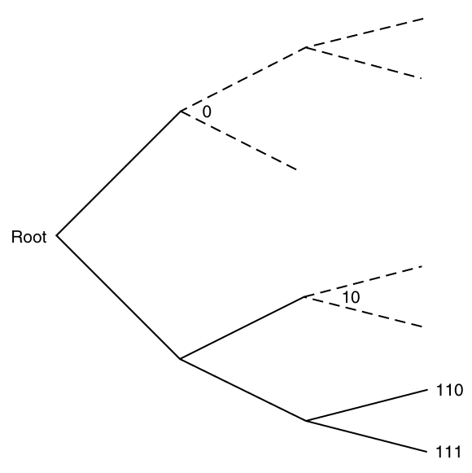

* [Back to Elements of Information Theory](../../main.md)

# 5.2 Kraft Inequality

### Theorem 5.2.1) Kraft Inequality
- Why needed?)
  - A sufficient condition for the existence of a codeword set with the specified set of codeword lengths.
- Theorem)
  - For any [instantaneous code (prefix code)](../01/note.md#concept-prefix-code-instantaneous-code) over an alphabet of size $`D`$, the codeword lengths $`l_1, l_2, \cdots, l_m`$ must satisfy the inequality
    - $`\displaystyle \sum_i D^{-l_i} \le 1`$
  - Conversely, given any set of codeword lengths $`l_1, l_2, \cdots, l_m`$ that satisfy the Kraft inequality, we can always construct a tree as above.

- pf)
  - Consider a $`D`$-ary tree in which each node has $`D`$ children.
  - Let 
    - branches : represent the symbols of the codeword.
    - leaves : represent each codeword.
  - Then the path from the root traces out the symbols of the codeword.
  - And the no codeword is an ancestor of any other codeword on the tree.
    - Hence, each codeword eliminates its descendants as possible codewords.
  - Put $`l_{\max}`$ : the length of the longest codeword of the set of codewords.
  - Then, a codeword at level $`l_i`$ has $`D^{l_{\max} - l_i}`$ descendants at level $`l_{\max}`$.
    - Why?)   
      $`\begin{aligned}
        D   \textrm{ descendants} &\textrm{ at level } l_{i+1} \\
        D^2 \textrm{ descendants} &\textrm{ at level } l_{i+2} \\
        D^3 \textrm{ descendants} &\textrm{ at level } l_{i+3} \\
        &\vdots \\
        D^{l_{\max} - i} \textrm{ descendants} &\textrm{ at level } l_{\max} \\
      \end{aligned}`$
  - Also, these descendant sets must be **disjoint**.
    - e.g.) In the above image, the set of $`0`$'s descendants and that of $`10`$ are disjoint.
  - Hence, summing over all the codewords,
    - $`\displaystyle \sum_i D^{l_{\max} - l_i} \le D^{l_{\max}}`$
      - Why?)
        - $`\sum_i D^{l_{\max} - l_i}`$ is equal to the number of all nodes in this tree.
        - Since it is $`D`$-ary tree, the number of all nodes is $`\displaystyle\sum_{k=1}^{l_{\max}} D^{k-1} = \frac{D^{l_{\max}}-1}{D-1} \lt D^{l_{\max}}`$
        - Thus, $`\displaystyle \sum_i D^{l_{\max} - l_i} = \sum_{k=1}^{l_{\max}} D^{k-1}\le D^{l_{\max}}`$
  - Therefore, $`\displaystyle \sum D^{-l_i} \le 1`$.

 

### Theorem 5.2.2) Extended Kraft Inequality
- Theorem)
  - For any countably **infinite** set of codewords that form a prefix code, the codewords that form a prefix code, the codeword lengths satisfy the extended Kraft inequality, 
    - $`\displaystyle \sum_{i=1}^\infty = D^{-l_i} \le 1`$
  - Conversely, given any $`l_1, l_2, \cdots`$ satisfying the extended Kraft inequality, we can construct a prefix code with these codeword lengths.
- pf)
  - Let
    - $`\{0,1,\cdots, D-1\}`$ : the $`D`$-ary alphabet
    - $`y_1y_2\cdots y_{l_i}`$ : the $`i`$-th codeword.
    - $`0.y_1y_2\cdots y_{l_i}`$ : the real number given by the $`D`$-ary expansion.
      - i.e.) $`\displaystyle 0.y_1y_2\cdots y_{l_i} = \sum_{j=1}^{l_i} y_j D^{-j}`$
  - Then this codeword corresponds to the interval
    - $`\displaystyle \left[ 0.y_1y_2\cdots y_{l_i} \; , \; 0.y_1y_2\cdots y_{l_i} + \frac{1}{D^{l_i}} \right)`$
      - i.e.) the set of all real numbers whose $`D`$-ary expansion begins with $`0.y_1y_2\cdots y_{l_i}`$.
    - These intervals are the subintervals of $`[0,1]`$.
      - i.e.) $`\displaystyle \left[ 0.y_1y_2\cdots y_{l_i} \; , \; 0.y_1y_2\cdots y_{l_i} + \frac{1}{D^{l_i}} \right) \subset [0,1]`$
  - By the [prefix condition](../01/note.md#concept-prefix-code-instantaneous-code), these intervals are disjoint.
  - Hence, the sum of their lengths must be less than or equal to $`1`$.
    - i.e.) $`\displaystyle \sum_{i=1}^\infty D^{-l_i} \le 1`$

 

* [Back to Elements of Information Theory](../../main.md)