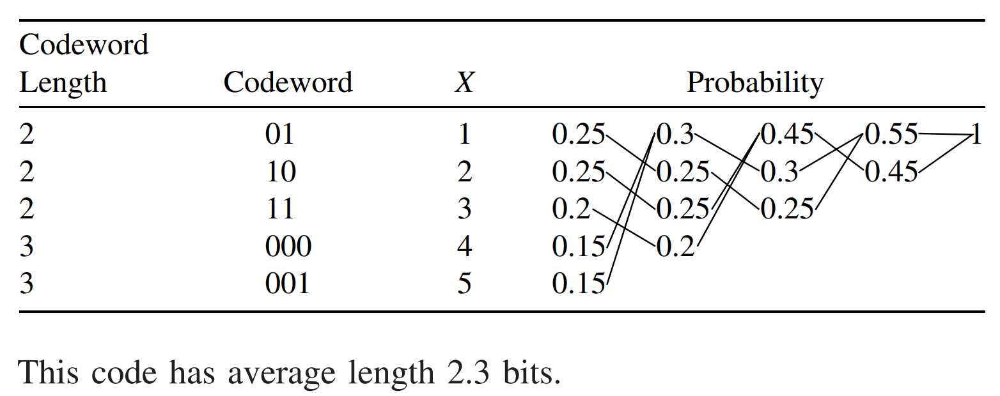

* [Back to Elements of Information Theory](../../main.md)

# 5.6 Huffman Codes

### Concept) Huffman Code
- Desc.)
  - An [optimal (shortest expected length) prefix code](../03/note.md#53-optimal-codes) for a given distribution can be constructed by a simple algorithm discovered by Huffman.
  - In [section 5.8](../08/note.md), we will prove that any other code for the same alphabet cannot have a lower expected length than the code constructed by the algorithm.

#### Example 5.6.1) Binary Code
- Settings)
  - $`X`$ : a random variable taking values in the set $`\mathcal{X} = \{1,2,3,4,5\}`$ with probabilities as below.   
    |$`\mathcal{x}`$|$`p(\mathcal{x})`$|
    |:-:|:-:|
    |1|0.25|
    |2|0.25|
    |3|0.2|
    |4|0.15|
    |5|0.15|

- Getting the code.
  - How?)
    - Combine the two least likely symbols into one symbol until we are finally left with only one symbol.
    - Assign codewords to the symbols.
  - e.g.)    
    
    1. 4 and 5 are the least likely symbols with the probabilities 0.15 respectively.
       - Assign the longest symbols to 4 and 5 with equal lengths. : 00X
         - Why equal lengths?) 
           - Otherwise, we can delete a bit from the longer codeword and still have a prefix code but with a shorter expected length.
       - Combine the symbols 4 and 5 into a single source symbol 00X, with a probability assignment 0.30.   
         |Symbol|Codeword c|p(c)|
         |:-:|:-:|:-:|
         |4, 5|00X|0.30|
         |1|-|0.25|
         |2|-|0.25|
         |3|-|0.2|
    2. 2 and 3 are the least likely symbols.
       - Assign the next longest symbols to 2 and 3 with equal lengths : 1X.
       - Combine the symbols 2 and 3 into a single symbol 1X, with a probability assignment 0.45.   
         |Symbol|Codeword c|p(c)|
         |:-:|:-:|:-:|
         |2, 3|1X|0.45|
         |4, 5|00X|0.30|
         |1|-|0.25|
    3. 1 and (4,5) are the least likely symbols.
       - Assign the next longest symbols to 1 and (4,5) with equal lengths : 0X
       - Combine the symbols 1 and (4,5) into a single symbol 0X, with a probability assignment 0.55.   
         |Symbol|Codeword c|p(c)|
         |:-:|:-:|:-:|
         |1, 4, 5|0X|0.55|
         |2, 3|1X|0.45|
    4. (1,4,5) and (2,3) are the final two symbols.
       - Assign the next longest symbols to (1,4,5) and (2,3) with equal lengths : X
       - Combine the symbols (1,4,5) and (2,3) into a single symbol X, with a probability assignment 1.00.   
         |Symbol|Codeword c|p(c)|
         |:-:|:-:|:-:|
         |1, 2, 3, 4, 5|X|1.00|

 

* [Back to Elements of Information Theory](../../main.md)